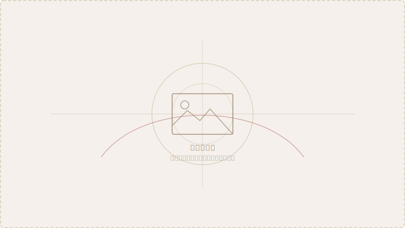

# 第1章　从造船厂与飞机厂出发

> "那个年代，数学家是要下厂的。"
> — 某位参与者的口述

---

## 1.1 工业一线的几何问题

二十世纪六七十年代，中国的造船工业和航空制造业正在快速扩张。大型船舶的船体设计、飞机机翼与蒙皮的曲面加工，都面临同一个核心难题：**如何用数学语言精确描述复杂的自由曲面，并指导数控机床完成加工？**

这个问题，在西方被称为"计算机辅助几何设计"（Computer-Aided Geometric Design，CAGD），是计算几何的核心分支。但在当时的中国，它还没有一个统一的名字——人们只知道，车间里的工人在用木模板、铅垂线和经验放样，误差大，效率低，无法满足精密制造的需要。

*图 1-1　传统船体放样使用木制样板和手工修线，精度受限于工匠经验*

## 1.2 "下厂"的年代

1960年代至1970年代，中国高校数学系的教师和学生经历了大规模的"产学结合"运动——走出课堂，进入工厂，用数学解决实际问题。这一运动的政治动机固然复杂，但客观上促成了一批数学家与工业现实的正面接触。

一些日后成为计算几何奠基人的学者，正是在这个时期第一次接触到了船体放样和数控编程的问题。复旦大学的教师走进了江南造船厂；浙江大学的研究人员与杭州的机械厂建立了合作；山东大学则与青岛的造船企业有着天然的地缘联系。

> "我第一次看到数控绘图机的时候，觉得这是真正的数学问题——不是玩具，是生产。"

## 1.3 数学家面对的核心挑战

从工业现场带回来的问题，用数学语言来表述大致是这样的：

- 给定若干**型值点**（由设计图纸或测量得到），如何构造一条**光滑曲线**通过这些点？
- 这条曲线如何被计算机存储和计算？
- 如何保证相邻曲线段在连接处的**光滑性**（连续阶数）？
- 曲面的情况比曲线更复杂，如何处理？

这些问题在当时的中国数学界几乎是全新的。样条理论（Spline）、Bézier 曲线、B 样条方法——这些西方在1960年代已经开始发展的工具，在中国还鲜为人知。

## 1.4 起步的条件与限制

1970年代末，中国改革开放的大幕拉开，高校教学和科研秩序逐步恢复。几位日后的奠基人物开始有机会接触到国际文献。

但条件依然艰苦：
- 计算机极为稀缺，许多计算需要手算或借用工厂的早期数控设备完成
- 英文文献获取困难，往往只有少数人能看到影印本
- 国内几乎没有同行，研究者处于高度孤立的状态

正是在这种背景下，几位关键人物的出现，改变了这一切。

---

::: tip 本章关键词
船体放样 · 数控编程 · 样条曲线 · 产学结合 · 型值点插值
:::

**→ 下一章：[第2章　几位奠基者与早期探索](./ch02)**
