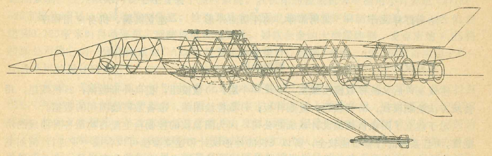
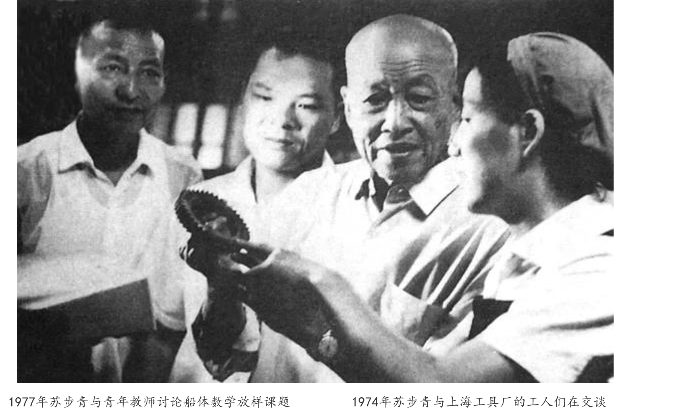
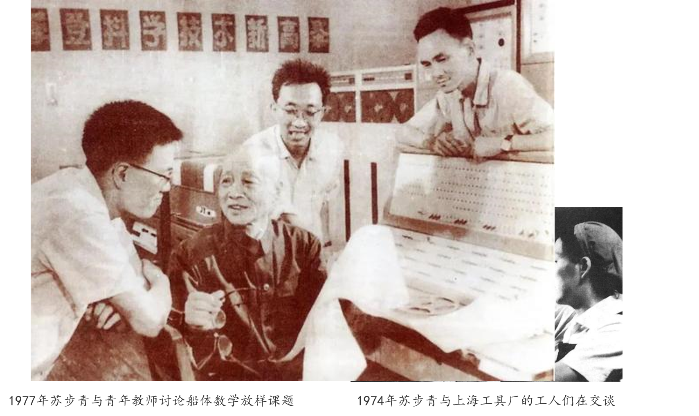
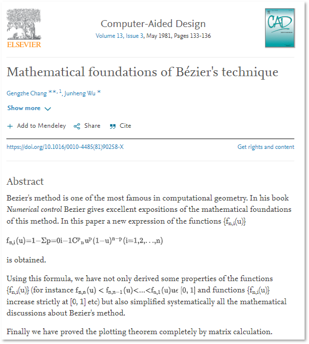
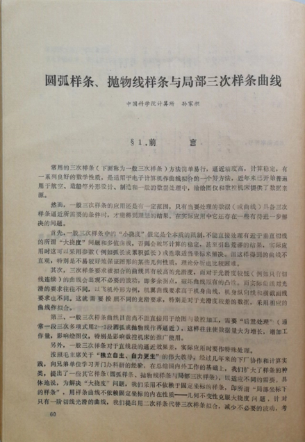
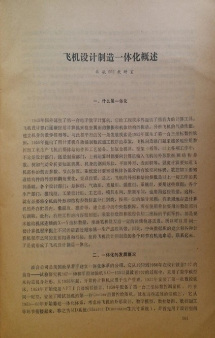

# 第1章　从造船厂与飞机厂出发

> "那个年代，数学家是要下厂的。"
> — 某位参与者的口述

---

## 1.1 工业一线的几何问题

二十世纪六七十年代，中国的造船工业和航空制造业正处于高速扩张之中。大型船舶的船体曲面、飞机机身与蒙皮的外形轮廓，都需要在从设计图纸到车间加工之间完成一次精密的数学转化：如何用计算机可以处理的数学语言，精确描述这些形态复杂、要求严苛的自由曲面，并进而指导数控机床完成加工？

在西方，这个问题有一个专门的名字——"计算机辅助几何设计"（Computer-Aided Geometric Design，CAGD），是计算几何的核心分支之一，已在1960年代开始系统发展。但在当时封闭的中国，这门学科尚未传入，也没有人用一个统一的词汇来描述它。人们只知道，车间里的工人依靠木制样板、铅垂线和世代积累的经验完成船体"放样"，误差大，效率低，远远无法满足现代精密制造的需要。

那么，问题的数学本质是什么？一架歼击机的机头罩，其轮廓曲线如何被精确地存储进一台早期计算机，并被机床的刀头精准地"重新画出来"？这个问题，就是中国计算几何的起点。

*图 1-1　工程师手绘的飞机外形曲线示意，每一条轮廓线的数学表示都是一个待解的几何问题*

## 1.2 "下厂"的年代

1960年代末至1970年代，一场大规模的"产学结合"运动席卷中国各高校。数学系的教师和学生被要求走出课堂，进入工厂，以实际生产问题为课题。这一运动有其复杂的政治背景，但它客观上促成了一批数学家与工业现实的正面接触，也催生了一批此前从未有人系统研究过的数学问题。

1970年，中国科学院计算技术研究所的青年学者孙家昶，承接了三机部六院委托的"飞机外形的数学模型"课题。这个课题在当时颇为特殊——没有任务书、没有指标、没有经费，被同事戏称为"三无课题"。然而正是这个"三无课题"，开启了孙家昶此后三十年的研究方向，也成为中国计算几何历史的一条重要线索。

与此同时，在上海，另一位数学家正以不同的方式参与这场工业与数学的相遇。复旦大学的苏步青教授从1974年起多次前往江南造船厂，致力于为工厂设计船体数学放样方法，用数学的精确性取代传统的经验放样。苏步青的身影出现在嘈杂的车间里，出现在工人和工程师之间，这本身就是那个年代的一个缩影。

*图 1-2　1974年，苏步青与工厂工人交谈，这是那个年代数学家"下厂"的典型场景*

在航空工业一侧，北京航空航天大学的熊振翔等人也相继奔赴沈阳飞机厂，为歼击机的全机外形建立数学模型。整个1970年代，无论是造船业还是航空业，来自高校和研究所的数学工作者，都在以前所未有的规模介入工业生产的核心环节。

到1977年，苏步青已不再只是一个人奔走于工厂与大学之间，而是开始带领复旦的青年教师，共同以船体放样为题展开研究。这种老先生带年轻人、年轻人到工厂的传帮带模式，成为后来整整一代计算几何学者成长历程的底色。

*图 1-3　1977年，苏步青与青年教师讨论船体数学放样课题，激励更多年轻学者投身这一领域*

> "我第一次看到数控绘图机的时候，觉得这是真正的数学问题——不是玩具，是生产。"

这场大规模的产学协作，为中国计算几何共同体的形成积蓄了人员基础。彼此独立、散布各地的学者，将在不久之后因一次重要的学术聚会而走到一起。

## 1.3 数学家面对的核心挑战

从工业现场带回来的问题，经过数学家的提炼，大致指向同一组核心命题。给定若干由设计图纸或测量所得的"型值点"，如何构造一条光滑曲线通过这些点？这条曲线如何被计算机存储和计算？相邻曲线段在连接处的光滑性（即连续阶数）又如何保证？而当问题从曲线延伸到曲面，复杂性便骤然上升。

这些问题，在当时的中国数学界几乎是全新的领域。西方在1960年代已经开始系统发展的工具——样条理论（Spline）、Bézier曲线、B样条方法——在中国尚鲜为人知。面对这种状况，各地学者不得不独立探索，有时从零开始建立理论，有时则靠着少数人辗转获取的影印文献勉强了解西方进展。

1974年，孙家昶发表了他的第一篇学术论文《样条函数及其在计算方法中的某些应用》。在写作这篇文章时，他征得中国科学院冯康先生的同意，首次将英文"Spline"一词译为"样条"，这一译法此后在中国学术界沿用至今。这个看似微小的翻译决定，标志着一个新概念在中文数学语境中正式落地生根。

在航空工业领域，各方力量在不同的坐标上同步推进。北京航空航天大学的唐荣锡深入飞机制造工厂，系统普及推广Coons曲面、Bézier曲面及数控加工技术。中国科学技术大学的常庚哲奔赴贵州安顺飞机厂，在生产一线开展"飞机机头罩和进气道曲面外形"的建模实习，用Coons曲面实际构造了外形曲面。他将这些经验凝练为理论，在《计算机应用与应用数学》发表了综述长文《Coons曲面介绍》，并与北京航空航天大学的吴骏恒合作完成了《Bézier曲线、曲面的数学基础及其计算》——这篇文章于1981年发表于国际期刊《Computer-Aided Design》，是中国学者在该领域国际刊物上最早的发表之一。

*图 1-4　1981年，常庚哲与吴骏恒在《Computer-Aided Design》发表论文，这是中国学者最早在该领域国际期刊上的重要发表之一*

孙家昶则另辟蹊径。1977年，他在《数学学报》上发表了《局部坐标下的样条函数与圆弧样条曲线》，提出了圆弧样条方法——以圆弧段作为曲线的基本元素，在局部坐标系下处理大挠度或多值曲线的插值问题。这一方法被成功应用于国产大型喷气客机运-10的外形设计；据后来的记录，该团队在运-10研制过程中"对飞机整体进行了总体设计和当时国内首次数字化的模拟"，"合力开创了我国大规模使用计算机进行飞机模型仿真的先河"。

*图 1-5　孙家昶1977年在《数学学报》发表的圆弧样条论文，这一方法后来被用于运-10的外形设计*

吉林大学的齐东旭深入研究样条函数理论，将其运用于飞机外形及进气道形状的设计实践。浙江大学的金通洸在成都飞机制造厂参与机身的光顺设计，成功应用了改进的双圆弧方法，并独立开展了数控绘图的TN法研究。

1976年6月，三机部飞机情报网在北京航空学院召开了一次重要的专题座谈会，汇集了来自国营工厂和高校院所的研究力量，集中总结交流飞机设计制造中外形数学模型和绘图软件研究的成果。国营130厂、国营512厂、北京航空航天大学、中国科学院计算所等机构均有参与贡献。这次会议形成的资料汇编，是那个年代中国航空工业与数学研究协同攻关的一份珍贵记录。

*图 1-6　北航502教研室编写的《飞机设计制造一体化概述》，记录了航空制造业数学化改造的早期探索*

在船舶工业领域，六机部主导推动了相关自动化研发的整体部署。苏步青三赴江南造船厂，开发出船体数学放样的计算方法。山东大学的谢力同与刘鼎元在上海沪东造船厂、汪嘉业在青岛红星船厂，分别独立开展了船体放样的研发工作。浙江大学的董光昌率领梁友栋等人，在上海求新造船厂及嘉兴、宁波等地的造船企业开展科研攻关，深入探索船体线型光顺的数学方法。金通洸还在杭州机床厂、沈阳水泵厂等地从事螺杆泵加工的原理研究，将曲面几何方法延伸到了更广泛的机械制造领域。

这一时期，分散在航空和造船两条战线上的学者们彼此之间的交流极为有限。他们不约而同地面对着相似的数学命题，却在各自的轨道上独立前进。这种局面既造成了大量的重复劳动，也在不自觉间孕育着日后协作共同体形成时的巨大张力。

## 1.4 起步的条件与限制

1970年代末，改革开放的大幕拉开，高校教学与科研秩序逐步恢复。几位日后的奠基人物开始有机会接触国际文献，第一次看到了自己多年实践与世界前沿之间的距离——有时惊喜地发现殊途同归，有时则是意识到差距的沉重。

但条件依然严苛。计算机在国内极度稀缺，大量计算不得不靠手工完成，或借用工厂的早期数控设备凑合进行。英文文献的获取尤为困难，一份重要的影印件往往在数人之间辗转传阅，读完一遍便已算幸运。国内真正意义上的同行几乎不存在，研究者在相当长的时间里处于高度孤立的状态。孤立，既是局限，也在某种程度上逼出了独立探索的勇气。

然而，这种孤立正在接近尾声。在航空、造船两条战线上各自奋斗多年的学者，即将因一次重要的学术组织活动而聚拢到同一个旗帜之下。中国计算几何作为一个学术共同体的历史，才刚刚要开始。

---

::: tip 本章关键词
船体放样 · 数控编程 · 样条曲线 · 产学结合 · 型值点插值
:::

**→ 下一章：[第2章　几位奠基者与早期探索](./ch02)**
