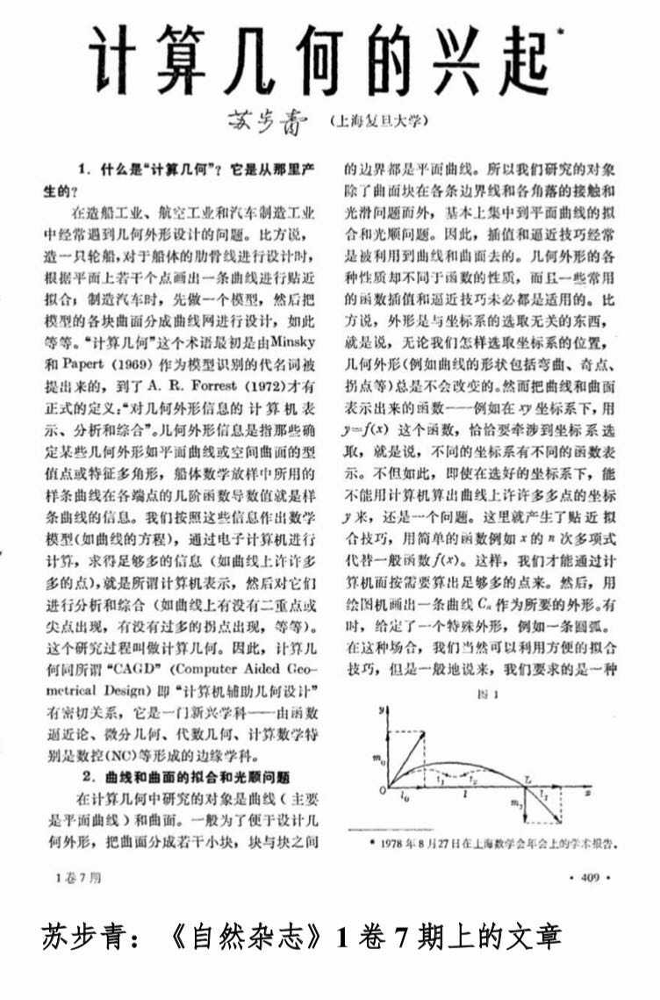
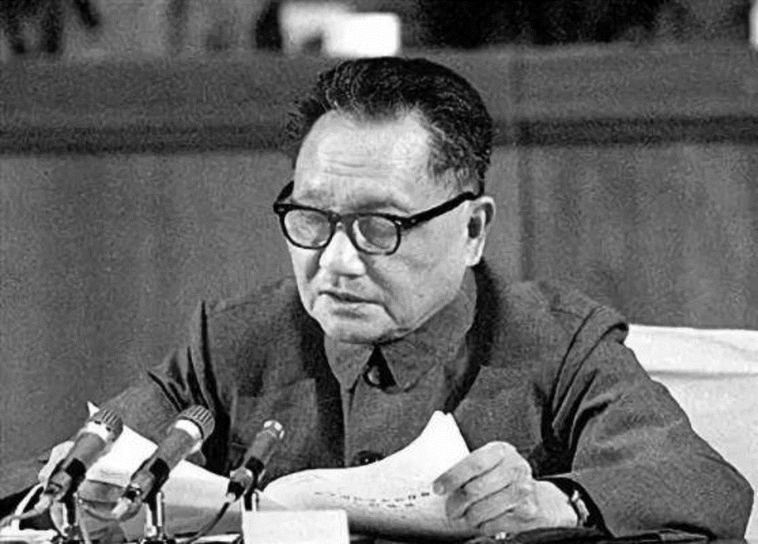
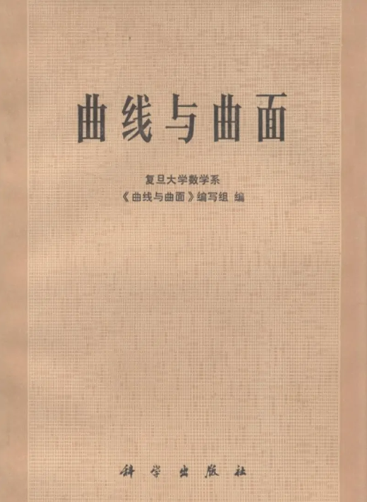
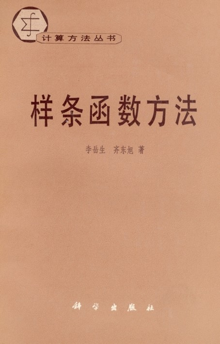
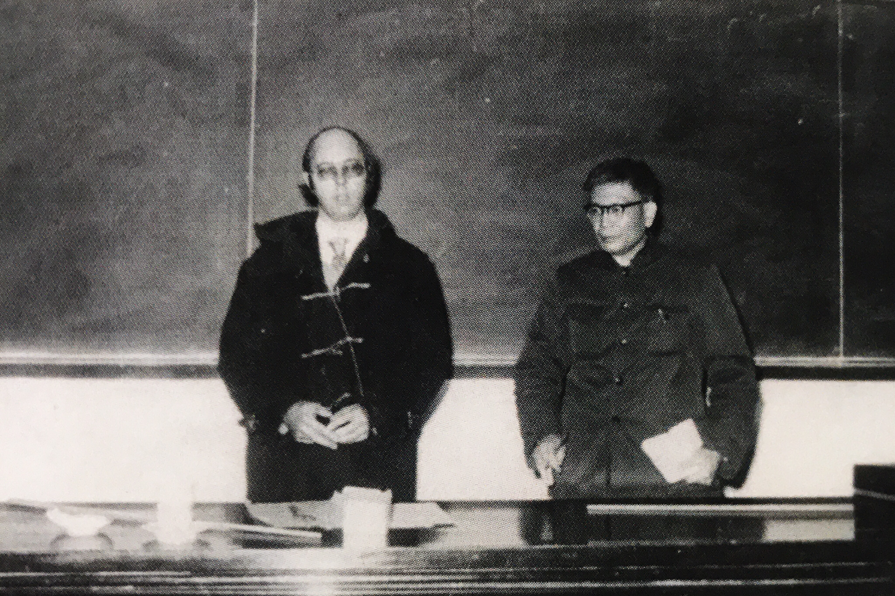
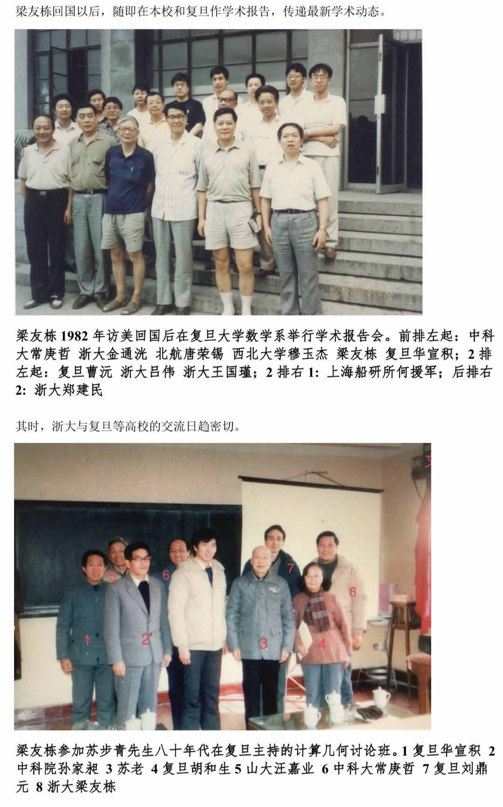
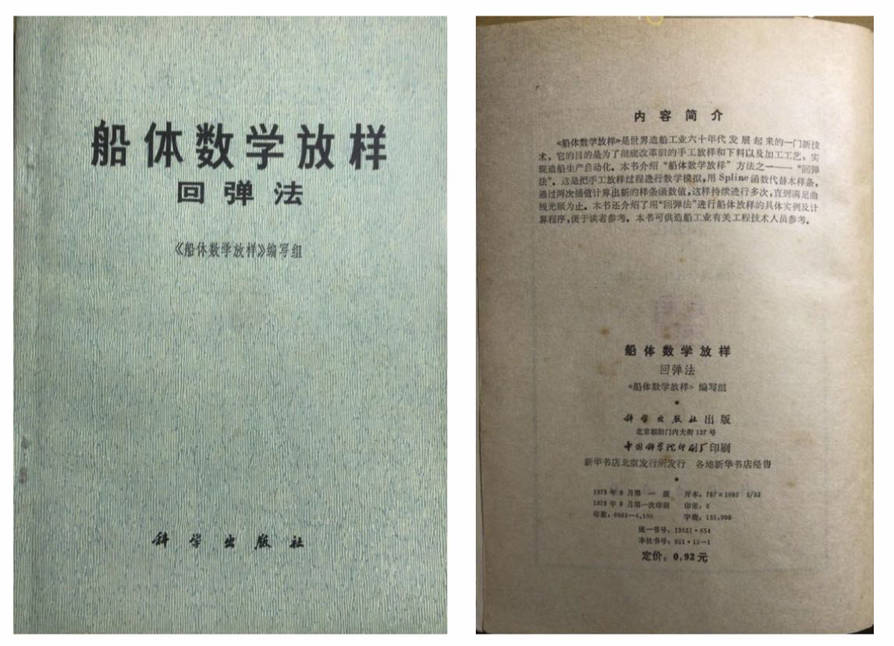

# 第2章　几位奠基者与早期科研探索

> "苏步青先生说，数学要为工业服务。这句话，我们那一代人是当真的。"

---

## 2.1　苏步青的学科远见

在中国计算几何的故事里，苏步青（1902–2003）是绕不开的那个名字。作为中国微分几何的开创者之一，他自 1950 年代起主持复旦大学数学系的工作，教学与科研活动主要围绕射影微分几何和仿射微分几何等纯理论方向展开。然而进入 1970 年代，当造船、航空、汽车等行业日益频繁地把"外形设计"作为难题摆上数学家的桌面时，苏步青敏锐地意识到：一门从工业现场里生长出来的新学科正在酝酿之中，而中国还没有学人对它做出正式的命名。

1978 年 8 月 27 日，苏步青在上海数学会年会上作了一份题为《计算几何的兴起》的学术报告，全文随后刊登于《自然杂志》1 卷 7 期第 409 页起。报告开篇即从"造一只轮船"讲起，循着船体肋骨线的型值点、汽车覆盖件的曲面拟合、飞机外形的分块设计这些具体场景，把工程师日常面对的几何问题引导到数学的言语之中。苏步青在文中引用了 Minsky 和 Papert（1969）与 A. R. Forrest（1972）对计算几何的早期定义，并给出了一句在此后二十多年里被反复征引的判断——

> 计算几何同所谓"CAGD"（Computer Aided Geometrical Design）即"计算机辅助几何设计"有密切关系，它是一门新兴学科——由函数逼近论、微分几何、代数几何、计算数学特别是数控（NC）等形成的边缘学科。
> ——苏步青《计算几何的兴起》，《自然杂志》1 卷 7 期，1978

这段文字看似平直，其实为一个尚未在国内成形的学科划定了坐标：工业需求为源头，微分几何、逼近论、计算数学为腹地，CAGD 和数控技术为出口。今天回头看，这是中国学人第一次在公开场合把"计算几何"当作一个有学科边界的对象来讨论。

*图 2-1　苏步青与他的《计算几何的兴起》——奠基者与其学科宣言的并置*

*图 2-2　1978 年刊登于《自然杂志》1 卷 7 期的苏步青《计算几何的兴起》报告首页，这是中文文献中最早系统界定"计算几何"一词的学术报告*

这篇报告并非凭空而来。1970 年代，苏步青已经数次到江南造船厂蹲点，与船厂技术人员一道，把手工放样的经验转写成样条拟合与光顺的数学流程；他主持的"船体放样项目"在 1978 年全国科学大会上受到表彰，此后由他领衔的"曲面法船体线型生产程序"又获得国家科技进步二等奖。文章中那些对平面曲线拟合、样条函数端点高阶导数的具体讨论，正是从船厂实践里沉淀下来的。十余年后，苏步青在 1992 年杭州协作组会议的代序中回望这段历程，写下了这样一句话："回顾 1978 年计算几何学在国内兴起，至今已有十四年了。"——他把学科诞生的年份，自觉地落在了自己作报告的那一年。

## 2.2　"科学的春天"与下厂的风气

要理解苏步青 1978 年的那份报告为什么能在此后几年里激起如此宽的涟漪，必须把它放回当时的时代语境。1978 年 3 月，全国科学大会在北京召开。邓小平在开幕式上重新确认了"科学技术是生产力"的判断，并提出"知识分子是工人阶级自己的一部分"。大会同时集中表彰了一批在"文革"期间艰难支撑的科研工作。据《自然杂志》及相关档案记录，复旦大学数学系苏步青等研发的船体数学放样项目、浙江大学金通洸等研发的螺杆泵螺杆简易近似加工方法、吉林大学齐东旭等的相关工作，都在这次大会上获得了奖励。

*图 2-3　1978 年 3 月全国科学大会开幕式上，邓小平作重要讲话，"科学的春天"让包括计算几何在内的应用数学研究重新获得制度空间*

这个节点对后来的计算几何来说至关重要。"科学的春天"不仅是一句口号，它意味着一批在 1960 年代中后期被搁置的研究可以重新摆回桌面，意味着高校与研究所重新拥有了公开做研究、公开开讨论班的合法空间。正是在这种氛围里，此前分散在各地车间、船厂、机床厂里的数学家开始把"下厂"的经验整理成文字、整理成课程、整理成教材。

"下厂"这个词在本章后面还会多次出现，因为它几乎定义了这一代奠基者共同的工作方式。复旦苏步青三赴江南造船厂；浙大董光昌去上海求新造船厂以及嘉兴、宁波等地的造船厂，与梁友栋等人合作开展船体线型光顺的攻关；浙大金通洸去杭州机床厂、沈阳水泵厂研究螺杆泵设计与加工的数学原理，还与蔡耀志等开展数控绘图的正负法与 TN 法研究。这些人和这些地名之间的连线，勾画出了 1970 年代中国计算几何的真实地形——它不在某一所大学的某一间办公室里，而散布在整个工业体系的具体现场中。

*图 2-4　1978 年，浙江大学董光昌从事船体数字放样工作——"下厂"年代高校数学家与造船工业正面接触的缩影*

## 2.3　早期的集体探索

如果说苏步青的那份报告是中国计算几何学科的"命名仪式"，那么真正让这门学科开始有内容的，是同一时期几个单位几乎平行展开的独立探索。它们彼此之间大多没有正式的协作关系，相当一部分研究者甚至不知道其他地方还有人在做类似的事情，但在问题的提法、方法的取舍上却不约而同地指向同一片区域。

在复旦，苏步青之外，刘鼎元等人参与了早期的样条函数研究与数控编程工作。1977 年，复旦大学数学系《曲线与曲面》编写组编著的《曲线与曲面》由科学出版社出版——这是一部由高校教师与工厂技术人员密切配合完成的几何教材，以机械加工中常见的几何问题为脉络，把凸轮型线、齿轮啮合、曲线拟合等具体任务组织进一门面向工程师的几何课。这本书的写作方式本身，就是那个时代复旦风格的缩影：把工厂车间里的问题当作数学教学的起点，而不是先讲一套抽象理论再寻找应用。

*图 2-5　复旦大学数学系《曲线与曲面》编写组编著，科学出版社 1977 年出版。这是一部由高校教师与工厂技术人员密切配合完成的几何教材，以机械加工中的具体问题为叙述脉络*

在吉林长春，李岳生与齐东旭合著的《样条函数方法》1979 年由科学出版社出版，作为"计算方法丛书"的第一本面世。这本书深入讨论了样条函数的构造、理论及其在数值计算中的应用，强调了样条函数与 δ 函数的内在联系，并首次在中文文献中系统提出保凸拟合与磨光法。齐东旭此前在吉林大学数学系的讨论班里，和李岳生一道从空气动力学问题切入样条理论；这一批工作随后成为吉大在计算几何领域的学术起点。

*图 2-6　李岳生、齐东旭《样条函数方法》（科学出版社，1979）是"计算方法丛书"的第一本，系统讨论样条函数的构造、理论及其在数值计算中的应用*

在青岛，汪嘉业（1937 年生于上海）1959 年毕业于山东大学数学系计算数学专业后留校任教。1970 至 1971 年，他被派到青岛红星船厂做船体数字放样，由此进入自由曲线曲面构造与光顺领域。此后的 1972 至 1979 年间，山东大学集中力量于小规模集成电路通用计算机的研制工作，汪嘉业参与其中；到 1979 年，他获得国家公派资格前往英国东英吉利大学（University of East Anglia），在 Robin Forrest 教授指导下从事 CAD、自由曲线曲面与计算机图形学的系统学习——这次出国访学是他与这门学科正面相遇的开始，也为山东大学后来形成工程导向鲜明的研究传统埋下伏笔。

在杭州，梁友栋（1935 年生）1956–1960 年作为复旦研究生师从苏步青，1960 年毕业后长期任教于浙江大学数学系。他在浙大的分析与逼近论传统里持续工作了近二十年，直到 1970 年代后期，随着工业需求与国际学术动向的迭起，他的研究重心开始向计算几何与图形学迁移。在这一时期，浙大的早期探索由梁友栋、金通洸、董光昌等人分头推进：一条线指向样条函数的几何性质与逼近论联系，另一条线则面向车床、造船厂等实际工程问题。1979 年梁友栋赴美国犹他大学访学——这一事件将在下一章详细展开，此处只作铺垫。

在北京，北航的唐荣锡自 1970 年代中期开始从事飞机外形曲面的计算机辅助几何设计研究。1979 年 10 月，他邀请英国东英吉利大学的 A. R. Forrest 教授来华讲学——这是中国计算几何学界最早的高水平国际学术交流之一。Forrest 正是苏步青在 1978 年报告中引用定义的那位学者。从"间接引用"走向"面对面的讨论"，这一次访问让北航成为那个年代中国 CAD/CAGD 的另一极——与复旦的几何路径、浙大的分析路径、山大的工程路径互成对照。

*图 2-7　1979 年 10 月，北京航空学院唐荣锡邀请英国东英吉利大学 A. R. Forrest 教授来华讲学，是中美建交之后中国计算几何学界最早的高水平国际学术交流之一*

这几个团队之间的联系在那几年里还十分稀薄。在没有电子邮件、没有学术会议、没有期刊专号的条件下，他们大多只能依靠非正式的通信往来和偶尔的机会相互了解。1980 年 5 月 4 日，苏步青致信中国科学院的孙家昶，提到"浙大梁友栋在 Utah 大学 Riesenfeld 处学习，曾经来过信，谈起图象仪的奇妙应用。可见，大势所趋，急需赶上"——这封私人信件罕见地把复旦、中科院、浙大和太平洋彼岸的犹他大学串在了一起，是那一代学人跨机构、跨地域自觉联络的同期书证。

## 2.4　从讲习班到第一本教科书

分散的探索需要一个汇聚的节点。1980 年，复旦大学举办了一次"计算几何讲习班"。从现存的讲习班名单来看，参加者涵盖华东师范大学、东北师范大学、郑州大学、河南大学、延边大学、湖北大学、西北大学、北方交通大学、南京航空学院、吉林工业大学、哈尔滨工业大学、西北工业大学、华中师范学院、天津大学、清华大学、山东大学、湘潭大学、湖南大学、上海柴油机研究所、吉林大学等多所院校与研究所，涉及的二级单位既有数学系、计算机系，也有机械工程系、制图教研室、CAD/CAM 研究中心与应用数学系。这是中国计算几何第一次在教学层面完成跨机构的集结，比 1982 年青岛短训班整整早了两年。

*图 2-8　1980 年复旦大学计算几何讲习班现场，中国计算几何第一次在教学层面完成跨机构的集结*

*图 2-9　1980 年复旦讲习班参加人员名单，涵盖 20 余所院校与研究所的数学系、计算机系、机械工程系、CAD/CAM 研究中心等二级单位*

讲习班的直接产物之一，是一年后出版的第一本系统的中文专著。1981 年，苏步青与刘鼎元合著的《计算几何》由上海科学技术出版社作为"现代数学丛书"之一种出版，全书约 20 万字，共 296 页，系统讲述了样条曲线、曲面、Bézier 曲线、B 样条、光顺、仿射空间等计算几何与 CAGD 的核心内容。1980 年 8 月 21 日苏步青在给儿子的家书中写道："还有一本与刘鼎元（复旦数学讲师）合著《计算几何》（20 万字）也将于下月上海科技出版社出版，美国 John Wiley 公司已来联系译成英文，但未决定，要等出书后再说。"这封家书同期记录了书的字数、合作者身份、预计出版时间与国际反响等细节，为后人保留了一段罕见的成书现场。此书英译本由中国科技大学常庚哲教授于 1989 年完成出版 [需核实出版社]，使它的影响进一步扩展至国际学术界。

*图 2-10　苏步青、刘鼎元合著《计算几何》（上海科学技术出版社，1981，现代数学丛书）封面，中国第一本系统的计算几何中文专著，1989 年由中国科技大学常庚哲教授译为英文出版*

从 1978 年《计算几何的兴起》到 1981 年《计算几何》，中国计算几何用了三年时间，从一份报告走到了一本教科书。这本书为次年在青岛召开的"计算几何讨论会、短训班"提供了共同的学术语言，也为协作组初期的培训班提供了核心教材——这一次会议将是下下一章的主题。

苏步青组织的讨论班在这段时间里持续活跃。从现存影像看，梁友栋多次作学术报告并参与苏老主持的讨论班活动。这种"老师—弟子—弟子的合作者"之间来回流动的讨论机制，是复旦—浙大学脉在那几年里最真实的工作形态。

*图 2-11　梁友栋作学术报告及参加苏步青主持的讨论班——"老师—弟子—弟子的合作者"之间来回流动的讨论机制，是复旦—浙大学脉在那几年里最真实的工作形态*

## 2.5　早期的技术线索

把这一时期散布在各地的工作做一次粗略的归拢，大致可以看到四条并行的技术线索。第一条是三次样条插值与 B 样条的理论研究，主要落在复旦和浙大，问题的切口是给定型值点如何构造光滑的插值曲线，以及如何在有界的自由度里控制曲线的凸性与拐点。1978 年由《船体数学放样》编写组编写、科学出版社出版的《船体数学放样回弹法》，就是这条线的一个具体成果——它把样条函数代入手工放样的全过程，用两次插值的反复迭代逼近光顺，附有完整的计算程序，可被船厂技术人员直接使用。

*图 2-12　《船体数学放样回弹法》（《船体数学放样》编写组编，科学出版社，1978）——用样条函数代替木样条、通过两次插值迭代逼近光顺，附完整计算程序可供船厂技术人员直接使用*

第二条线索是船体曲面的拟合与光顺，主要落在山东大学与浙江大学。问题来自造船厂的具体需求：离散测量得到的点云如何重建成一整张可加工的曲面。山大的路径由汪嘉业等人从青岛红星船厂的项目中长出，偏向系统化的软件实现；浙大的路径由董光昌、梁友栋等人从上海求新造船厂等地的实践中长出，更强调几何性质的严格分析。

第三条线索是数控绘图与数控编程，在多所高校都有进展。浙大金通洸与蔡耀志等开展的正负法与 TN 法研究是其中的代表；而金通洸在螺杆泵螺杆简易近似加工方法上的贡献，已在 1978 年全国科学大会上受到表彰。曲线数据如何转写为机床指令，是这条线的中心问题。

第四条线索是逼近论与函数方法的基础建设。吉林大学李岳生、齐东旭的《样条函数方法》所代表的，是这一条的基础理论成果；复旦《曲线与曲面》所代表的，则是把这些工具面向工程教育所做的一次整理。

这四条线索彼此之间并不完全独立，参与其中的研究者常常同时在两条甚至三条线上工作。然而在 1981 年之前，它们尚未形成自觉的共同体。每个人都在自己的车间、讲堂与计算机机房里，各自面对着同一个大时代的同一批问题。这种状况，即将因为几个人的归来而开始改变。

---

::: tip 本章关键词
苏步青 · 刘鼎元 · 汪嘉业 · 梁友栋 · 金通洸 · 董光昌 · 李岳生 · 齐东旭 · 唐荣锡 · 《计算几何的兴起》 · 《计算几何》 · 复旦讲习班
:::

**→ 下一章：[第3章　1981：一次回国与一次碰撞](../02-spark/ch03)**

---

## 图说建议

- **图 2-1（fig_213）**：苏步青与他的《计算几何的兴起》——奠基者与其学科宣言的并置。
- **图 2-2（fig_075）**：1978 年《自然杂志》1 卷 7 期刊登的苏步青《计算几何的兴起》报告首页，是中文文献中最早系统界定"计算几何"一词的学术报告。
- **图 2-3（fig_013）**：1978 年 3 月全国科学大会开幕式上，邓小平作重要讲话，"科学的春天"让计算几何等应用数学研究重新获得制度空间。
- **图 2-4（fig_220）**：1978 年浙江大学董光昌从事船体数字放样工作，"下厂"年代高校数学家与造船工业正面接触的缩影。
- **图 2-5（fig_012）**：复旦大学数学系《曲线与曲面》（科学出版社，1977），以机械加工中的具体问题为叙述脉络的早期几何教材。
- **图 2-6（fig_011）**：李岳生、齐东旭《样条函数方法》（科学出版社，1979），"计算方法丛书"的第一本，中国样条函数理论的奠基性专著。
- **图 2-7（fig_072）**：1979 年 10 月唐荣锡邀请英国 A. R. Forrest 教授到北京航空学院讲学，是中美建交后中国计算几何学界最早的高水平国际学术交流之一。
- **图 2-8（fig_086）**：1980 年复旦大学计算几何讲习班现场，中国计算几何第一次在教学层面完成跨机构集结。
- **图 2-9（fig_087）**：1980 年复旦讲习班参加人员名单，涵盖 20 余所院校与研究所的多种二级单位。
- **图 2-10（fig_073）**：苏步青、刘鼎元合著《计算几何》（上海科学技术出版社，1981），中国第一本系统的计算几何中文专著。
- **图 2-11（fig_185）**：梁友栋作学术报告及参加苏步青主持的讨论班，复旦—浙大学脉最真实的工作形态。
- **图 2-12（fig_010）**：《船体数学放样回弹法》（科学出版社，1978），用样条函数模拟手工放样的早期代表性成果。

## 待核实清单

- 《计算几何》（苏步青、刘鼎元，1981）英译本 1989 年的具体出版社——苏步青家书中提到美国 John Wiley 公司接洽，但实际承印方尚需核实。
- fig_221"金老师"的准确身份（疑为浙大金通洸）。
- 1980 年复旦讲习班的具体日期、学时与主讲人完整名单。
- Forrest 1979 年 10 月北航讲学的具体日期、讲题与讲学地点。
