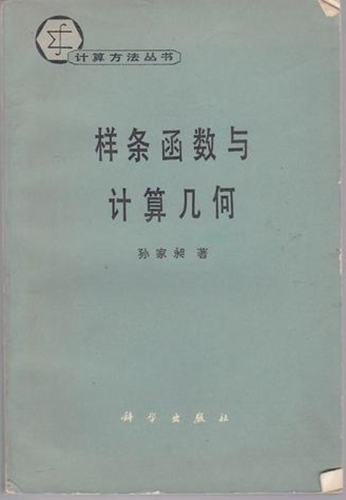

# 第4章　1982青岛：一个时代的起点

> "社会一旦有技术的需要，则这种需要就会比十所大学更能把科学推向前进。"
> ——恩格斯，1894

---

## 4.1　会议前夜

上一章已经说过，1981 年前后的那组"非正式接触"让几位学者意识到同一件事：中国的计算几何研究需要一个正式的集结场合。从意识到事件之间，隔着的是主办单位的确定、经费的筹措、议程的商定以及教育部门的合法性背书。这些工作在 1981 年底到 1982 年春天之间陆续铺开。据李心灿在会议闭幕时的发言，这次活动"在苏老的亲切关怀下，由复旦大学数学所、浙江大学数学系、山东大学计算机科学系联合举办"。三家联合主办单位的出现本身就是一件值得细看的事：在那个一切活动都倾向"单一主办"的年代，三所来自不同城市、分属不同教育系统的单位共同署名承办一次会议，是相当少见的做法。它反映了参与者们彼此之间在那两三年里已经建立起的信任，也提前预演了此后跨机构组织形态的运作方式。

会议之前，几条线索已经分别铺开。一条是教学层面的彩排——1980 年复旦大学举办的计算几何讲习班，第一次把来自二十余所高校与研究所的教师聚在同一个教室里系统听课，建立起了一个初步的人员名单和通讯网络，这些名字中的许多人将再次出现在 1982 年青岛的报到桌前。另一条是国际信息的回流——1979 年夏天，浙大梁友栋赴美国犹他大学 R.F. Riesenfeld 处访问，几乎同时，中科大常庚哲也被派往同一所大学访问数学系的 R. Barnhill 教授；1979 年 11 月，浙大汪国昭赴英国东英格利亚大学（UEA）。1980 年 5 月 4 日，苏步青在写给中科院计算所孙家昶的一封信中明确指出："今后我们工作的方向要转到世界先进单位的研究方面，决不可拘泥于自己原来的领域里。" 这封信里，苏步青还顺带提到了梁友栋从犹他大学寄回的来信内容："谈起图象仪的妙处与高级应用，可见，大势所趋，急需赶上。" 这两句私人信件中的判断，今天读来几乎可以视为对青岛会议必要性的提前论证。第三条线索则是教材的成型——1981 年由苏步青与刘鼎元合著的《计算几何》（上海科学技术出版社）正式面世，这是当时国内唯一可用的系统性中文教材。1982 年 7 月来到青岛的那些研究生、青年教师和工厂工程师中，许多人手里就是带着这本书上路的。

苏步青本人此时已年届八十，未亲临青岛，但在会议结束后撰写的《序言》中，他以一个奠基者对后辈的亲切口吻描述了这次集结。这份序言后来被收入会议论文集的首页，为这次会议留下了第一份具有权威性的同期书证。

## 4.2　会议本身

1982 年 7 月，"计算几何讨论会、短训班"如期在青岛举行。会议持续了约半个月，地点是青岛一所高校的会场。苏步青在序言中记录下会议的基本数据：全国六十八个单位、约一百三十名代表参会，会上共有十七篇论文汇编成集，委托浙江大学出版发行。这些数字在当时已经不算小——六十八个单位意味着几乎覆盖了所有与计算几何沾边的国内高校与研究所，而一百三十人的规模则意味着在青岛那所高校的会场里，每一排座位都坐满了从事或想要从事这门学科的人。

这次活动的结构颇具特色。按李心灿在闭幕发言中的概括，它是"讨论会 + 短训班"的双层结构：白天的上半场是讨论会，用于研究报告与专题讲座；下半场则是短训班，用于系统地向参会者普及理论与方法。这种安排之所以被反复提起，是因为它直接回应了那个年代中国学术界最突出的矛盾——既要给已有一定基础的研究者一个讨论前沿的场合，又要给仍在起步的年轻人一个系统学习的入口。双层结构的同时展开，让一次会议承担了两种本该由不同活动承担的功能。短训班的核心教材，正是前文提到的苏步青、刘鼎元《计算几何》——按李心灿在闭幕发言中的原话，"在短训班上学习的主要内容就是他和刘鼎元同志合著的《计算几何》"。

*图 4-1　孙家昶《样条函数与计算几何》（科学出版社，"计算方法丛书"）——把样条函数理论与计算几何并列在书名上，本身就是那一时期中国计算数学学派对新兴学科的一次方向性表态*

议程之中最有分量的，是一组"国际线 + 国内线"的双线报告。在国际线上，梁友栋、汪嘉业、唐荣锡、齐东旭、邓子琼这几位刚从海外归来的学者，分别介绍了美、英、法、西德、加拿大等国在计算几何与 CAGD 方向上的最新进展。对绝大多数与会者来说，这是他们第一次在同一场合、以系统化的方式听到这些国家在过去几年里做了什么——很多内容此前只在影印件和讨论班的口译里零星出现过。在国内线上，近年的研究成果被集中汇报出来：中国科学院的徐叔贤、复旦的刘鼎元、浙大的梁友栋与金通洸、山大的汪嘉业、吉大的齐东旭、北航的唐荣锡，以及来自工业界的上海五七〇三厂郭会琳、三机部六二五所徐微、六〇八所肖宏恩、南京航空学院丁秋林等，逐一走上讲台。这份名单本身就是一幅早期中国计算几何的共同体全景图：数学系教师、工科院校教师、研究所研究员、工厂工程师同台登场，没有谁被另一方视为外人。

从这些报告和讨论中整理出来的十七篇论文，构成了《浙江大学学报——计算几何专辑》的主要内容 [需核实：青岛会议论文集与 1984 年浙大学报专辑之间的具体关系——按王国瑾回忆，1984 年浙大学报专辑主要载入梁友栋回国后在离散 B 样条方面的三篇长文，与青岛论文集是否为同一物存疑]。论文的两个显著特色，在苏步青序言里被明确点出：第一是"几何化"，即以中国学者所熟悉的几何观点处理计算几何问题，形成与国际主流略有不同的独特风格；第二是"填补国内空白"，即在不少方向上做出了此前国内未曾系统触及的工作。

## 4.3　这次会议的几个特色

如果说 1982 年青岛会议为日后整个学科留下了什么气质上的底色，那么有四个特征值得专门记下。

第一是"民办"。李心灿在闭幕发言里用了这个词——一次全国性的学术会议由三家大学联合发起，没有某个上级部门的自上而下安排，经费花得不多，合作却相当顺畅。在 1982 年的中国，一次学术会议要达到这种状态并不容易。它要求主办单位在各自校内都具备足够的调动能力，也要求几位主要发起人之间的私人信任足以撑起议程磋商和经费协调这些琐碎而敏感的工作。"民办"这个词在这次会议里并非一种自我标榜，而是对一个事实的如实描述——之后很长一段时间里，计算几何协作组都保持着这种"不设编制、不走财政"的运作方式。

第二是跨界。会议报告人的名单里，来自上海 5703 厂的郭会琳、三机部 625 所的徐微、608 所的肖宏恩等工业界代表与来自高校的教授站在同一张议程表上，这在那个年代的学术会议上并不常见。这种学术与工业的同台，是对"理论与实际相结合"这一口号最直接的响应，也与前两章反复提到的"下厂"传统一脉相承。对许多青年教师和研究生而言，在青岛第一次见到工厂技术人员在大会上做学术报告本身，就是一次重要的观念冲击。

*图 4-2　计算几何协作组成员早年（八十年代）研讨交流场景——这张照片虽非 1982 年青岛现场，但它保留下来的工作方式，是青岛会议气质的直接延续*

第三是"中年知识分子为主"。李心灿在闭幕发言里特别提到了这一点。1982 年的中央刚刚颁布关于"落实中年知识分子政策"的文件，而这次会议恰好为这一政策提供了一个几乎同步的学界注脚——从议程到主持，承担着最多工作量的，正是一批年龄在四十上下的学者。这种结构既来自历史原因（经历过 1960 年代学术训练、又在 1970 年代下过厂的那一代人，此时恰好处于学术精力最充沛的阶段），也来自会议本身的定位（不追求仪式化的"权威压阵"，而偏向务实的工作会议）。

第四是"几何化"。这一点前文已经提及，这里需要再补一句：它不只是一种方法论的倾向，更是一种学派自觉的萌芽。苏步青本人是在微分几何方向上成长起来的，他的学生梁友栋、刘鼎元等人后来涉足计算几何，也都带着几何的眼光看待曲线曲面问题。1982 年的青岛会议第一次把"几何化"作为这个群体共同的方法论标签写在了序言里——而几乎同时期，苏步青正与浙大金通洸合作剖析 Bézier 曲线的几何本质，把所发现的包络定理冠以"金通洸磨光定理"之名，并在前往日本的论文报告会上加以介绍。"几何化"由此不只是一句口号，而是国际同行已能在具体定理中识别出的中国学者的一种风格。

## 4.4　从青岛到协作组：一段两年的过渡

关于"全国高校计算几何协作组"究竟在何时、以什么方式成立，现存史料的说法并不一致。按华宣积的口述回忆，协作组早在 1981 年 1 月便已由浙江大学、山东大学、北航、中科院、中科大、复旦等单位组成，青岛会议是它成立后举办的第一次大型活动；另有若干笔记则把协作组的正式成立定在 1982 年青岛会议期间。然而，依据浙大王国瑾在 2021 年所作的较为系统的回忆，协作组的正式成立时间应是 **1984 年**——王国瑾的原话是："1984 年，在苏老的大力支持下，在梁友栋的提议下，经刘鼎元、汪嘉业、常庚哲、齐东旭的积极活动，'高校计算几何协作组'正式宣告成立，苏老为顾问，浙大为组长单位。"

这三种说法各有侧重，但相互之间并非完全矛盾。一个比较合理的整合方式是：1981 年前后是几所单位之间"非正式协作"的开端（这便是华宣积所记忆的时间点）；1982 年青岛会议是这种非正式协作第一次以"讨论会—短训班"的方式公开集结，但当时尚未冠以"协作组"之名（这与李心灿在闭幕发言里只称"三校联合举办"而未使用"协作组"一词的事实相符）；1984 年，在两年的酝酿之后，协作组才以正式的名义宣告成立。本书在叙述时遵循王国瑾这一时间认定。至于"经教育部批准"这一表述，因目前尚未见到对应的批文档案，仅作存疑处理，待核实。

按王国瑾的记述，1984 年成立时，协作组的首批成员主要包括：苏步青任顾问，浙大梁友栋（1935— ）、金通洸（1934—2020）任组长单位代表；其余成员有复旦的刘鼎元、华宣积（1939— ），中科大的常庚哲（1936—2018）、冯玉瑜（1940—2016），山东大学的汪嘉业（1937— ），吉林大学的齐东旭（1940— ），中国科学院软件研究所的孙家昶，西北大学的穆玉杰，以及北京航空学院的唐荣锡（1928— ）。以机构和个人并列的方式概括，则可以这样说：协作组继承了 1982 年青岛"三校联合"的格局——由复旦数学所、浙大数学系、山大计算机科学系作为核心，向中科院、中科大、北航、西北大学、吉大等单位延伸；梁友栋、刘鼎元、汪嘉业是主要发起人，苏步青是精神上的支持者。

那么，1982 年到 1984 年之间这两年究竟发生了什么？除了几所单位之间的不间断走动之外，至少有一件事情在事后看具有标志性意义。1983 年，国家科委等八个部委在江苏南通召开**首届 CAD 应用工作会议**，几所参与协作的高校以"高校计算几何协作组"的名义（彼时尚未正式宣告成立，更接近于一个事实上的合作体）推选浙大梁友栋为代表，详细陈述了开发我国 CAD 软件的远大设想。按王国瑾后来的概括，"这标志着我国学者首次向高层直接发出'发展我国自主版权 CAD 产业'的庄严呼声"。这一发言的意义在于，它把青岛会议在学术层面所确立的"几何化 + 填补空白"的双重议程，第一次推到了国家科技规划的桌面上。从这个意义上说，1983 年南通是 1982 年青岛与 1984 年协作组成立之间的一座关键桥梁——青岛是学界的集结，南通是学界向国家的发声，协作组的正式成立则是这一发声获得回响后的组织化结果。

王国瑾在回忆这件事时给出的判断是"应运而生"。他用了四个字去描述协作组成立的过程——"天时地利人和"。所谓天时，是指它"正好碰上计算几何的诞生"这一国际学科节律；所谓地利，是指当时几所发起单位之间已经在 1981 年的非正式接触和 1982 年的青岛会议中建立了彼此的信任；所谓人和，则是指这一批刚从海外归来、对国际进展有共同感受的中生代学者。这些判断出自当事人的口述，带有明显的事后整理色彩，本书在引用时视其为"这一代人如何理解自己所经历的事情"的证言，而非对事件原委的唯一解释。

## 4.5　起点的意义

苏步青在 1982 年秋所写的那份序言里，留下了一句被后人反复引用的话：今后，希望"每隔一两年能够开一次这样的讨论会，出一本论文集，使计算几何的研究更加发展起来"。这句话在事后看，几乎成了一份"学科路线图"——接下来的十年里，协作组大约每两年一次的会议节律、每次会议之后一册论文集的结集方式，都可以追溯到这一句期望。

会议之后，青岛带来的另一项连锁效应是研究生培养的制度化。据华宣积的回忆，"然后各个高校结合着这个方向培养研究生"。这意味着"计算几何"不再只是几位老先生个人主持的研究课题，而是开始以课程、导师组、答辩委员会等制度化形式，在多所高校的数学系与计算机系里生根。事实上，浙大数学系早在 1978 年就已恢复研究生招生并设立了"计算几何"专业方向，由梁友栋、金通洸主持，首批入学的汪国昭、王国瑾、吕嘉钧、徐佩君（复旦 63 级）等人正是在 1981 年前后陆续毕业留校，构成了浙大团队的第一代——青岛会议为这一在浙大已经先行开始的实践提供了全国性的合法性与可见度，使其迅速在其他高校扩散。此后几年里，浙大、复旦、山大、中科院、北航等单位陆续有专门以计算几何与 CAGD 为方向的硕士、博士研究生毕业——他们将成为 1985 年后本书诸多故事的主角。

青岛会议留给这门学科最直接的遗产，因此可以用两句话概括：它把前三章中各自独立的线索汇合到了一张会议桌前；又把这张会议桌推向了一个以协作组为载体、以两年一次的会议和论文集为节律的长周期过程。从青岛到 1984 年协作组的正式成立，再到此后十六年的协作组运转直至 2001 年并入"中国工业与应用数学学会"成为"几何设计与计算专委会"，青岛是这条长链条的真正起点。从这里开始，中国计算几何的故事不再是几位奠基者的个人事迹，而成为一群人的共同事业。

---

::: tip 本章关键词
1982青岛 · 讨论会与短训班 · 双层结构 · 民办 · 几何化 · 1983南通 · 协作组(1984) · 苏步青序言 · 李心灿闭幕发言
:::

**→ 下一章：[第5章　全国计算几何协作组的成立及发展](./ch05)**

---

## 图说建议

- **图 4-1（fig_076）**：孙家昶《样条函数与计算几何》封面，把"样条函数"与"计算几何"并列作为学术宣言，是 1980 年代中国计算数学学派对新兴学科的方向性表态。
- **图 4-2（fig_027）**：计算几何协作组成员早年研讨交流场景。虽非 1982 青岛现场影像，但"讨论班文化"是青岛会议气质的直接延续。

## 待核实清单

- 全国高校计算几何协作组的精确成立时间——本书依王国瑾 2021 年回忆采用 1984 年说，与华宣积口述（1981 年 1 月）和部分笔记（1982 青岛期间）存在出入。建议参照各发起单位档案进一步核实。
- "协作组经教育部批准成立"一说目前未见正式批文，待核实其确切表述与文号。
- 1982 年青岛会议的具体会场地址与承办校方工作人员名单。
- 青岛会议论文集（十七篇论文）与 1984 年《浙江大学学报——计算几何专辑》之间的具体关系——按王国瑾回忆，1984 年浙大学报专辑主要刊登梁友栋回国后在离散 B 样条方面的三篇长文；与青岛十七篇论文是否为同一物，需进一步核实。
- 1983 年江苏南通"首届 CAD 应用工作会议"的具体日期、与会单位名单与梁友栋发言全文——目前依据王国瑾 2021 年回忆，建议核对国家科委 1983 年档案。
- 工业界代表（上海 5703 厂郭会琳、三机部 625 所徐微、608 所肖宏恩、南航丁秋林等）的完整单位名称与所作报告题目。
- 1984 年协作组首批成员名单的最终版本——王国瑾给出的名单与其他史料是否完全一致。