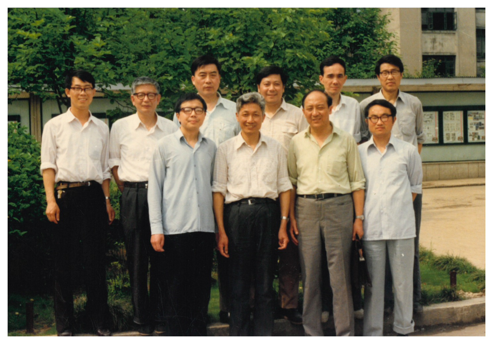
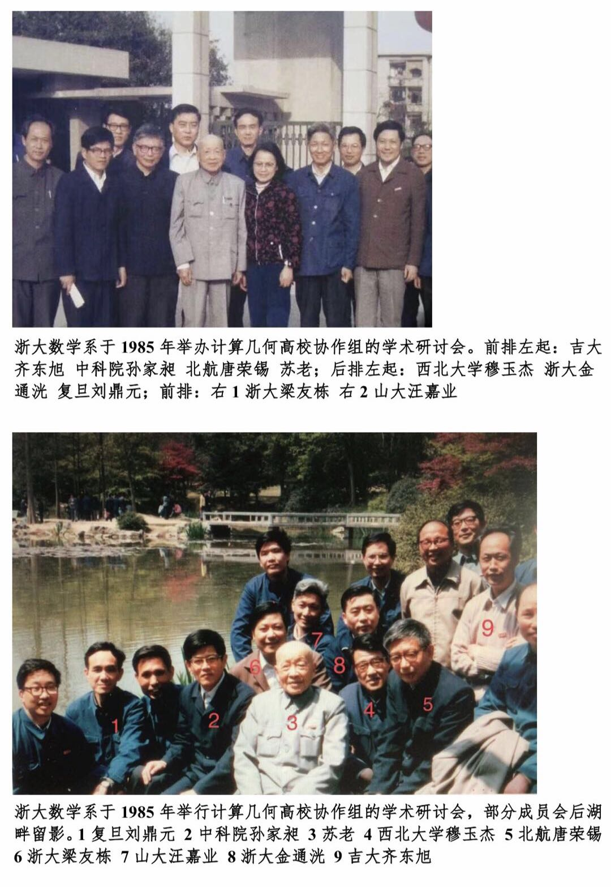
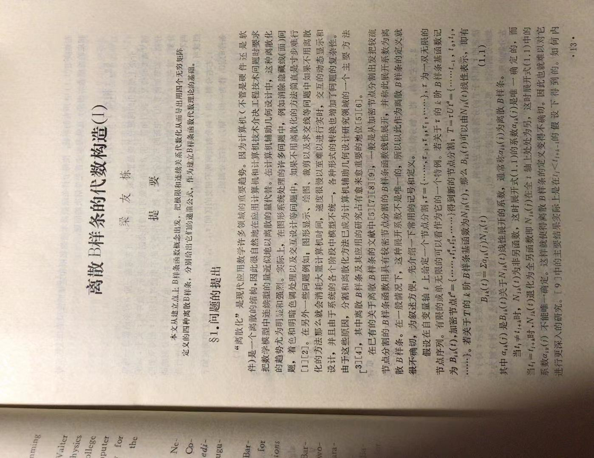
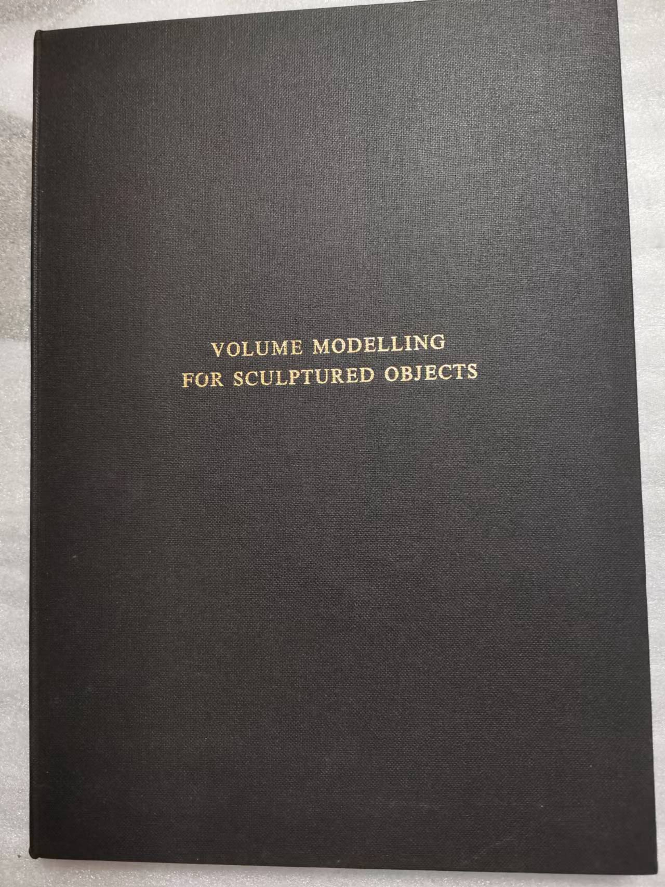

# 第5章　全国计算几何协作组的成立及发展

> "我们开会，是真的在讨论数学问题。没有 PPT，就在黑板上推导。有时候争论到深夜。"

---

## 5.1　为什么是复旦、浙大、山大

协作组在 1982 年青岛前后的雏形里，核心是三所大学——复旦、浙大、山东大学。这个"三角"不是一次事先的规划选拔，而是若干条既有学脉在同一个时代节点上自然汇到了一处。理解这一点，需要从三所学校与苏步青的学术关系讲起。

复旦大学之所以成为协作组的起点之一，原因几乎是不言自明的：1970 年代以来苏步青长期在复旦主持数学工作，1978 年起出任校长。苏步青不仅是全国数学界的旗帜性人物，也是中国计算几何学科最早的倡议者。他 1978 年的《计算几何的兴起》、1981 年与刘鼎元合著的《计算几何》，以及 1980 年主持的复旦讲习班，都把复旦数学系放在了这门新学科最早的教学与研究现场。刘鼎元作为苏步青学生、作为《计算几何》的合作者，在协作组早期承担着"教材人"的角色；华宣积等复旦数学家后来在 CAGD 方向上做出了持续的工作。复旦的加入，意味着这个新兴学科从第一天起就有一本"圣经级"的中文教科书可用。

浙江大学的加入，有着更久远的根源。苏步青 1931 年归国后的长期教学岗位就是在当时的浙江大学，1952 年院系调整才迁回复旦。他的学生群体里，从浙大教过的一批，到复旦期间带出的研究生，实际上构成了一张跨越南北的学术网络。梁友栋正是这张网的一个重要节点——1956 至 1960 年作为复旦研究生师从苏步青，1960 年后长期任教于浙大数学系。他 1979 年起的犹他大学访学，又把当时国际 CAGD 的最新进展带回了杭州。进入 1980 年代，浙大数学系的传统底蕴与梁友栋的国际视野在同一个系里汇合，再加上金通洸、董光昌、汪国昭等人在样条、逼近论与工业应用上的积累，使得浙大在协作组里的位置既有理论纵深，也有面向国际的锐度。

*图 5-1　1986 年，计算几何协作组成员在浙大校门口合影——浙大是协作组"三角"中最稳定的一极，兼具理论纵深与国际化面向*

山东大学的加入，则来自一条以工程为底色的路径。汪嘉业 1959 年毕业于山大数学系计算数学专业后长期在校任教，1970–1971 年在青岛红星船厂做船体数字放样，1972–1979 年参与山大自行研制十万次小规模集成电路通用计算机，1979 年赴英国东英吉利大学访学后，于 1981 年转入山大计算机科学系 [需核实：上述具体年份与单位变动来源]。他的学术路径——从造船工业回到数学系，再从数学系转入计算机系，再以访学身份面对国际 CAGD——几乎是一条浓缩的"中国计算几何工程化路径"。山大的加入，让协作组在数学与 CAGD 理论之外，天然具备了一支面向系统实现的队伍。

所以，协作组最初之所以是复旦、浙大、山大三家，不是因为它们在全国挑了三个"最好"的单位去代表计算几何，而是因为在 1981—1984 年这段时间窗口里，这三家恰好同时具备三种条件：苏步青学术人脉的直接覆盖、有过海外访学经验的中生代研究者、以及在前一阶段已经形成的工业合作基础。三家加在一起，才足以构成一个既能编教材、又能做研究、还能面向工程问题的最小可行集合。

在这三家核心之外，中国科技大学、中国科学院（孙家昶在软件所、徐叔贤等）、北京航空学院（唐荣锡）、吉林大学（齐东旭）、西北大学（穆玉杰）、南京航空学院等单位，作为延伸力量在 1982 年青岛前后已陆续进入协作组的活动范围。按浙大王国瑾在 2021 年所作的回忆，1984 年协作组正式成立时，被列入首批成员名单的有：苏步青任顾问，浙大梁友栋（1935— ）、金通洸（1934—2020）作为组长单位代表，复旦的刘鼎元、华宣积（1939— ），中科大的常庚哲（1936—2018）、冯玉瑜（1940—2016），山大的汪嘉业（1937— ），吉大的齐东旭（1940— ），中科院软件所的孙家昶，西北大学的穆玉杰，以及北航的唐荣锡（1928— ）。这份十二人左右的名单——加在一起几乎覆盖了那一时期全国所有有计算几何活跃研究的高校与研究所——既显示出协作组的跨地理覆盖度，也提示了一个事实：这一切关系网络的源头，仍可以追溯到苏步青、孙家昶、梁友栋、唐荣锡、齐东旭等几位关键人物之间的私人交情。这也是下一节要继续展开的话题。

## 5.2　协作组的组织方式

协作组在后来的三十多年里被反复谈起，但如果要用一句话概括它在 1980 年代的运作形态，最贴切的大概是"不设编制、不走财政"。它既不是学会，也不是专业委员会，不具备法人资格，没有公章，没有固定办公地点。它的日常运转几乎完全不依赖正式的行政链条 [需核实：协作组成立时是否有教育部正式批文——浙大王国瑾 2021 年回忆未提及批文，李心灿 1982 年闭幕发言只称"三校联合举办"，建议查阅各发起单位档案]。

与之对应的是，协作组成员各自的身份并不因为加入协作组而改变。一位浙大数学系教授仍然是浙大数学系教授，一位山大计算机系副教授仍然是山大计算机系副教授，他们在协作组里的角色更像是这些"本职身份"之外叠加的一重"工作关系"。会议由谁主办，经费就由谁在本校张罗；需要某位教授去另一所学校做主讲，就由两校之间通过非正式途径商定借调或客座安排。论文集由当年承办会议的单位委托出版社印行，印数与发行方式也随行就市。在今天看来，这样的组织方式几乎无法想象；但在当年有限的资源条件下，它恰恰提供了一种轻巧而有弹性的运作模板。

*图 5-2　协作组早年研讨交流场景——没有会议手册、没有讲台灯光，甚至没有固定的会场，"开会"更接近一次持续若干天的讨论班*

这种组织方式之所以能够运转起来，根本上依靠的是一张"人情网络"。苏步青是精神上的象征，他很少直接介入具体事务的协调，但他的存在本身就为协作组提供了在各校内部调动资源时不可替代的合法性。真正把日常事务扛在肩上的，是梁友栋、刘鼎元、汪嘉业等中生代学者，他们彼此之间在 1981 年前后的那几次非正式接触中已经建立了充分的个人信任，使得事关经费、议程、招生、联合指导等敏感话题能够在电话和通信里顺利推进。一次跨校借调研究生去参加另一所学校的讨论班，可能只是一通十分钟的长途电话；一次联合申请课题的分工，可能只是一封来回两周的航空信。

这种"民办"风格与上一章李心灿在 1982 年闭幕式上所说的"民办"一脉相承。李心灿当时是把"民办"作为一种会议气质来描述的，而到了协作组的日常阶段，它已经从气质沉淀为一种工作方式——凡事从最小代价出发，凡事先把数学问题讨论清楚再谈组织形式。与今天大量学术活动越来越行政化、程序化的面貌相比，这种工作方式自然有其时代局限，但也正因如此，它为后来的中国计算几何留下了一份不依赖行政资源便可展开严肃研究的方法遗产。

## 5.3　早期会议与讲义

协作组在 1984 年正式成立之后的最初十年里，基本保持着每一到两年举办一次全国性研讨会的节律。这个节律可以追溯到苏步青 1982 年青岛序言里留下的那句期望——"每隔一两年能够开一次这样的讨论会，出一本论文集"。会议的主办单位在浙大、山大、复旦之间轮换，偶尔也由兄弟单位临时承担。会议的地点并不固定，杭州、青岛、威海、黄山、千岛湖等地都留下了那几年协作组讨论的痕迹。按王国瑾的回忆，由于浙大是组长单位、山东大学热情好客，活动地点实际上"最多设在山东与杭州"——这并不是规则上的安排，而是若干年下来逐渐固定的事实。

1985 年在浙江大学举办的计算几何学术讨论班，是协作组以正式名义组织的首次大型活动，也是青岛之后第一个规模较大的学术集结。据现存记录，苏步青已年届八十三岁，仍然专程从上海赶到杭州出席这次讨论班。这个细节在日后被反复提起——一位八十高龄的老先生亲自到场，不仅为讨论班增添了分量，也为台下一批第一次见到苏老的青年研究者留下了深刻印象。1985 年的浙大讨论班在议题上延续了青岛会议"国际线 + 国内线"的双线结构，但整体篇幅更偏重最新研究成果的交流，而非普及性的短训。

*图 5-3　1985 年浙江大学计算几何学术讨论班现场，苏步青亲自出席——青岛之后第一次较大规模的学术集结*

1986 年是协作组极为活跃的一年。浙大在这一年先后主办了校园内的一次讨论会和一次千岛湖会议，黄山亦留下过一次同期的协作组活动 [需核实：1986 年浙大校内会议、千岛湖会议与黄山会议三者的关系及各自的主办性质]。山大则在同年在威海举办了一次计算几何培训班。千岛湖会议的场景在日后被参与者反复回忆——封闭的湖光山色、一组围坐讨论的学者、黑板上密密麻麻的推导——成为浙大学派"封闭式学术讨论"传统最有代表性的注脚之一。

*图 5-4　1986 年高校计算几何协作组千岛湖合影——在协作组制度初步稳定的这一年，千岛湖成为浙大系最有代表性的学术讨论地点之一*

1988 年在威海的那次会议，则是协作组在 1980 年代后半段最具代表性的集结。按相关材料，这次会议由山东大学汪嘉业等主办，出席者包括华宣积、冯玉瑜、汪嘉业、金通洸、唐荣锡等在协作组中最为活跃的一批学者。会议的规模与议题的密度都比 1985 年浙大讨论班更进一步，被视为协作组三角格局正式成形的节点事件。

*图 5-5　1988 年威海计算几何会议——协作组在 1980 年代后半段最具代表性的一次集结*

在会议之外，协作组对整个学科文献生态的贡献还体现在教材与讲义的合作编写上。除了前文已反复提到的苏步青、刘鼎元《计算几何》（1981）作为"圣经级"教材之外，协作组骨干成员在 1980 年代中后期还陆续组织编写了若干部面向研究生和青年教师的系统性教材。其中具有代表性的一部，是由唐荣锡、汪嘉业、彭群生等联合编著、1990 年 4 月由科学出版社出版的《计算机图形学教程》。这本书从协作组跨学派合作的意义上讲尤其值得一提——主编阵容同时覆盖了北航、山大、浙大三家，其体例与深度在当时堪称同类教材之最，初版后先后印刷七次，并在 1995 年获电子工业部优秀教材奖。

*图 5-6　唐荣锡、汪嘉业、彭群生等编著《计算机图形学教程》（科学出版社，1990）——协作组跨学派合作最具代表性的教材之一*

与正式出版的教材并行存在的，是大量以"内部讲义"形式存在的文献。每次协作组会议结束后，主办单位会把本次讲义整理成油印册或铅印册，在成员单位之间传阅；部分章节在此后几年里进入正式教材，另一些则只保留在少数研究者的抽屉里 [需核实：各年份讲义的完整清单及现存情况]。在影印技术仍不普及的年代，这种"内部讲义"既是学术成果的载体，也是协作组内部知识流动的实际线路。

协作组合作不久之后，开始结出一批国际化的成果。1983 年，彭群生在英国东英吉利大学完成博士论文《Volume Modeling for Sculptured Objects》，是中国人在 CAD 领域完成的最早的一批博士论文之一；1984 年《浙江大学学报》刊出"计算几何专辑"，梁友栋以三篇长文系统论述了他回国以后在离散 B 样条方面的理论研究成果 [需核实：此专辑与 1982 年青岛会议十七篇论文集之间是否为同一物——按王国瑾回忆，专辑核心是梁友栋三篇长文；按苏步青序言，青岛十七篇汇编亦委托浙大出版，两者关系待考]；同期汪国昭在曲面细分与求交方面的工作也已成形，后被 Ron Goldman 在其专著中以"Wang's formula（汪氏公式）"之名加以引用；而梁友栋早在 1979–1982 年访美期间就已发明的 Liang-Barsky 裁剪算法，在那几年里也通过《Communications of the ACM》等渠道写入了国际同行的教科书。到 1988–1989 年，浙大 CAD/CAM 研究中心的朱寅宁、彭群生、梁友栋三人合著的一组真实感图形算法论文，先后获得国际期刊《Computers & Graphics》的 1988–1989 年度最佳论文奖，以及欧洲图形学年会 Eurographics '89 的 Best Paper Award（二等奖）。这两项国际奖项在同一年内连续斩获，是中国计算机图形学走向国际舞台的标志性事件——而支撑这一事件的人员网络，正是几年前那个在青岛第一次聚到一起、又在 1984 年正式合署成军的协作组。

*图 5-7　梁友栋《离散 B 样条的代数构造（Ⅰ）》，发表于 1984 年《浙江大学学报——计算几何专辑》*

*图 5-8　彭群生 1983 年在英国东英吉利大学完成的博士论文《Volume Modeling for Sculptured Objects》，中国学者在 CAD 领域最早的博士论文之一*

*图 5-9　1989 年 Pergamon Press 颁发给浙江大学朱寅宁、彭群生、梁友栋的《Computers & Graphics》1988–1989 年度最佳论文奖证书，由出版人 Robert Maxwell 签署*

## 5.4　协作组的学术氛围

如果把前述会议、教材与成果放在一起看，协作组在 1980 年代的氛围有一个无法忽略的底色——匮乏。经费的匮乏：一次全国性会议的开支常常要靠主办单位从校内外零散筹措，出差的车旅费要排队审批，印论文集的纸张曾经是协作组反复讨论的具体话题之一。文献的匮乏：国际主流期刊几乎无法通过正常渠道订阅，一份《Computer Aided Design》或《ACM Transactions on Graphics》的影印件常常在几位学者之间辗转传阅，有人读完批注，再把原件寄给下一位。国际交流的匮乏：出国访学名额极为有限，外汇配额更为紧张，一次国际会议出差动辄需要半年以上的筹备，因而能站在国际讲台上的人屈指可数。

这些匮乏并非只是当事人事后追溯时加上去的色彩，而是 1980 年代协作组日常工作的真实底色。然而正是在这种底色之上，协作组却塑造出了一套独特的学术氛围。第一，重视基础理论而非追逐热点。由于无法实时获得国际最前沿的论文，协作组的讨论往往只能从基本定义和基本定理入手，反复推演；这种"由基本功入手"的习惯，后来被这一代学者带入了各自培养的学生之中。第二，师生关系密切，口传心授。由于印刷与复印资源有限，一个学生要从导师那里获得一份完整的讨论班讲义，常常意味着从导师的办公桌上借走一份钢笔手稿，再自己抄一遍；这种"抄讲义"的经历被后来的许多学生称为他们学术训练里最核心的一段。第三，跨机构合作不计较署名顺序。由于协作组里的研究者们都清楚彼此的贡献，很多合作论文在署名时并不刻意排序；有时几位学者共同完成的工作会以其中一位的名义发表，而其他几位只在致谢中出现——这在今天看来极不严谨，在当时却是一种默认的合作伦理。第四，工程问题与数学理论紧密结合。这一点承接了上一章里 1982 年青岛会议的"理论联系实际"精神，也直接对应协作组三家核心单位各自的历史路径——无论是船体放样、飞机外形、还是数控绘图，在协作组的讨论班里从来不被视为"不够理论"的话题。

把这四条拢在一起，就是本章开篇那句引语所描述的那种工作场景：没有 PPT，只有黑板；没有短暂的 15 分钟报告，只有可以延续整整一下午甚至争论到深夜的讨论；没有先发论文再谈数学，而是先把数学问题讨论透再决定是否写文章。

匮乏并不意味着冷峻。协作组的另一面是一种近乎家庭式的温情。按王国瑾的回忆，"这个高校计算几何协作组几乎每年暑假都开展交流活动，由于山东大学热情好客，浙江大学是组长单位，所以活动地点最多设在山东与杭州。每当兄弟院校代表到杭，金通洸总要在学术报告结束后，带大家去杭州最好的面馆品尝美味的杭州蟮面"。他用了一句话来概括这种状态——"高校协作组亲如一家人"。这种细节并不会出现在任何一本正式会议纪要里，却恰恰是协作组运作得以持续十六年的关键之一。学术上的反复推演与生活上的真诚交往在同一群人身上同时展开，使协作组既具备了一套严肃的学术伦理，也具备了一套足以撑过 1980 年代物质匮乏的人际生态。

这种氛围在今天还剩多少，本书不打算在这里展开讨论。可以肯定的一点是：1980 年代这一段"匮乏造就专注"的协作组生涯，为后来的中国计算几何留下了一份共同的性格底色。此后几章里将逐一写到的浙大、复旦、山大、北航、中科院等不同学派，尽管路径不同、气质各异，但它们在对待基础理论的态度、在师生关系的亲密程度、在跨机构合作的默契上，几乎都带着同一份协作组岁月留下的底色。

协作组本身则在 1984 年成立之后又延续了十六年。到 2001 年，在清华等单位的努力之下，它最终归入"中国工业与应用数学学会"麾下，转型为正式的"几何设计与计算专业委员会"（即今天通称的 GDC）。汪国昭出任 GDC 首届主任。一个不设编制、不走财政、靠人情网络维系的合作体，在走完了将近二十年的历程之后，以学术建制的形式获得了延续——这是协作组的终点，也是后续故事的起点。本书第十一章及之后的章节将沿着这条线索继续展开。

---

::: tip 本章关键词
协作组(1984成立) · 复旦 · 浙大 · 山大 · 民办 · 1985 浙大讨论班 · 1986 千岛湖 · 1988 威海 · 《计算机图形学教程》 · Computers & Graphics 最佳论文奖 · Eurographics '89 · 2001 转型为 GDC
:::

**→ 下一章：[第6章　浙江大学：玉泉数学系的计算几何团队](../03-schools/ch06)**

---

## 图说建议

- **图 5-1（fig_022）**：1986 年计算几何协作组成员在浙江大学校门口合影——浙大作为协作组"三角"中最稳定一极的视觉象征。
- **图 5-2（fig_028）**：协作组早年研讨交流场景，代表"不设编制、不走财政"的工作形态。
- **图 5-3（fig_016）**：1985 年浙江大学计算几何学术讨论班，苏步青亲自出席，协作组以正式名义组织的首次大型活动。
- **图 5-4（fig_225）**：1986 年高校计算几何协作组千岛湖合影——浙大学派"封闭式学术讨论"传统的典型注脚。
- **图 5-5（fig_018）**：1988 年威海计算几何会议，协作组在 1980 年代后半段最具代表性的一次集结。
- **图 5-6（fig_062）**：唐荣锡、汪嘉业、彭群生等编著《计算机图形学教程》（科学出版社，1990）——协作组跨学派合作最具代表性的教材。
- **图 5-7（fig_046）**：梁友栋《离散 B 样条的代数构造（Ⅰ）》，发表于 1984 年《浙江大学学报——计算几何专辑》。
- **图 5-8（fig_048）**：彭群生 1983 年英国东英吉利大学博士论文《Volume Modeling for Sculptured Objects》。
- **图 5-9（fig_058）**：1989 年《Computers & Graphics》期刊 1988–1989 年度最佳论文奖证书，颁发给浙江大学朱寅宁、彭群生、梁友栋。

## 待核实清单

- 协作组 1984 年正式成立时是否有教育部正式批文——本书目前依据王国瑾 2021 年回忆采用 1984 年说，但批文档案尚未见到。建议核对教育部 1984 年文件与各发起单位档案。
- 5.1 节中关于汪嘉业 1959 年毕业、1970–1971 年在青岛红星船厂、1972–1979 年参与十万次机研制等细节的具体来源——王国瑾 2021 年回忆未涉及这些年份，建议核对山大档案或汪嘉业本人撰文。
- 1986 年黄山会议的具体主办方、议程以及在协作组历史中的确切地位——现有史料只能证明"那一年有一次黄山会议"，尚不足以断定其与千岛湖会议、浙大本部会议的主从关系。
- 1986 年千岛湖会议的确切日期与参会者完整名单。
- 1988 年威海会议的完整议程、主办经费来源与会议论文集是否正式出版。
- 协作组各年讲义（1983–1990）的完整清单与现存档案情况。
- 《浙江大学学报——计算几何专辑》（1984）与 1982 年青岛会议论文集之间的关系——按王国瑾回忆，专辑核心是梁友栋离散 B 样条三篇长文；按苏步青 1982 年序言，青岛十七篇论文亦委托浙大出版。两者是否为同一物，待考。
- 1989 年 Eurographics 二等奖与 Computers & Graphics 最佳论文奖两项奖项的完整获奖论文信息（期、号、页码）。
- 协作组从 1984 年成立到 2001 年转型为 GDC 这十六年间的完整年会记录与主办单位轮换情况。