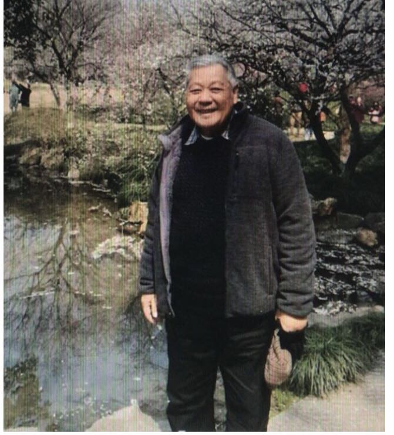
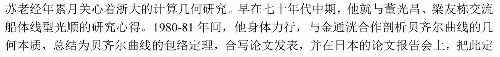
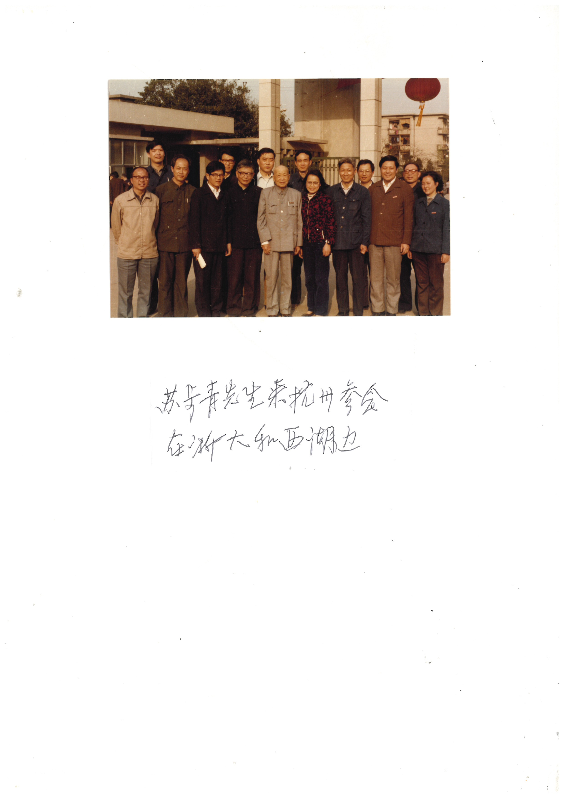
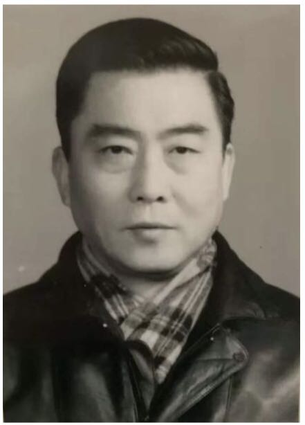
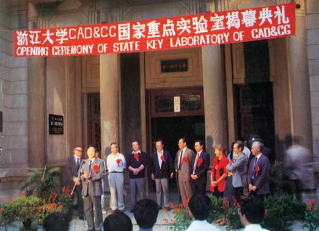
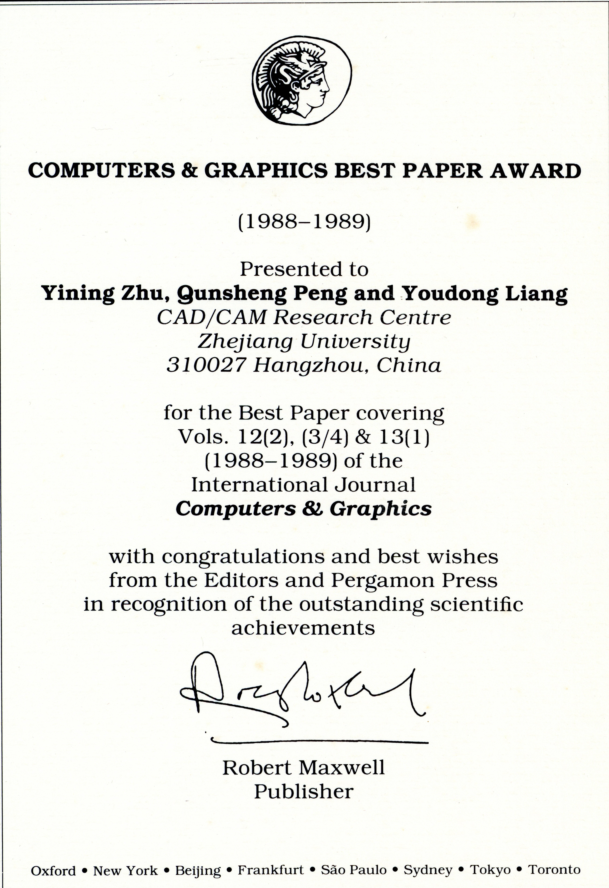
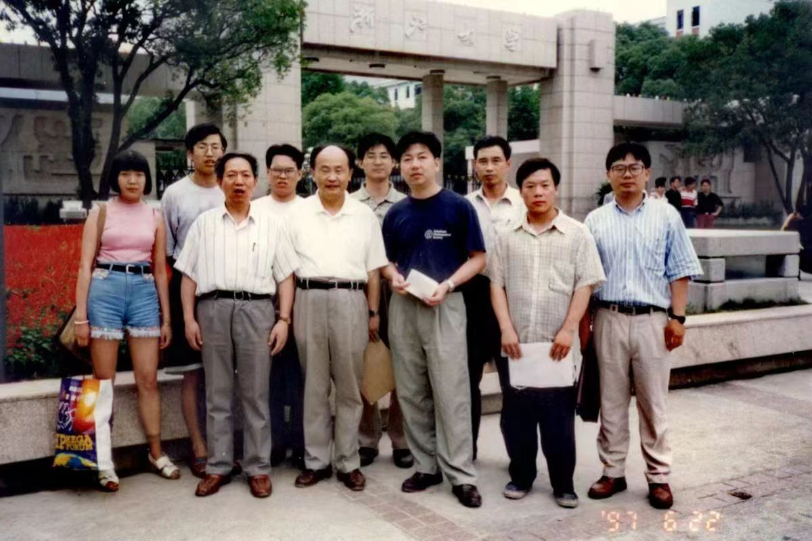
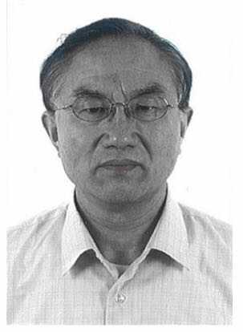
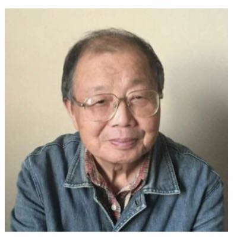

# 第6章　浙江大学：数学根基与几何方法

> "今后我们工作的方向要转到世界先进单位的研究方面，决不可拘泥于自己原来的领域里。"
> ——苏步青致孙家昶，1980 年 5 月 4 日

---

## 6.1　玉泉的土壤

把浙江大学放进中国计算几何的故事里，先要回到玉泉校区那座以"应用数学"为名的系。1980 年代初，玉泉浙大应用数学系在全国工科院校的应用数学系中位居首列。"应用"二字与"计算几何"在"工业应用"目标上完全吻合——这一点在日后被王国瑾在 2021 年的回忆里反复点出：天时、地利、人和。

学派的根脉则要更早。苏步青 1931 年归国后长期任教于当时的浙江大学，1952 年院系调整才迁回复旦，1978 年起又出任复旦校长。这层"半个浙大人、半个复旦人"的双重身份，使得日后浙大数学系承接计算几何这门新学科时，从一开始就处在苏步青学术网络的中心位置。梁友栋 1956 至 1960 年在复旦师从苏步青，1960 年研究生毕业后即任教浙大数学系——师生关系跨越两座学府的安排，本身就是学派源流的一个微缩切片。

七十年代中期，与全国其他高校一样，浙大数学系的老师们也带着各自的数学训练走进了车间。复旦苏步青三赴江南造船厂，浙大董光昌奔走于上海求新造船厂、嘉兴造船厂、宁波造船厂之间，1978 年由科学出版社出版了《船体数学放样回弹法》专著。梁友栋则被派到六机部十一所——也就是上海船舶工艺研究所——与该所的何援军合作攻关；何援军是汪国昭在浙大数学系的同班同学，这层人脉关系将在此后近半个世纪里反复在协作组里出现。金通洸的去向更杂一些，杭州机床厂、沈阳水泵厂等地都留下过他的踪迹，研究主题是螺杆泵设计与加工的数学原理；与之相关的成果在 1977 年由科学出版社结集为《数学在螺杆泵设计与制造的应用》，金通洸还与蔡耀志等开展数控绘图的正负法与 TN 法研究。同期，浙大杨士林率队访问英国剑桥大学实验室，回国后向系里通报了对方用计算机辅助设计花瓶的具体细节——国际大气候与下厂经验在这里第一次"不谋而合"，按王国瑾后来的总结，结论只有六个字："一要建队，二要合作。"

这便是玉泉的土壤。1970 年代中期下厂的那批老师，在 1978 年研究生招生恢复时已经准备好了第一批问题、第一批合作伙伴与第一批可以带的学生。

## 6.2　1978：研究生招生与团队雏形

1978 年，玉泉浙大恢复研究生招生。计算机系何志均招收潘云鹤等四位硕士生；数学系则以董光昌、郭竹瑞、梁友栋为首，分微分方程、函数逼近论、计算几何三个专业方向招收三年制硕士生。计算几何方向首批入学的是汪国昭、王国瑾、吕嘉钧（三人分别为浙大 63、62、64 级），以及一位从复旦 63 级招进来的徐佩君。在那一届新生里，"中年知识分子"是普遍底色——汪国昭、王国瑾都是 1944 年生，1978 年入学时已三十四岁。文革年月里散落各地的青壮年学者，赶在恢复招生的这一年回到了课堂。

主导师是梁友栋，金通洸协助。但仅仅过了一年，1979 年夏天梁友栋就被国家派往美国犹他大学做访问学者，1979 年 11 月汪国昭也赴英国东英格利亚大学（UEA）。计算几何方向的硕士培养，由金通洸独自挂帅完成。王国瑾、吕嘉钧、徐佩君三人的硕士学位最终由金通洸指导完成；他们读硕期间还曾肩背被褥到杭州卡车厂蹲点一个月，搞卡车外形设计——这段经历日后被反复用作"理论联系实际"的注脚。

第一届毕业生的去向，几乎可以视为那个年代知识分子选择的一个缩影。汪国昭赴英、徐佩君后自费赴美攻博并定居美国，王国瑾留校。1981 年王国瑾、1983 年汪国昭先后毕业留校，按王国瑾自己的话说，"以梁金为首的数学系计算几何团队于 1981 年正式建立并开始运作"。这是浙大计算几何团队的真正起点——比 1984 年高校计算几何协作组的正式成立还要早三年，比 1985 年 CAD&CG 国家重点实验室立项早四年。

*图 6-1　梁友栋（1935— ）——浙大计算几何团队的创始人，1979–1982 年赴美访学期间提出 Liang-Barsky 裁剪算法*

## 6.3　走出去与带回来：1979–1983 的国际接触

走出去的不止梁友栋一人。1979 年夏天，梁友栋赴美国犹他大学计算机系 R.F. Riesenfeld 教授处；几乎同时，中科大数学系的常庚哲也被派往同一所大学的数学系访问 R. Barnhill 教授。其时犹他大学是全美 CAGD 研究的重镇——Riesenfeld 主攻 B 样条曲面的计算与显示，Barnhill 主攻函数逼近论意义下的 CAGD——在世界上都处于领先地位。1979 年 11 月汪国昭赴 UEA；1983 年 10 月，浙大应数系还从英国 UEA 接回了一位 CAD 博士——彭群生，他在 A.R. Forrest 处获学位后于 1983 年年底加盟浙大应数系，被系主任梁友栋派往新建的 CAD&CG 国家重点实验室作为应数系代表，历任副主任与主任。

走出去的同时，关键算法也在国外完成。Liang-Barsky 裁剪算法是梁友栋 1979–1982 年在美国期间提出并发表的，此后通过国际同行的教科书写入了图形学领域的标准曲目；Wang's formula（汪氏公式）则是汪国昭在 UEA 期间在曲面细分与求交方面的工作，二十多年后由 Ron Goldman 在专著《Pyramid Algorithms》中以 Wang's formula 之名加以介绍——这两个以中国学者姓氏冠名的成果，都不是回国以后才做出来的，而是在那两次访学里就已经完成的。

带回来的工作则是从 1982 年开始的。梁友栋于 1982 年回国，回到玉泉之后随即在本校与复旦做学术报告，把美国一线的研究动态系统讲了一遍。前述这场学术报告会留下了一张十一人的合影——前排左起为中科大常庚哲、浙大金通洸、北航唐荣锡、西北大学穆玉杰、梁友栋、复旦华宣积；第二排左起为复旦曹沅、浙大吕伟、浙大王国瑾，第二排右一为上海船研所何援军；后排右二为浙大郑建民。这是一张"浙大、复旦、北航、中科大、西北大学、船研所"六家共五城聚于复旦数学系的合影，是浙大人回国之后立刻把信息传遍全国学术网络的具体证据。

需要特别说明的是：fig_077–083 那一组合影是 1979–1982 年学者们在美国犹他大学和英国 UEA 的访学合影，归属于"国际接触"主线下 1981 年前后的"碰撞"叙事，与 1982 年回国后的复旦报告会并非同一场景。本章只在文字里引用前者作为浙大人国际接触的背景，照片本身仍归海外访学群像的章节使用。

[图待补：fig_TBA_001——1982 年梁友栋访美回国后在复旦大学数学系学术报告会合影（11 人，详见 book_004 page 13）]

## 6.4　苏步青的关怀与"金氏磨光定理"

苏步青对浙大团队的关怀贯穿整个 1980 年代。一方面是老浙大数学系主任对故土母校的牵挂，另一方面是老师对学生（梁友栋）跨越两所大学的师生情谊，再一方面则是这位早已年届八十的微分几何学家对一门新兴学科真切的兴趣。三种感情合在一起，使得苏老对浙大计算几何团队的扶持远超一般意义上的"老一辈支持新一辈"。

他与金通洸在 1980–1981 年合作剖析 Bézier 曲线的几何本质，得到一条被苏步青本人冠名为"**金通洸磨光定理**"的 Bézier 曲线包络定理，并合写论文发表。1981 年苏老前往日本参加论文报告会时，把这条定理以"金氏磨光定理"之名作了正式介绍。这是中国学者命名的第一个被苏步青在国际场合主动推介的计算几何定理。

[图待补：fig_TBA_005——1980 年 5 月 4 日苏步青致中科院孙家昶信扫描件（详见 book_004 page 12）；待核实 fig_085 是否即为此件]

苏步青写给中科院计算所孙家昶的那封 1980 年 5 月 4 日的信，更是浙大主线的一份关键史料。原文如下：

> 家昶同志：
>
> 接到手书，获悉讲学胜利归来。大开眼界，非常高兴。今后我们工作的方向要转到世界先进单位的研究方面，决不可拘泥于自己原来的领域里。
>
> 浙大梁友栋在 Utah 大学 Reisenfeld 处学习，曾给来过信，谈起图象仪的妙处与高级应用，可见，大势所趋，急需赶上。
>
> 先此奉复，顺公祺
>
> 撰安
>
> 苏步青　1980.5.4

这封一百余字的私人信件信息密度极高：一方面把"转到世界先进单位的研究方面"作为整代人的方向性判断写下来；另一方面把孙家昶的访美讲学和梁友栋在犹他大学的访学并置——前者代表中科院线、后者代表浙大线，苏老在同一封信里同时关心两条国际化通道，这也正是他此后两年继续推动 1982 年青岛会议、1984 年协作组成立的内在逻辑。

*图 6-2　苏步青向同行介绍"金氏磨光定理"——这是中国学者命名的第一个被苏步青在国际场合主动推介的计算几何定理*

[图待补：fig_TBA_002——苏步青八十年代在复旦主持的计算几何讨论班合影（华宣积、孙家昶、苏老、胡和生、汪嘉业、常庚哲、刘鼎元、梁友栋共 8 人，详见 book_004 page 13）]

王国瑾在 1981 年解决了 1978 年盐湖城第一届国际 CAGD 会议上提出的一个公开问题——圆弧样条逼近及圆柱螺线样条逼近的收敛性证明与算法。论文初稿由金通洸递交苏老。苏老的处理方式直截了当：把这篇浙大学生的初稿布置到复旦的几何讨论班上，让讨论班的几位老先生与中年学者共同审读。出席这次讨论的，按现存合影记录，是复旦华宣积、中科院孙家昶、苏老本人、复旦胡和生、山大汪嘉业、中科大常庚哲、复旦刘鼎元、浙大梁友栋共八人——一份跨复旦、浙大、山大、中科大、中科院五家的"全国级"审稿名单，为一篇浙大硕士的论文初稿专门组织了一次跨校讨论班。这是苏老对浙大团队的扶持中最具体的一次。

[图待补：fig_TBA_006——金通洸到华东医院看望苏老的合影；金通洸送苏老的对联书法"风范舆卓识齐仰，贤德共高寿俱望"]

师生与友谊的另一面，则保留在两副对联里。金通洸送苏老的是"风范舆卓识齐仰，贤德共高寿俱望"，苏老回赠的则是刘禹锡《浪淘沙》九首其八里的两句——"千淘万漉虽辛苦，吹尽狂沙始到金"——巧妙嵌入"金"字以呼应金通洸。1985 年苏老 83 岁高龄，亲临浙大数学系参加协作组的学术研讨会。这一事件的合影可能对应 fig_034 / fig_035（1985 年浙大数学系研讨 C1 / C2 系列）[需核实：合影中是否能够辨认出苏老身影]。

*图 6-3　苏步青先生来杭州参加学术活动——老浙大数学系主任对故土母校的牵挂，贯穿了整个 1980 年代*

*图 6-4　金通洸（1934–2020）——金通洸磨光定理的发现者之一，1990–1997 年间任浙大计算几何团队负责人*

## 6.5　1984：协作组与"组长单位"

第五章已经写过协作组本身的成立、运作与气质，本节只聚焦浙大作为组长单位的具体动作，避免重复。需要再次强调的是协作组的成立时间——本书统一采用 **1984 年**说，依据是王国瑾 2021 年的系统回忆："1984 年，在苏老的大力支持下，在梁友栋的提议下，经刘鼎元、汪嘉业、常庚哲、齐东旭的积极活动，'高校计算几何协作组'正式宣告成立，苏老为顾问，浙大为组长单位。"——这一表述与第四章、第五章的口径一致。

浙大在协作组里承担的"组长"角色，在 1984 年正式成立之前其实已经先行一步。1983 年，国家科委等八个部委在江苏南通召开首届 CAD 应用工作会议，几所合作单位以"高校计算几何协作组"名义（彼时尚未正式宣告成立，更接近一个事实上的合作体）推选浙大梁友栋作为代表，详细陈述了开发我国 CAD 软件的远大设想。按王国瑾的概括，"这标志着我国学者首次向高层直接发出'发展我国自主版权 CAD 产业'的庄严呼声"。这一呼声的落点是国家级科技规划，发声者却是浙大数学系主任——浙大对全国学科的"组长式贡献"，从这一年就已经开始。

1984 年《浙江大学学报》随即刊出"计算几何专辑"，梁友栋以三篇长文系统论述他回国以后在离散 B 样条方面的理论研究成果（专辑封面图见第五章图 5-7，本章不重复配图）[需核实：此专辑与 1982 年青岛会议十七篇论文集是否为同一物——按王国瑾回忆，专辑核心是梁友栋三篇长文；按苏步青序言，青岛十七篇汇编亦委托浙大出版]。学报的"专辑"形式本身就具有协作组组长单位的意味——没有专门刊号、没有正式资助，靠的是组长单位自己的学报版面把全国性的研究成果集中刊出。

协作组的日常运作里，浙大也承担了实际的组织成本。按王国瑾的回忆，"这个高校计算几何协作组几乎每年暑假都开展交流活动，由于山东大学热情好客，浙江大学是组长单位，所以活动地点最多设在山东与杭州。每当兄弟院校代表到杭，金通洸总要在学术报告结束后，带大家去杭州最好的面馆品尝美味的杭州蟮面。"这段细节在第五章已作过引用，本章不再展开，仅作为浙大组长身份的具体注脚再点一句——杭州蟮面是 1980 年代浙大对协作组最具体的"东道主礼数"，金通洸是这一礼数的实际执行人。

## 6.6　国家重点实验室与国际突破

1984 年起梁友栋出任浙大应用数学系系主任，把数学系-机械系-计算机系的学科交叉提到了一个新高度。同一时期，他兼任浙江大学 CAD/CAM 中心主任，并联合计算机系石教英、机械系应道宁等人，开始筹建后来声誉极高的"CAD&CG 国家重点实验室"。这条路径的展开是分阶段的：1985 年实验室成功立项，1989 年正式列入国家建设计划，1992 年通过验收；梁友栋出任首位学术委员会主任，此后实验室多次被评为 A 类，两次获金牛奖。数学系计算几何团队为实验室培养与输送的科研骨干包括谭建荣、高曙明、鲍虎军、张三元、童若锋、刘新国、张宏鑫、蔺宏伟、郑友怡等——其中一位日后出任实验室主任，另两位出任副主任。

*图 6-5　《VAX系列（UNIX）机械产品 CAD 支持系统的研究》课题论证会现场——1980 年代国家级 CAD/CAGD 重大课题的代表性学术评审活动，是浙大筹建国家重点实验室前后的具体场景之一*[需核实：具体年份与参会名单]

*图 6-6　浙江大学 CAD&CG 国家重点实验室揭幕典礼*[需核实：揭幕年份究竟是 1989 年（列入国家建设计划当年）还是 1992 年（通过验收当年）]

筹建国家重点实验室的同一段时间里，浙大团队在国际期刊上连续完成了一组"零的突破"。1988 年，朱寅宁、彭群生、梁友栋三人合著的辐射度论文被 SIGGRAPH'88 录用，这是中国学者首次登上 SIGGRAPH 讲坛；同一组合作的另一篇论文随后斩获国际期刊《Computers & Graphics》的 1988–1989 年度最佳论文奖，1989 年又获得欧洲图形学年会 Eurographics'89 的 Best Paper Award（二等奖）。三项国际奖项在 1988–1989 年间连续落到同一支团队头上，是中国计算机图形学走向国际舞台的标志性事件——支撑这一连串事件的人员网络，正是几年前那个在青岛第一次聚到一起、又在 1984 年正式合署成军的协作组。

*图 6-7　1989 年 Pergamon Press 颁发给浙江大学朱寅宁、彭群生、梁友栋的《Computers & Graphics》1988–1989 年度最佳论文奖证书（与第五章图 5-9 同物，本章作为浙大主线高潮再次引用）*

把视角拉回到"以中国学者命名的国际成果"这条更长的线索上，浙大在 1980 年代积累下了一组在国际同行那里能被叫得上名字的工作：梁友栋的 **Liang-Barsky** 裁剪算法（1979–1982，犹他大学）、汪国昭的 **Wang's formula**（八十年代早期，UEA，被 Ron Goldman 专著引用）、王国瑾的 **Wang-Ball 曲线**（1987，把英国 CONSURF 飞机设计系统的 Ball 曲线推广到任意次数）、以及金通洸与苏步青合作的 **金通洸磨光定理**（1980–1981，被苏老在日本论文报告会上正式介绍）。这四个名字加在一起意味着的并不是"中国学者跟着国际做出了某些工作"，而是"国际学者在自己的教科书里以中国学者的姓氏命名了一类工作"。这是一个历史性的位置变化，也是浙大主线在 1980 年代最有分量的国际突破。

## 6.7　接力：从协作组到 GDC，从老一辈到新一代

浙大计算几何团队自 1981 年正式建立以来，经历过五次负责人更迭。1975–1990 年由梁友栋与金通洸共同挂帅；1990–1997 年金通洸独自挂帅，正值国家重点实验室通过验收前后的关键阶段；1997–2011 年由汪国昭与王国瑾接力；2011–2013 年由刘利刚与杨勋年挂帅，延续到 2013 年刘利刚调中科大之后；2013 年起由蔺宏伟与杨勋年共同主持。两代领头人之间的衔接，几乎都发生在国家重点实验室与协作组的运转节奏之内——这是浙大团队"团队工作经验"里最具方法意义的一条。

*图 6-8　1997 年浙江大学计算几何讨论班——浙大团队"每周硕博生各一个下午"讨论班制度的典型现场*[需核实：具体场景与参与者名单]

[图待补：fig_TBA_003——浙大数学系计算几何专业团队两代领头人 2001 年合影（右起汪国昭、梁友栋、金通洸、王国瑾，详见 book_004 page 12）。本节核心配图]

2001 年是另一次接力的节点。从 1984 年算起，高校计算几何协作组已经走过了十六年；这一年，在清华等单位的努力之下，协作组终于归入"中国工业与应用数学学会"麾下，转型为正式的"几何设计与计算专业委员会"（GDC）。GDC 首届主任由浙大汪国昭出任。浙大主线于此完成了一次组织形态上的跃迁——从 1984 年的"非编制合作体"走到 2001 年的"学会专委会"。

*图 6-9　汪国昭（1944— ）——1979–1982 年赴 UEA 访问期间提出 Wang's formula；2001 年出任 GDC 首届主任，主持浙大计算几何团队 1997–2011 年*

*图 6-10　王国瑾（1944— ）——1981 年解决盐湖城会议公开问题、1987 年提出 Wang-Ball 曲线；本章主要史料 book_004 即为其 2021 年所撰浙大学科史*

[图待补：fig_TBA_004——2001 年 6 月汪国昭、王国瑾在清华大学参与组建 GDC 合影（左起清华胡事民、浙大汪国昭、王国瑾、中科院高小山、北方工大齐东旭、中科大冯玉瑜、陈发来、中科院李华，详见 book_004 page 15）]

到 2023 年，刘利刚接任 GDC 主任[需核实具体月份与场合]——这是浙大计算几何团队在 GDC 平台上的第二位主任。从 1984 年苏步青任协作组顾问、梁友栋任组长，到 2001 年汪国昭任 GDC 首届主任，再到 2023 年原浙大团队负责人刘利刚任 GDC 主任，浙大与全国计算几何学科组织之间的关系，跨越四十年保持着同一种"组长式"的连续性。

团队培养的"国家级人才"是这种连续性的另一种证据。一位院士谭建荣（2007 年当选），五位国家杰青——谭建荣（1994）、马利庄（1996）、鲍虎军（1999）、胡事民（2002）、刘利刚（2020），三位优青——刘利刚（2012）、张磊（2019）、胡瑞珍（2023），三位 973 首席科学家——胡事民（2006）、鲍虎军（2009）、谭建荣（2011），两位国家重点实验室主任——鲍虎军（CAD&CG 实验室主任，2003–2013）、胡事民（虚拟现实实验室主任，2018— ）。这些名字里，胡事民在浙大读硕士与博士、毕业后任教清华，是浙大学派与清华学派之间的一座桥梁，他的完整故事将在第十一章展开；其余诸位的具体学术轨迹也将散落在后续"流派篇"与"当代发展"章节里。

[图待补：fig_TBA_007——浙大团队 2016–2023 年合影集锦（合肥、烟台、桂林、银川、厦门、杭州、广州、长沙、青岛、上海、旧金山，详见 book_004 page 39–44），可选 1–2 张近期合影作为本节末尾的"接力"配图]

落点回到 2021 年王国瑾在 book_004 末尾留下的"团队工作经验"六条——坚持严格、求实、创新的科研精神；坚持每周硕博生各一个下午的讨论班制度；学科交叉吸取多门学科理论；理论推导与上机编程、图形显示验证相结合；与实际工业单位密切联系；与国内外同行的合作与交流。这六条与 1970 年代中期老师们下厂的那批问题、1978 年研究生招生时的那批学生、1980 年代国家重点实验室筹建时的那批合作者、2001 年 GDC 成立时的那张清华合影、以及今天蔺宏伟、刘利刚、杨勋年等带的那批学生之间，是同一条延续了将近五十年的"团队接力线"。从 1975 年的卡车厂、机床厂、船研所，到截至 2023 年的 GDC 平台，浙大数学系计算几何团队的这份连续性，是中国计算几何学科最完整、最连贯的一个样本。

---

::: tip 本章关键词
玉泉 · 应用数学系 · 梁友栋 · 金通洸 · 汪国昭 · 王国瑾 · 1978 研究生招生 · 1979–1982 访学 · Liang-Barsky · Wang's formula · Wang-Ball · 金通洸磨光定理 · 1980 苏步青致孙家昶信 · 1984 协作组(浙大组长) · 1985 立项 / 1992 验收 · CAD&CG 国家重点实验室 · SIGGRAPH'88 · Computers & Graphics 最佳论文奖 · Eurographics'89 · 2001 GDC(汪国昭首届主任) · 2023 刘利刚任 GDC 主任 · 团队接力
:::

**→ 下一章：[第7章　山东大学：从船体放样到系统实现](./ch07)**

---

## 图说建议

- **图 6-1（fig_184）**：梁友栋肖像，浙大计算几何团队的创始人，Liang-Barsky 裁剪算法的提出者。
- **图 6-2（fig_214）**：苏步青向同行介绍"金氏磨光定理"——金通洸与苏步青合作发现的 Bézier 曲线包络定理，是中国学者命名的第一个被苏步青在国际场合主动推介的计算几何定理。
- **图 6-3（fig_216）**：苏步青先生来杭州参加学术活动——老浙大数学系主任对故土母校牵挂的视觉证据。
- **图 6-4（fig_221）**：金通洸肖像，1990–1997 年浙大计算几何团队负责人。
- **图 6-5（fig_065）**：《VAX系列（UNIX）机械产品 CAD 支持系统的研究》课题论证会，国家重点实验室筹建前后的具体学术评审场景。
- **图 6-6（fig_194）**：浙大 CAD&CG 国家重点实验室揭幕典礼。
- **图 6-7（fig_058）**：《Computers & Graphics》1988–1989 年度最佳论文奖证书（与第五章图 5-9 同物，本章作为浙大主线高潮再次引用）。
- **图 6-8（fig_025）**：1997 年浙江大学计算几何讨论班——浙大团队"每周讨论班"制度的典型现场。
- **图 6-9（fig_190）**：汪国昭肖像，Wang's formula 的提出者，2001 年 GDC 首届主任。
- **图 6-10（fig_201）**：王国瑾肖像，Wang-Ball 曲线的提出者，本章主要史料 book_004 的撰写人。

### 待新增图（fig_TBA 系列，建议起草后由 insert_figures 工作流补全）

- **fig_TBA_001**（6.3 节）：1982 年梁友栋访美回国后在复旦大学数学系学术报告会合影，11 人。来源 book_004 page 13。
- **fig_TBA_002**（6.4 节）：苏步青八十年代在复旦主持的计算几何讨论班合影，8 人。来源 book_004 page 13；与 ch08（复旦）共享。
- **fig_TBA_003**（6.7 节核心）：浙大数学系计算几何专业团队两代领头人 2001 年合影（汪国昭、梁友栋、金通洸、王国瑾）。来源 book_004 page 12。
- **fig_TBA_004**（6.7 节）：2001 年 6 月汪国昭、王国瑾在清华大学参与组建 GDC 合影。来源 book_004 page 15；与 ch11（清华）共享。
- **fig_TBA_005**（6.4 节核心）：1980 年 5 月 4 日苏步青致中科院孙家昶信扫描件。来源 book_004 page 12；待核实 fig_085 是否即为此件。
- **fig_TBA_006**（6.4 节）：金通洸到华东医院看望苏老的合影 + 金通洸送苏老的对联书法。来源 book_004 page 10。
- **fig_TBA_007**（6.7 节末尾）：浙大团队 2016–2023 年合影集锦（合肥、烟台、桂林、银川、厦门、杭州、广州、长沙、青岛、上海、旧金山），选 1–2 张近期合影。来源 book_004 page 39–44。

## 待核实清单

- 协作组 1984 年成立时是否有教育部正式批文（与第四、第五章共享待核实项）。
- 1984 年《浙江大学学报——计算几何专辑》与 1982 年青岛会议十七篇论文集之间的关系（与第四、第五章共享待核实项）。
- fig_034 / fig_035（1985 年浙大数学系研讨 C1 / C2）合影中是否能够辨认出苏老身影——以确认是否对应 1985 年苏老 83 岁亲临浙大研讨会的具体合影。
- fig_065（VAX CAD 课题论证会）的具体年份与参会人员名单。
- fig_085 是否即为 1980 年 5 月 4 日苏步青致孙家昶信的扫描件。
- fig_187 / fig_188 / fig_189（樱花树下合影）的具体年份与参与者，以判断本章是否选用其中一张作温情配图。
- fig_194（CAD&CG 国家重点实验室揭幕）的具体年份——1989 年（列入国家建设计划当年）抑或 1992 年（通过验收当年）。
- 2023 年刘利刚接任 GDC 主任的具体月份与场合。
- 浙大主线下，刘利刚团队 2013 年从浙大调中科大、王国瑾团队 2016 年合肥年会等关键节点的完整时间表。
- book_004 中提到的 note_002、note_005、note_006、note_010（如涉及浙大人物的口述材料），建议起草后回补具体内容。
