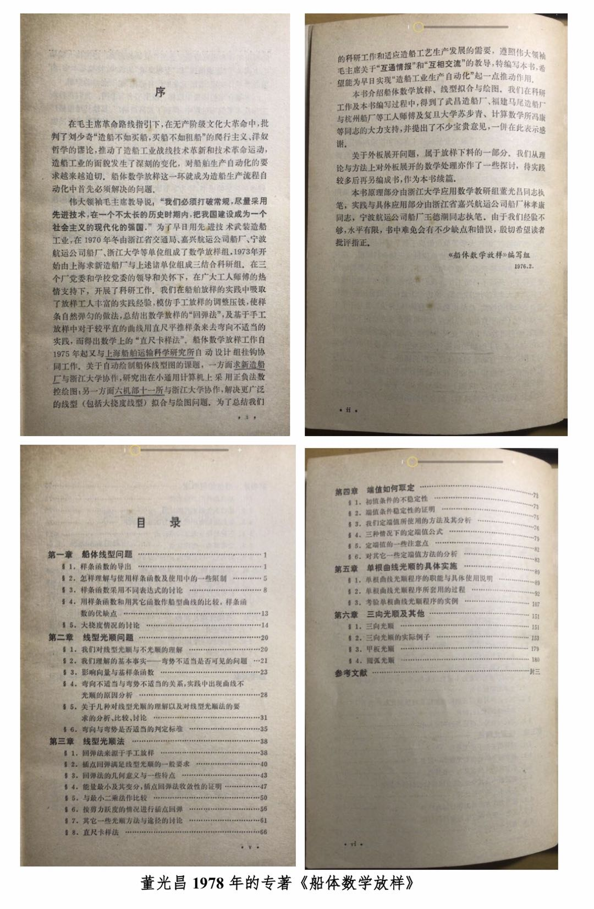
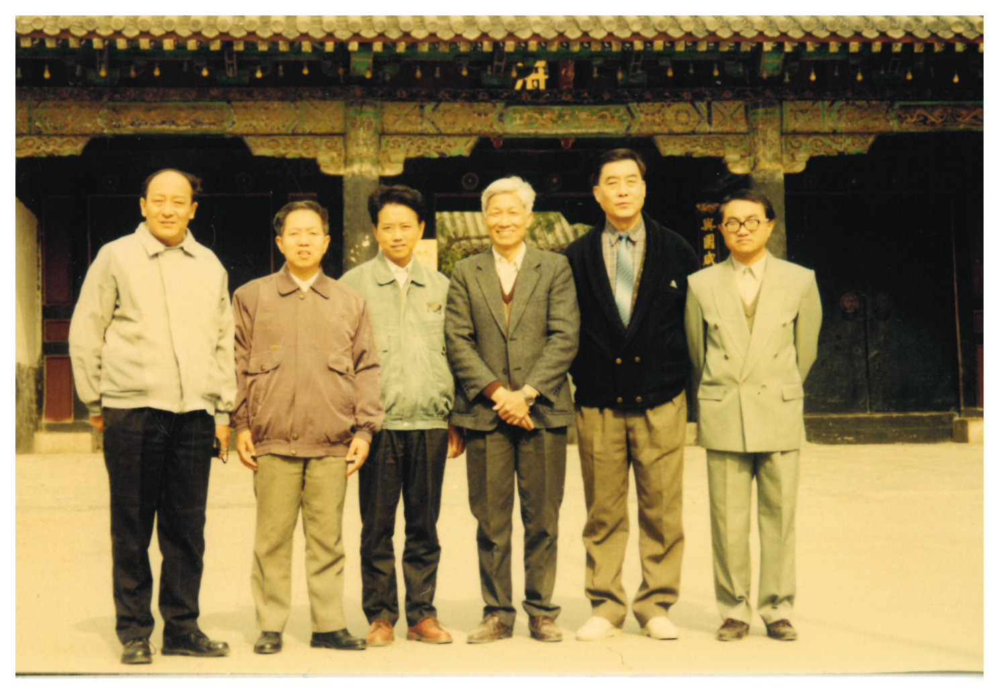
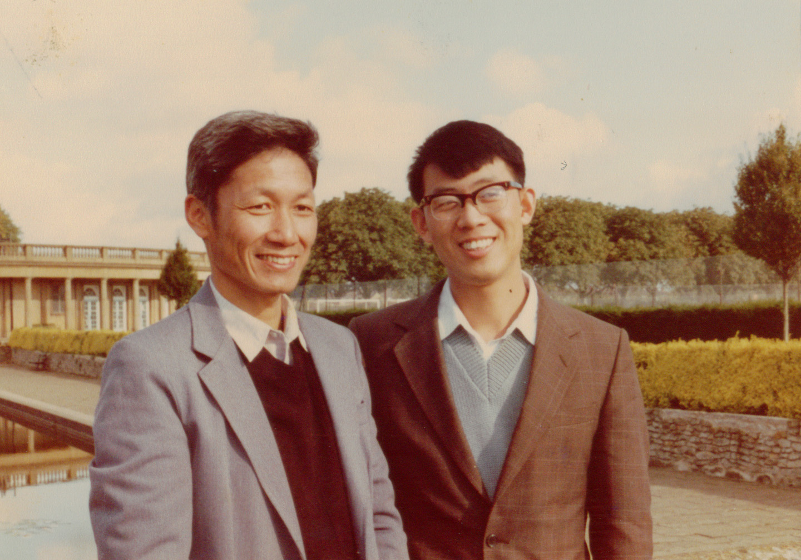
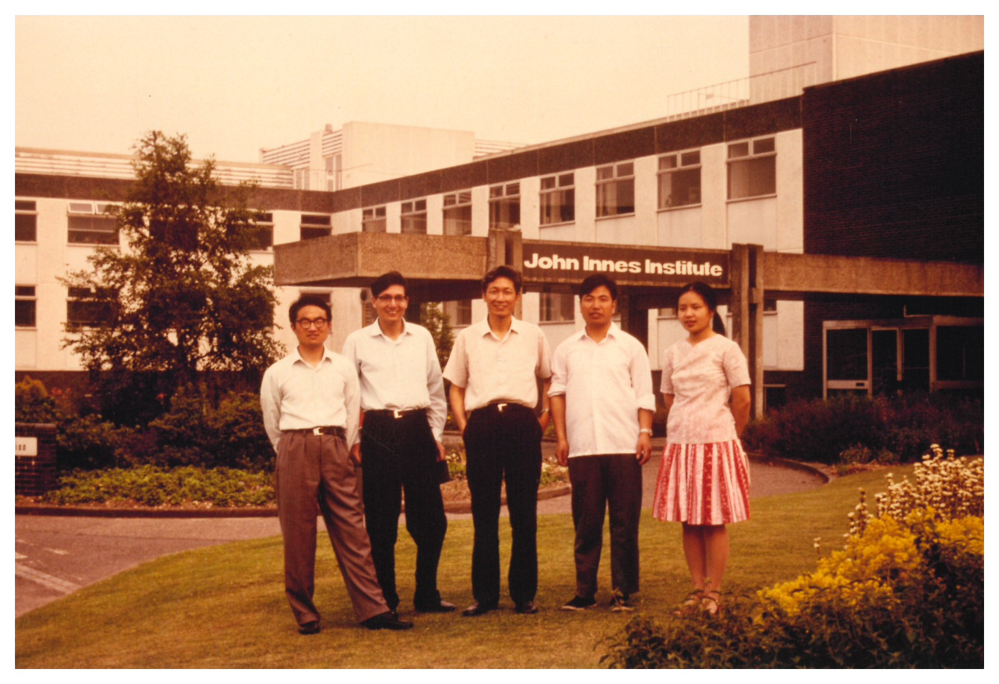
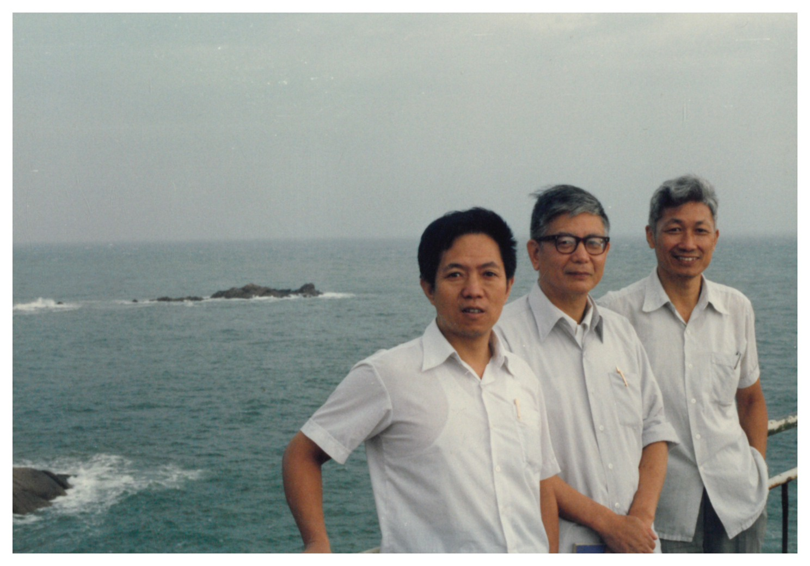
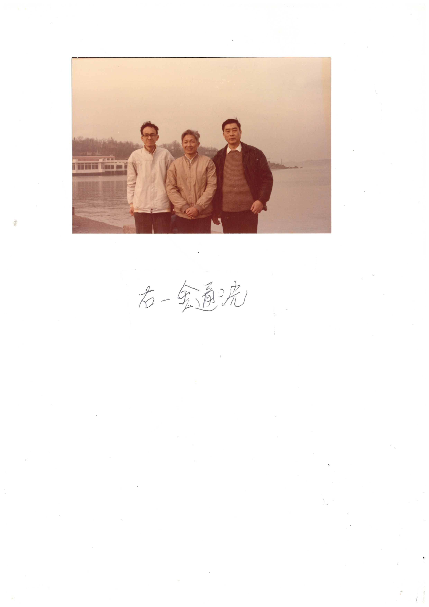
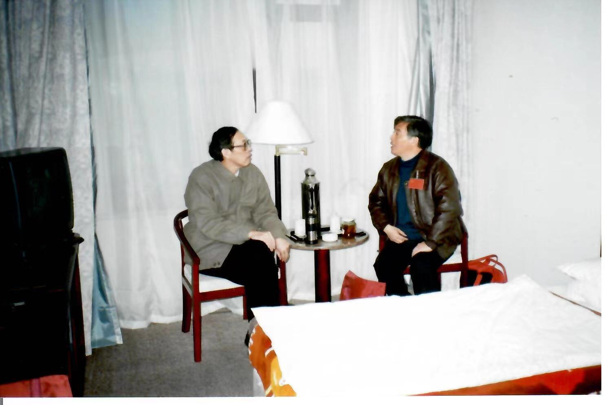
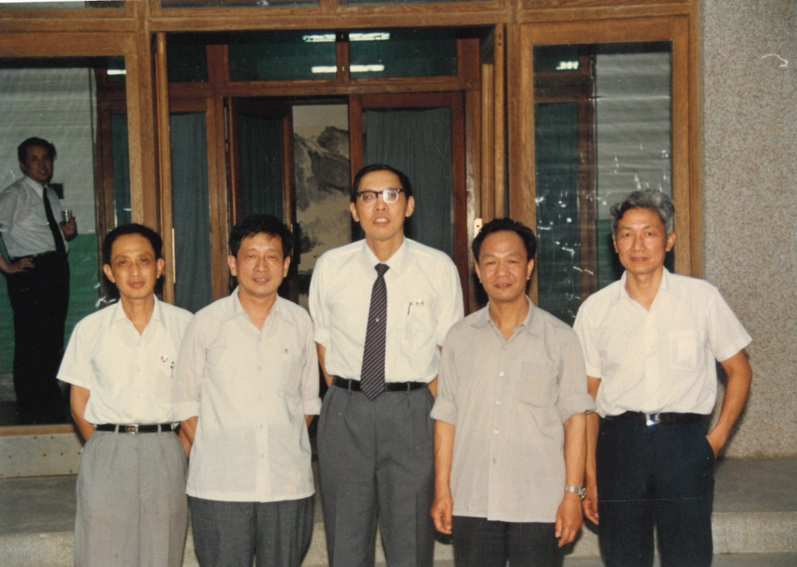

# 第7章　山东大学：从船体放样到系统实现

> "前三次都是由汪嘉业老师带领山东大学承办的。"
> ——张彩明，1982 年青岛会议会务组成员

---

## 7.1　青岛红星船厂的起点

把山东大学放进中国计算几何的版图里，最自然的入口是青岛。山大的数学系与计算机系都设在济南，但它的工业实践却几乎全部沿着山东半岛的造船海岸线展开——青岛红星船厂、烟台、威海，这些日后在协作组会议史里反复出现的地名，最早其实是山大数学系的青年教师下厂的目的地。

汪嘉业（1937— ）是这一支线索最完整的承载者。他 1959 年毕业于山东大学数学系并留校任教，1970 至 1971 年间被派往青岛红星船厂从事船体数字放样的研究工作[需核实：具体下厂年限与项目编号；目前依据 ch05 中"汪嘉业 1970–1971 年在青岛红星船厂做船体数字放样"的表述，bundle note_011/note_014 中的汪嘉业资料尚需进一步核对]。这段经历放在全国地图上看，与同一时期苏步青三赴江南造船厂、浙大董光昌奔走于上海求新与嘉兴宁波之间、北航 703 教研组在贵州安顺为飞机机头罩做曲面数模、上海船舶工艺研究所何援军与浙大梁友栋的合作——它们共同构成了 1970 年代中期中国数学界"下厂"实践的工业地图。山东大学在这张地图上的位置，是工业基础最厚的造船业大省里最重要的综合性大学。

*图 7-1　董光昌 1978 年专著《船体数学放样回弹法》（科学出版社）——浙大与山大共同分享的"船体放样"时代背景：复旦的苏步青、浙大的董光昌、山大的汪嘉业几乎同时在中国不同的造船厂做着相同性质的工作*

*图 7-1.5　济南趵突泉——山大计算几何团队所在的济南地缘符号，本章地理底色配图*

与浙大、复旦在第二章已经写过的"船体放样"主线相比，山大的特殊之处在于它身处的省份本身就是一处巨大的造船与机械制造现场。1970 年代中期那批"知识为国民经济作贡献"的青年教师走进车间时，浙大与复旦的老师们要从杭州、上海跨城前往造船厂；山大数学系的青年教师只需要在山东省内的青岛、烟台与威海之间奔走，下厂的成本远低于其他几所大学。这一点在事后看几乎不被作为优势提起，但在 1970 年代物质与交通极为匮乏的条件下，它直接决定了山大能够把工业实践维持成一种"长期、持续、贴近"的状态，而不仅仅是几次短期蹲点。

## 7.2　1972–1979：山大自研十万次机

把山大与浙大、复旦区分开来的另一条更具体的线索，是硬件。1972 至 1979 年间，汪嘉业参与了山东大学自行研制十万次小规模集成电路通用计算机的工作[需核实：项目编号、立项部委、研制人数及具体型号]。这一台机器在今天看来当然算不上什么大事——1970 年代的"十万次"指每秒十万次定点运算，仅相当于后来一台普通 PC 的零头——但它对山大计算几何团队后来几十年的研究文化所产生的塑形作用，是同期几所兄弟院校都没有的。

浙江大学在 1970 年代中期下厂研究的也是工业课题，但其计算几何团队从来没有从头研制过一台计算机。复旦数学系的传统则更偏纯粹的数学训练，下厂去做船体放样的苏步青、刘鼎元等人，所使用的计算资源主要是借自船舶系统或机械系统的现成设备。山大的特殊之处在于：在做计算几何研究之前，他们先做过一台属于自己的计算机。从最底层的电路板到指令集再到操作系统再到应用软件，这一整条软硬件栈都是由山大自己搭起来的。这种"造过自己的计算机"的工程经历，在汪嘉业等人 1980 年代再去做计算几何与 CAD 系统时，转化为一种很难用论文衡量、却随处可感的工作方式——重视实现细节、重视一台机器能不能稳定跑下来、重视软件与硬件之间那一层薄薄的接口。

正是因为有过这样七年的硬件经历，1979 年后汪嘉业转身做计算几何与 CAD 时所采取的研究取向，与同期复旦的"教材—讲习班—讨论班"路线、浙大的"理论推导—国际前沿"路线，呈现出明显不同的色调。山大计算几何的底色不是"几何化"也不是"传播性"，而是"系统实现"——能不能把一段算法做成一个可以被工程师坐在终端前用起来的子程序，能不能把一组子程序拼装成一个能在自家计算机或同期主流机型上稳定跑出几何外形的软件包，这两个问题在山大数学系-计算机系合一的工作方式下，从一开始就是同一个问题。

## 7.3　1979–1981：UEA 访学与回国转系

1979 年，汪嘉业被国家选送赴英国东英吉利大学（UEA）计算机研究学院做访问学者，与同年稍晚抵达 UEA 的浙大彭群生属于同一批"中美建交、外交解冻"之后第一波出国访学的中国 CAGD 学者。UEA 当时的核心人物是 A.R. Forrest——前文已多次提及，他正是 1972 年为"计算几何"下了那个权威定义、并把这门学科从概念上推向国际舞台的人物。汪嘉业在 UEA 的两年里，所接触到的不止 Forrest 个人的学术指导，而是当时英国 CAD 实验室的一整套实验环境——从硬件平台到图形终端、从基础几何库到面向实体造型的系统性思考——这些都是同时期国内任何一所大学都无法独立提供的科研条件。

*图 7-2　1981 年汪嘉业（右）在英国 UEA 留学时的合影——这是山大学派工程化方向国际渊源的核心影像，与同期浙大梁友栋（犹他大学）、汪国昭（UEA）、彭群生（UEA）的国际接触群像构成 1979–1982 年间中国 CAGD 学者集体走出去的全景*

*图 7-3　汪嘉业、彭群生在 UEA 同期访学的合影——山大与浙大两条流派在英国 UEA 的物理交集。彭群生 1983 年回国后加盟浙大应用数学系，汪嘉业 1981 年回国后转入山大计算机科学系，两人在 1980 年代后续协作组与 CAD 国家重点实验室筹建中持续合作*

汪嘉业的 UEA 经历，在第三章已作为 1979–1982 年"中美建交后第一批 CAGD 学者集体出国"群像的一部分写过；本章不再重复那段全国视角下的国际接触史，只专注于汪嘉业回国之后对山大计算几何方向所产生的具体后果。1981 年汪嘉业从 UEA 回国，紧接着在 1982 年起转入山大计算机科学系，并出任该系自 1982 年至 1990 年的第一任系主任。这一转系动作在山大学科史上是一个被低估的关键节点——它把"计算几何"这门此前在山东大学主要由数学系青年教师承担的研究方向，从"数学系兼做的工业问题"重新定位为"计算机系的本职课题"。山大在协作组里日后被反复称为"工程实现导向"的那一极，制度上的依据正是这一次跨系转移。

转系之后的汪嘉业，把 UEA 带回的实验室经验、山大十万次机研制留下的硬件文化、青岛红星船厂的工业课题三条线索同时纳入了山东大学计算机科学系新组建的计算几何方向。从这一年开始，山大不再只是一个"数学系老师下厂"的单位，而是一个"以计算机系为本位、面向 CAD 系统实现"的研究节点。这与浙大、复旦那两个仍以数学系为本位的协作组核心成员形成了一个明确的差异——也正是这个差异，使山大日后在协作组三足之间承担了"系统派"的角色。

## 7.4　三届协作组会议：山大作为组织节点

如果说浙江大学是协作组的"组长单位"、复旦大学是协作组的"教材源头"，那么山东大学在协作组里所承担的角色是"承办者"。这一点在张彩明的回忆里有最直接的证词。据张彩明回忆，"40 年前的 1982 年我是一年级硕士研究生，作为会务组成员有幸参加在青岛举行的第一届，分别参加了在烟台和威海举办的第二届、第三届，前三次都是由汪嘉业老师带领山东大学承办的。印象最深的是报名参会人员近 200 人，实际报道的人数有 400 多人。"

这段话信息密度很高。第一，它从山大视角把 1982 年青岛、烟台、1988 年威海三次会议串成一条"前三届"序列，由汪嘉业带领山东大学连续承办。第二，第三届威海是 1988 年（与本书第五章所引 fig_018–021 的年份一致），由此可以反推第二届烟台时间约在 1985–1986 年间[需核实：第二届烟台会议的精确年份与议程，bundle 中尚无独立史料佐证]。第三，张彩明给出的与会人数"实际报道 400 多人"与苏步青 1982 年青岛序言所记的"约 130 名代表"之间存在明显出入——较为合理的整合是，"130 人"指会议正式议程上的代表名册，"400 多人"则包含了短训班学员与列席旁听者，两个数字描述的是同一场会议的不同切面。

第四章已经写过 1982 青岛会议本身的双层结构与历史意义。本章只在山大一侧补充一句：作为承办方的山东大学，由汪嘉业主持会务工作，张彩明作为一年级硕士研究生进入会务组——这正是山大计算几何从"老师下厂"过渡到"师生合力办全国会"的具体节点。1982 年青岛之后，第二届烟台会议（约 1985–1986）与第三届威海会议（1988）的承办，使山大在协作组成立前后的 1980 年代上半段累积了远超其他成员单位的会议组织经验。按王国瑾 2021 年回忆的概括，"由于山东大学热情好客，浙江大学是组长单位，所以活动地点最多设在山东与杭州"——这两句话与张彩明的会务组细节互相印证，构成了协作组日常运作中"杭州—山东"双轴格局的底层事实。

*图 7-4　1988 年威海计算几何会议——张彩明所记忆中"前三届"中的第三届，由山东大学汪嘉业等承办；本图与第五章图 5-5 同物，作为山大主线高潮在本章再次出现*

*图 7-5　金通洸（浙大）与汪嘉业（山大）合影——在协作组运作中"山东大学热情好客 / 浙江大学是组长单位"双轴关系的具体写照*

第三届威海会议的规模与议题密度比 1985 年浙大讨论班更进一步，被第五章视为协作组三角格局正式成形的节点事件。从山大本位视角看，这同时也是山大作为组织节点能力达到峰值的一个标志：从 1970 年代下厂到 1980 年代办全国级会议，山大用十几年时间完成了从"工业课题接收方"到"学术活动承办方"的角色升级。

需要再补一句的是，山东大学连续承办协作组前三届会议这件事，本身就解释了为什么 1984 年协作组正式成立时它能够顺理成章地与浙大、复旦并列为"三足之一"。在协作组成立时间这一问题上，本书第四、五、六章已统一采用 1984 年说，依据王国瑾 2021 年回忆——1984 年协作组在苏步青大力支持下、由梁友栋提议、经刘鼎元、汪嘉业、常庚哲、齐东旭积极活动而正式宣告成立。山东大学作为汪嘉业代表的核心成员单位，在此前两年（1982 青岛、1985–86 烟台）的连续承办中事实上已经把"组织能力"演练成熟，1984 年协作组挂牌不过是把这一事实正式化的过程。

## 7.5　山大的"系统实现"基因：潘承洞、CAD 实验室与人才输出

把视野拉回到山东大学校内，山大计算几何的另一条不可忽视的线索来自数学系的传统积淀与校长一级的支持。潘承洞（1934–1997）是世界级的数论学家，1986 年出任山东大学校长[需核实：具体上任时间]。在他主政期间，山大数学系与计算机系之间的学科交叉、与中国科学院系统的合作、与外部工业部门的横向课题对接都得到了具体的资源支持。一个作为数论学家的校长愿意把校级资源向"计算几何"这样在 1980 年代仍被视为"次主流"的应用方向倾斜，本身就是山大"工程基因"能在数学系背景下发育起来的关键制度条件。

*图 7-6　潘承洞校长看望王仁宏老师——山大校长一级对计算几何与计算数学方向研究者的具体重视；王仁宏先生主属大连理工大学，本章不再展开，本图作为"山大对计算几何学科重视"的视觉证据*

*图 7-7　《VAX 系列（UNIX）机械产品 CAD 支持系统的研究》课题论证会现场——1980 年代山大计算机系与中国科学院系统、部委工业系统之间在 VAX 平台上联合开展机械产品 CAD 支持系统研究的具体场景（与 fig_066 / fig_181 同一次会议）*

*图 7-8　中国科学院 CAD 实验室访问山东大学合影——本章作为合作配图引用，主属第九章中科院系统*

山大在 1980 年代中后期的具体工作，集中在两条彼此交织的合作主线上。一条是与中国科学院计算所/软件所之间的横向合作——围绕中科院在 1987 年成立的 CAD 开放实验室，山大计算机系派出研究队伍参与机械产品 CAD 支持系统的研究，留下了多张课题论证会与互访合影；这一主线将在第九章从中科院本位作完整叙述，本章不再展开，仅作为山大主线的合作侧面引用。另一条是面向工业部门的纵向课题——VAX 系列（UNIX）机械产品 CAD 支持系统正是这一方向上的代表性课题，它要求把曲线曲面求交、布尔运算、几何内核等"硬核"模块在主流工业机型上实现并落地，山大数学系的算法积累与计算机系的工程能力在这里第一次以正式课题的形式合在了一起。

人才输出是山大"系统实现"基因延续到 1990 年代之后的另一条线索。1982 年作为青岛会议会务组成员的一年级硕士研究生张彩明，在此后的几十年里成长为山东大学计算机科学与技术学院的核心研究者之一[需核实：张彩明完整学术履历]；同期及稍晚的孟祥旭、屠长河等山大研究者也陆续进入领域[需核实：进入时间与具体方向]。这批山大培养的研究者，与汪嘉业 1991–1997 年在新加坡南洋理工大学 Gintic 研究所的访学经历及其在香港大学的访问教授任期一道，共同构成了山东大学计算几何方向在 1990 年代之后的国际与产业延伸网络。

值得专门点出的是张彩明从 1982 年青岛会务组成员到 21 世纪山大计算机学院核心研究者这条个人成长曲线本身——它与汪嘉业从 1970 年代红星船厂下厂到 1980 年代承办全国会议再到 1990 年代南洋理工 Gintic 的职业轨迹合在一起，构成了山大计算几何团队"两代连贯"的基本模板。这种"师生连续二三十年留在同一支研究队伍内"的稳定性，在协作组成员单位中并不普遍——它使山大在 1980 年代结成的工程文化得以原封不动地传递到 1990 年代之后的国产工业软件浪潮里去，而不是在中间几次人事更替中消散。

*图 7-9　1994 年与汪嘉业教授合影——7.5 节承上启下的温情配图，对应汪嘉业 1991–1997 年南洋理工 Gintic 时期*

落点回到山大 1970 年代下厂的起点。从青岛红星船厂的船体数字放样，到 1979 年自研的十万次机，到 1981 年汪嘉业从 UEA 带回的实验室经验，到 1982–1988 年连续承办协作组前三届会议，到 1980 年代中后期与中科院系统联合的 CAD 课题，再到 1990 年代之后向工业软件领域的人才输出——山东大学走的是一条与浙大数学路线、复旦传播路线明显不同的"系统实现"路线。这条路线在 1980 年代不显赫，但当 21 世纪国产 CAD 浪潮重新成为产业话题（详见第十六章与第二十二章）时，山大那份"造过自己的计算机、办过协作组前三届会议、做过 VAX 平台 CAD 支持系统"的工程基因，重新显示出它的分量。

---

::: tip 本章关键词
山东大学 · 汪嘉业 · 1970–1971 青岛红星船厂 · 1972–1979 山大自研十万次机 · 1979–1981 UEA · A.R. Forrest · 1982 转入计算机科学系 · 1982–1990 计算机系第一任系主任 · 协作组承办前三届(1982 青岛 / 1985-86 烟台 / 1988 威海) · 张彩明会务组 · 潘承洞校长 · VAX 机械产品 CAD 支持系统 · 中科院合作 · 1991–1997 南洋理工 Gintic · 系统实现基因
:::

**→ 下一章：[第8章　复旦大学：学科引入与早期教学](./ch08)**

---

## 图说建议

- **图 7-1（fig_220）**：董光昌 1978 年《船体数学放样回弹法》——本章 7.1 节作为时代背景配图，与浙大、复旦共享。
- **图 7-2（fig_167）**：1981 年汪嘉业在 UEA 留学时合影——本章 7.3 节核心配图，山大学派工程化方向国际渊源的核心影像。
- **图 7-3（fig_082）**：汪嘉业、彭群生在 UEA 同期访学合影——7.3 节，山大与浙大两条流派在 UEA 的物理交集。
- **图 7-4（fig_018）**：1988 年威海计算几何会议——7.4 节，与第五章图 5-5 同物，本章作为山大承办前三届会议的高潮再次出现。

## 待新增图

- **fig_192**（章首或 7.1 节）：济南趵突泉，山大地缘符号。
- **fig_222**（7.4 节）：金通洸（浙大）和汪嘉业（山大）合影，"山东大学热情好客 / 浙江大学是组长单位"双轴关系的写照。来源 book_004。
- **fig_197**（7.5 节）：潘承洞校长看望王仁宏老师——山大校长一级对计算几何与计算数学方向的重视。
- **fig_065 / fig_066 / fig_181 / fig_182**（7.5 节）：《VAX 系列（UNIX）机械产品 CAD 支持系统的研究》课题论证会——选 1 张作为山大-中科院-工业系统三方合作的视觉证据。
- **fig_067 / fig_068**（7.5 节）：中科院 CAD 实验室访问山东大学合影——本章作为合作配图引用，主用归第九章。
- **fig_169**（7.5 节末尾）：1994 年与汪嘉业教授合影——温情承上启下，对应汪嘉业 1991–1997 年南洋理工 Gintic 时期。

## 待核实清单

- 汪嘉业 1970–1971 年在青岛红星船厂从事船体数字放样的具体年限、项目编号与合作单位（note_011 / note_014 中的汪嘉业资料尚需进一步核对）。
- 1972–1979 年山东大学自研十万次小规模集成电路通用计算机的项目编号、立项部委、研制人数及具体型号；以及汪嘉业在该项目中的具体分工。
- 1979 年汪嘉业赴 UEA 的精确出发月份与回国月份；1981 年回国后正式转入山大计算机科学系的具体年月。
- 协作组"前三届"中的第二届烟台会议精确年份（按张彩明回忆位于 1982 与 1988 之间，即 1985–1986 之间）、具体议程与承办经费来源。
- 张彩明完整学术履历，特别是 1982 年作为山大一年级硕士研究生的导师与研究方向。
- 孟祥旭、屠长河等山大计算几何研究者的进入时间与具体研究方向。
- 潘承洞校长出任山东大学校长的具体时间（1986 年），以及他在任期内对计算几何方向研究者的具体支持事件。
- 山大与中国科学院 CAD 开放实验室合作的具体课题清单与起止年份；fig_065 / fig_066 / fig_181 / fig_182 所对应论证会的具体年份与参会人员名单。
- 汪嘉业 1991–1997 年在新加坡南洋理工大学 Gintic 研究所的具体岗位与课题；其在香港大学访问教授的任期年限。
- 山大本位的史料（对照 book_004 之于浙大）尚未补全——bundle 建议优先补充 book_006 = 山大计算几何团队史料，可访谈汪嘉业本人或其学生。
