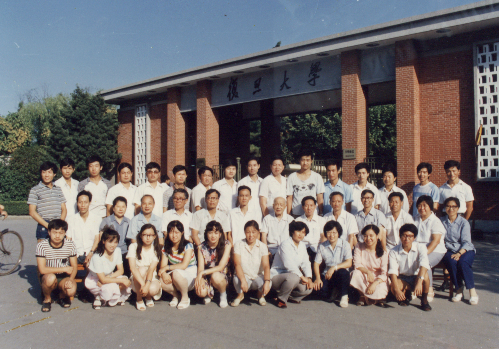
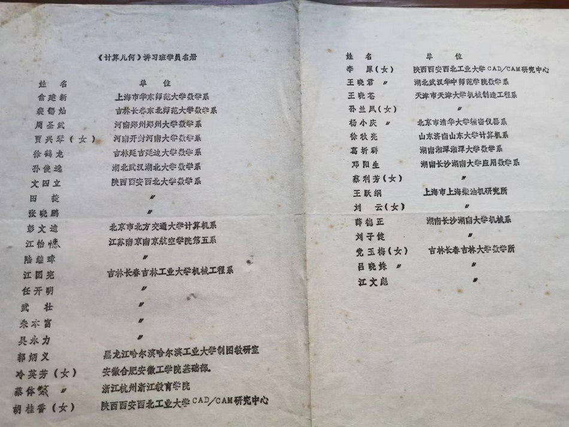
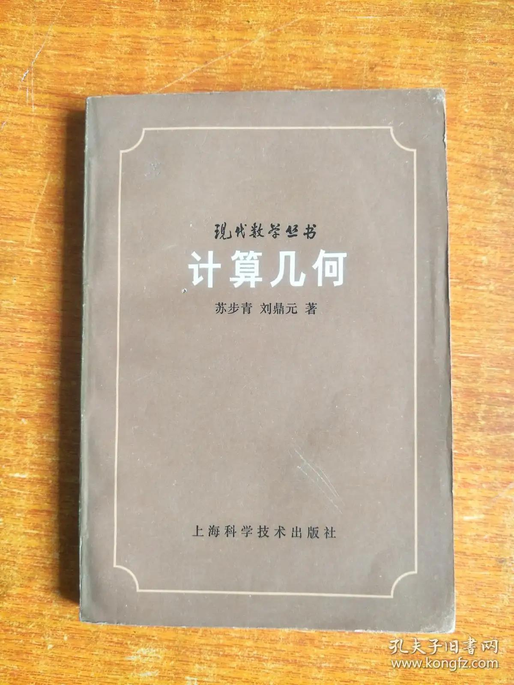

# 第8章　复旦大学：学科引入与早期教学

> "计算几何同所谓'CAGD'即'计算机辅助几何设计'有密切关系，它是一门新兴学科——由函数逼近论、微分几何、代数几何、计算数学特别是数控（NC）等形成的边缘学科。"
> ——苏步青，《计算几何的兴起》，《自然杂志》1卷7期，1978

---

## 8.1　1978：学科宣言的发布

把复旦大学放进中国计算几何的故事里，第一个无法绕过的时间点是 1978 年 8 月 27 日。这一天，苏步青（1902—2003）在上海数学会年会上作了一场题为《计算几何的兴起》的学术报告，全文随后发表于同年由上海科学技术出版社创刊的《自然杂志》第一卷第七期，文末作者署"上海复旦大学"。这是中文学术刊物上第一篇系统界定"计算几何"为一门独立学科的论文，也是国内学界第一次以正式文献的形式与 A.R. Forrest 1972 年的国际定义接轨。

报告开篇便是一段几乎可以一字不改地引用至今的判断。苏步青从造船、航空、汽车制造的几何外形设计需求切入，指出"计算几何"这一术语最早由 Minsky 与 Papert 在 1969 年提出、由 A.R. Forrest 在 1972 年定义为"对几何外形信息的计算机表示、分析和综合"，进而把这门学科明确定位为"由函数逼近论、微分几何、代数几何、计算数学特别是数控（NC）等形成的边缘学科"，并强调其与 CAGD（Computer Aided Geometrical Design，计算机辅助几何设计）"有密切关系"。这段表述同时完成了三件事——把"计算几何"作为一个新词带入中文语境、把它的国际谱系交代清楚、把它在多学科交叉之中的位置一次性写定。日后中国计算几何学派分布的几条线索，无论是几何学家路径、计算数学家路径还是工程实现路径，都可以在这一份不到一万字的报告里找到原始的方向标。

之所以由苏步青来作这场报告，并非偶然。1952 年院系调整后他即转任复旦数学系，1956 年起出任复旦副校长，1978 年起出任校长。1970 年代他三次赴江南造船厂下厂，主持"船体放样"项目，先后获得全国科学大会奖和国家科技进步二等奖——这一段亲历的工业实践已在第二章详述，本章不再展开。需要补一句的是：1978 年报告第一节正是以"造一只轮船"开篇，开篇句"在造船工业、航空工业和汽车制造工业中经常遇到几何外形设计的问题"，其几何举例直接对应他在江南厂车间里反复处理过的肋骨线拟合问题。这是一份从车间走回讲台的学科宣言——它的权威性既来自苏步青在中国数学界的旗帜性地位，也来自他本人在工业第一线积累的具体工作经验。

*图 8-1　苏步青《计算几何的兴起》（《自然杂志》1卷7期，1978）首页扫描——中国计算几何学科正式提出的奠基性文献*

复旦由此成为中国计算几何"宣言地"。把 1978 年这场报告作为本章的开端，并不只是为了交代一份史料的时间，而是为了说明：复旦在中国计算几何史上的角色，从一开始就不是一个被动的"传播者"，而是这门学科作为新学科被正式引入中国的发布地。

## 8.2　1980 复旦讲习班：第一次集结

宣言之后，紧接着的便是教学层面的第一次集结。1980 年，复旦大学举办了计算几何讲习班——这是国内第一次以"计算几何"为名义、以系统授课的方式把全国相关院校的教师聚到同一间教室里。按现存的讲习班名单照片，参加单位涵盖华东师范大学、东北师范大学、郑州大学、河南大学、延边大学、湖北大学、西北大学、北方交通大学、南京航空学院、吉林工业大学、哈尔滨工业大学、西北工业大学、华中师范学院、天津大学、清华大学、山东大学、湘潭大学、湖南大学、吉林大学等二十余所高校，以及上海柴油机研究所等工业单位的代表，分别来自数学系、计算机系、机械工程系、制图教研室、CAD/CAM 研究中心、应用数学系等不同二级单位。这份单位名单本身的"杂"——文理工结合、高校与研究所并立——已经暗合苏步青在 1978 年报告里给出的"边缘学科"定位。

*图 8-2　1980 年复旦大学计算几何讲习班现场——中国计算几何系统化教学的第一次大规模尝试*

*图 8-3　1980 年复旦大学计算几何讲习班参加人员名单——一份由二十余所高校与研究所组成的早期共同体名册*

这次讲习班在中国计算几何史上有两层意义。第一层意义是教学性的：1978 年的学科宣言此前还停留在一篇刊物文章上，1980 年讲习班则第一次把它转化为可以系统讲授的课程内容——讲什么、怎么讲、配什么例题，这些后来被沉淀到 1981 年那本《计算几何》教材里的章节安排，最初都是在 1980 年这次讲习班的黑板上反复打磨过的。第二层意义是组织性的：讲习班为参加单位之间建立了一份初步的人员名单和通讯网络，许多在 1980 年第一次出现在复旦讲台下方的名字，两年之后将再次出现在 1982 年青岛会议的报到桌前。第四章已经详述过青岛会议把"前三章中各自独立的线索汇合到一张会议桌前"的过程——从更长的时间线上看，那张会议桌的桌脚正是在 1980 年复旦讲习班期间一根根钉下去的。

在与第四章衔接的地方，本节只补一句不重复的史实：李心灿在 1982 年青岛闭幕发言里提到"短训班上学习的主要内容就是他和刘鼎元同志合著的《计算几何》"，这本被他称为"他和刘鼎元同志合著"的书，正是从 1980 年复旦讲习班的讲义脱胎而来——讲义先于教材一年成形，教材又作为青岛短训班的核心读本被再次使用。复旦的讲习班-讲义-教材-短训班这条链条，是 1978–1982 年中国计算几何最完整的一段教学落地路径。

## 8.3　1981《计算几何》：中国第一本系统性教材

1981 年，由苏步青、刘鼎元合著的《计算几何》在上海科学技术出版社出版，纳入"现代数学丛书"系列，统一书号 13119-909，全书 296 页，二十万字，定价一元四角。这是中国第一本系统的"计算几何"中文专著，系统介绍了样条曲线与曲面、Bézier 曲线、B 样条曲线、光顺、仿射空间等计算几何与 CAGD 的核心内容。

成书过程留下了一份罕见的同期家书证据。1980 年 8 月 21 日，苏步青在写给儿子的家书中亲口提到："还有一本与刘鼎元（复旦数学讲师）合著《计算几何》（20 万字）也将于下月上海科技出版社出版，美国 John Wiley 公司已来联系译成英文，但未决定，要等出书后再说。"这一段话的信息密度极高——它一方面记录了著作的字数与合作者身份，把刘鼎元"复旦数学讲师"的本职准确写出；另一方面提到 John Wiley 早在书稿尚未付梓之前已经主动接洽英译版权——尽管最终的英译本是 1989 年由中国科技大学常庚哲翻译出版，并非由 John Wiley 完成 [需核实：1989 年英译本的精确出版社]。1980 年那段时间国际同行对中国学者的关注由此可见一斑。

*图 8-4　苏步青、刘鼎元合著《计算几何》（上海科学技术出版社，1981 年，"现代数学丛书"）封面——中国第一本系统的"计算几何"中文专著*

这本教材在中国计算几何史上的位置可以从四个层面来看。从学科建制层面看，它把 1978 年报告里抛出的概念落实为可以反复传授的教学体系，使中国计算几何在三年之内走完了"学科宣言→讨论班讲义→正式教材"的形态跃迁；从协作组实践层面看，它既是 1982 年青岛短训班的核心教材，也是此后协作组运转的"圣经级"中文读本——用第五章的说法，"没有这本书，1982 年的协作组很难有共同的学术语言"；从风格层面看，它延续了苏步青本人长期治学的"几何化"路径——以中国学者熟悉的几何观点处理曲线曲面问题，与同期国际同行偏向函数逼近论的 CAGD 主流形成微妙的差异，这一差异在 1982 年苏步青为青岛会议论文集所写的序言里被明确归纳为"几何化"风格；从国际影响层面看，1989 年常庚哲译成英文出版后，本书成为中国计算几何学派在国际数学界的代表性著作之一，其英文版本的面世几乎与同年浙大彭群生在 Eurographics 获奖、《Computers & Graphics》最佳论文奖等事件同步，共同构成 1980 年代末中国计算几何"集体出海"的一个时间窗。

合作者刘鼎元的名字应当在这里被特别标记下来。刘鼎元是苏步青的学生、复旦数学系讲师，1980 年复旦讲习班的实际授课教师之一，1981 年《计算几何》的合著者，1984 年高校计算几何协作组的首批成员（具体身份与活动已在第五章交代，本章不重复）。在通常以"苏步青先生"作为整本教材署名标杆的叙述里，刘鼎元作为合作者的具体贡献容易被淡化——但从文献学意义上看，这本二十万字教材的章节架构、习题设计与公式推演，相当一部分是由这位"复旦数学讲师"在与苏步青反复商讨之后落笔的 [需核实：刘鼎元在《计算几何》各章具体的执笔分工]。本章把刘鼎元列为这本教材"两位主要作者之一"，而不是"苏老身边的整理者"，是出于对历史事实的尊重。

复旦数学系另一部更早的相关读本同样值得记一笔。1977 年由科学出版社出版的《曲线与曲面》，署"复旦大学数学系《曲线与曲面》编写组"集体编著，全书六章——向量基本概念与运算、凸轮型线与等距曲线、空间坐标变换、曲面包络问题、齿轮啮合问题、曲线拟合方法——把车间里的几何加工问题归纳整理为通俗易懂的几何教材。这本书早于 1978 年的学科宣言一年，是复旦数学系"工厂的工人、技术人员和学校的师生密切配合"传统的直接产物，可以视为 1981 年《计算几何》的一份前驱性铺垫 [需核实：编写组的具体成员名单及刘鼎元是否参与]。

[图待补：fig_012——《曲线与曲面》（复旦大学数学系《曲线与曲面》编写组编著，科学出版社，1977）封面，来源 fig_012]

## 8.4　苏步青在复旦的讨论班与"金通洸磨光定理"

1981 年教材出版之后，苏步青在复旦主持的计算几何讨论班并未停下来——相反，1980—1985 这五年是他亲自坐镇复旦讨论班最密集的一段时间。在这五年里，复旦讨论班同时承担了三种功能：一是复旦数学系内部年轻教师与研究生的常规学术训练；二是浙大、山大、中科院、中科大、北航等兄弟单位学者来沪交流时的临时报告台；三是协作组重要论文初稿的"全国级"审稿现场。需要特别强调的一点是：现存关于复旦讨论班的记述里，苏步青不只是名义上的召集人——这一节将要回到的两件具体事情，可以直接证明他本人就是计算几何的"直接研究者"，而绝不只是为复旦数学系留下"服务工业"传统的"精神象征"。

第一件事是 1980—1981 年间苏步青本人与浙江大学金通洸的合作研究。两位学者在反复剖析 Bézier 曲线几何本质的过程中得到一条 Bézier 曲线包络定理，并合写论文发表。1981 年苏步青前往日本参加论文报告会，专门把这条定理冠以"**金通洸磨光定理**"之名作正式介绍——这是中国学者命名的第一个被苏步青在国际场合主动推介的计算几何定理，也是同期"几何化"风格的国际可见度最具体的一个例证。第六章已经从浙大主线、即金通洸的学术贡献角度处理过这一事件，本章则补一句从复旦视角才能看清的前提：金通洸 1980—1981 年这段时间频繁来沪，正是为了在复旦讨论班上与苏老一道推演这条定理的几何意义。讨论班的黑板与日本论文报告会的讲台，其实是同一条线索的两端。

[图待补：fig_TBA_002——苏步青八十年代在复旦主持的计算几何讨论班合影（复旦华宣积、中科院孙家昶、苏老、复旦胡和生、山大汪嘉业、中科大常庚哲、复旦刘鼎元、浙大梁友栋共 8 人，详见 book_004 page 13）；本节核心配图，与 ch06 共享]

第二件事是 1981 年王国瑾论文初稿的复旦讨论班审读。第六章已经详述过：王国瑾在 1981 年解决了 1978 年盐湖城第一届国际 CAGD 会议上提出的一个公开问题——圆弧样条逼近及圆柱螺线样条逼近的收敛性证明与算法。论文初稿由金通洸递交苏老，苏老的处理方式直截了当：把这篇浙大学生的初稿布置到复旦的几何讨论班上，让讨论班的几位老先生与中年学者共同审读。出席这次讨论的，按现存合影记录，是复旦华宣积、中科院孙家昶、苏老本人、复旦胡和生、山大汪嘉业、中科大常庚哲、复旦刘鼎元、浙大梁友栋共八人——一份跨复旦、浙大、山大、中科大、中科院五家的"全国级"审稿名单，为一篇浙大硕士的论文初稿专门组织了一次跨校讨论班。从复旦本位的角度看，这件事更值得记下的细节是：被苏老选作审稿场地的，并不是复旦大学一间专门为外校学者开设的"协作会议室"，而正是他本人每周主持的常规计算几何讨论班——浙大的论文，被放进复旦讨论班的常规议程，由本班八位学者像审复旦本系学生论文那样逐字推演，这才是苏老对一篇外校论文最高规格的关怀。

第三件事是苏步青 1980 年 5 月 4 日致中科院计算所孙家昶的那封私人信件。第六章已经全文引用过这封信，本章不再重复抄录全文，只在复旦本位的语境下重读其中的几句关键判断。原文中那句"今后我们工作的方向要转到世界先进单位的研究方面，决不可拘泥于自己原来的领域里"，今天读来依然字字着力。苏步青写这句话时已年届七十八岁，本人在仿射微分几何、射影微分几何这两个传统方向上已经做了五十年；他说"决不可拘泥于自己原来的领域里"，首先是在对自己说。从这句话到他本人下场与金通洸合作 Bézier 包络定理、再到他主持复旦讨论班审读王国瑾论文初稿，是同一条逻辑线——"转到世界先进方向"不是一句对后辈的劝诫，而是这位老校长本人在七十八岁之后给自己定下的工作纲领。

[图待补：fig_TBA_005——1980 年 5 月 4 日苏步青致中科院孙家昶信扫描件（详见 book_004 page 12），与 ch06 共享]

把上面三件事并在一起看，原草稿中那句"苏步青虽然不是计算几何的直接研究者，但他为复旦数学系建立的'服务工业'传统，深刻影响了刘鼎元一代人的价值取向"显然不能成立。1980—1981 年，他与金通洸合作的 Bézier 包络定理在国际场合被冠以"金氏磨光定理"之名介绍；1981 年他与刘鼎元合著的《计算几何》成为中国第一本系统性中文教材；1980—1985 年他亲自主持复旦计算几何讨论班，亲自布置并审读外校学生的论文初稿；1980 年他亲自致信中科院孙家昶，把"转到世界先进方向"作为整代人的工作纲领写下来。这四件事每一件都是直接学术贡献，而不是"精神遗产"。本书第二章已经把苏步青早年在浙大、复旦的微分几何传统作为"奠基者篇"的主线交代过，本章在"流派篇"的复旦视角下再补一句：他对中国计算几何这门新学科，不是一位远远站在背景里的精神象征，而是自己拿起粉笔在黑板上推演公式的一线参与者。

## 8.5　复旦计算几何课题组的延续

1985 年之后，苏步青年事已高，逐渐从复旦数学系一线教学中淡出，但他参与发起的计算几何讨论班并没有随之停下。讨论班的主持工作在 1980 年代后半段逐步过渡到刘鼎元、华宣积（1939— ）等中年学者手上。华宣积是协作组首批成员中唯一的复旦本系教师里至今健在的关键人物，他在 1980 年代中后期开始独立承担复旦数学系计算几何方向的研究生培养，到 1990 年代逐渐成为复旦计算几何课题组的实际负责人。本章关于华宣积学术轨迹的具体记述，目前主要依赖 book_004 中的侧面叙述，复旦本位的口述材料尚待补足 [需核实：华宣积 1980—1990 年代在复旦数学系开设计算几何课程的具体年份与教学内容]。

复旦讨论班在跨校合作传统上的延续，可以从 1985 年以后协作组数次大型会议的复旦代表名单中看出。1985 年浙大讨论班、1986 年浙大及千岛湖会议、1988 年威海会议——这几次活动里复旦的与会者基本上都是刘鼎元、华宣积，加上若干位次一辈的年轻教师。这些会议的主线已在第五章叙过，本章不再重复，只补一句口径上的标注：复旦在协作组三家核心单位中的位置，从 1980 年代中期之后逐渐由"宣言地"转向"传统延续地"。所谓"传统延续"，是指它继续承担教材修订、研究生招生、讨论班维系等基础性功能，但学科前沿的攻关重心已经向浙大、山大、中科院等具备工程或大型计算资源的单位转移。

九十年代是这一转变最显著的一段时间。其时整个国内学术界经历"出国潮"的剧烈冲击，苏步青学术谱系下的青年学者亦有相当一部分流向海外，但复旦计算几何课题组在苏老的牵头下仍然保持着一定的研究节奏。1994 年留下的一张课题组合影，是这一时期复旦学派延续性的关键影像——前排从右往左为华宣积、苏步青、吴宗敏，最后排右一为汪国平。这张照片里的几个人都值得一并记下：苏老此时已经九十二岁，仍然在场；华宣积五十五岁，正处在课题组负责人最关键的一段；吴宗敏作为复旦数学系函数逼近论方向的中生代代表，把样条逼近这条线接到了计算几何的语境里；汪国平作为更年轻一代的代表，已经开始进入图形学应用层面的工作。从 1980 年讲习班到 1994 年课题组合影，复旦学派的人员结构在十四年里完成了一次完整的代际更替——这张合影对应的，正是这次代际更替的中段。

*图 8-5　1994 年复旦大学计算几何课题组合影——前排从右往左：华宣积、苏步青、吴宗敏；最后排右一为汪国平。"出国潮"冲击下复旦学派延续性的关键影像*

[图待补：fig_015——复旦大学奖状，作为复旦学派 1980—1990 年代研究成果的体制内承认，来源 fig_015]

把视角拉回到本章的整体脉络上，可以这样总结：复旦在中国计算几何史上的位置由四件事确立——1978 年《计算几何的兴起》作为学科宣言、1980 年复旦讲习班作为第一次集结、1981 年《计算几何》作为奠基性教材、1980—1985 年苏步青亲自主持的讨论班作为协作组前夜的"全国级"审稿现场。这四件事都发生在 1978—1985 这七年之内，构成中国计算几何作为一门新学科被正式引入并取得最初教学形态的核心时段。1985 年以后，复旦的角色由"宣言地"转向"传统延续地"，但在协作组里仍是一极。下一章将沿着 1980 年苏步青致孙家昶那封信里另一条暗线展开——孙家昶所代表的中国科学院系统，及其在数值几何方向上的工作。

---

::: tip 本章关键词
1978《计算几何的兴起》 · 苏步青 · 自然杂志 · CAGD · 边缘学科 · 1980 复旦讲习班 · 二十余所高校 · 刘鼎元 · 1981《计算几何》 · 现代数学丛书 · 1989 常庚哲英译 · 苏步青-金通洸合作 · 金通洸磨光定理 · 复旦讨论班 · 王国瑾论文初稿审读 · 1980 苏步青致孙家昶信 · 华宣积 · 1994 复旦课题组合影 · 复旦《曲线与曲面》（1977）
:::

**→ 下一章：[第9章　中科院系统：孙家昶与数值几何](./ch09)**

---

## 图说建议

- **图 8-1（fig_075）**：苏步青《计算几何的兴起》（《自然杂志》1卷7期，1978）首页扫描——中国计算几何学科正式提出的奠基性文献，与 ch02 共享。
- **图 8-2（fig_086）**：1980 年复旦大学计算几何讲习班现场——中国计算几何系统化教学的第一次大规模尝试，与 ch04 共享。
- **图 8-3（fig_087）**：1980 年复旦大学计算几何讲习班参加人员名单——一份由二十余所高校与研究所组成的早期共同体名册，与 ch04 共享。
- **图 8-4（fig_073）**：苏步青、刘鼎元合著《计算几何》（上海科学技术出版社，1981）封面——中国第一本系统的"计算几何"中文专著。
- **图 8-5（fig_023）**：1994 年复旦大学计算几何课题组合影（华宣积、苏步青、吴宗敏、汪国平等）——本章独家配图。

## 待新增图

- **fig_012**（8.3 节）：《曲线与曲面》（复旦大学数学系《曲线与曲面》编写组编著，科学出版社，1977）封面。素材已在 figures 库中（fig_012.png 待入 assets/）。
- **fig_015**（8.5 节）：复旦大学奖状——复旦学派研究成果的体制内承认。素材已在 figures 库中，但 assets/ 中尚未入册。
- **fig_TBA_002**（8.4 节核心）：苏步青八十年代在复旦主持的计算几何讨论班合影（华宣积、孙家昶、苏老、胡和生、汪嘉业、常庚哲、刘鼎元、梁友栋共 8 人）。来源 book_004 page 13；与 ch06 共享。
- **fig_TBA_005**（8.4 节）：1980 年 5 月 4 日苏步青致中科院孙家昶信扫描件。来源 book_004 page 12；与 ch06 共享，待核实 fig_085 是否即为此件。

## 待核实清单

- 1989 年《计算几何》英译本（常庚哲译）的精确出版社——苏步青 1980 年家书中提到 John Wiley 接洽，但实际出版社可能不同，需进一步核实。
- 刘鼎元在《计算几何》一书各章中具体的执笔分工——目前史料只能确认其作为合著者的整体身份，章节级分工待考。
- 1977 年复旦《曲线与曲面》编写组的具体成员名单及刘鼎元是否参与编写。
- 华宣积 1980—1990 年代在复旦数学系开设计算几何课程的具体年份、课程名与教学内容——建议优先访谈华宣积本人补足复旦本位的口述材料。
- 1994 年复旦计算几何课题组合影中除前排华宣积、苏步青、吴宗敏与最后排右一汪国平外的其他参与者完整名单。
- fig_012（《曲线与曲面》封面）与 fig_015（复旦大学奖状）是否已入 assets/ 目录——目前仅 fig_012.png 在素材库中可见，尚未入 chapters/assets/。
- book_003 的具体内容是否即为 1981 年《计算几何》本身。
- note_003、note_004 关于苏步青先生资料的具体内容及其与本章 8.4 节复旦讨论班史料的归属对应关系。
- 协作组 1984 年成立时是否有教育部正式批文（与第四、第五、第六章共享的待核实项）。
