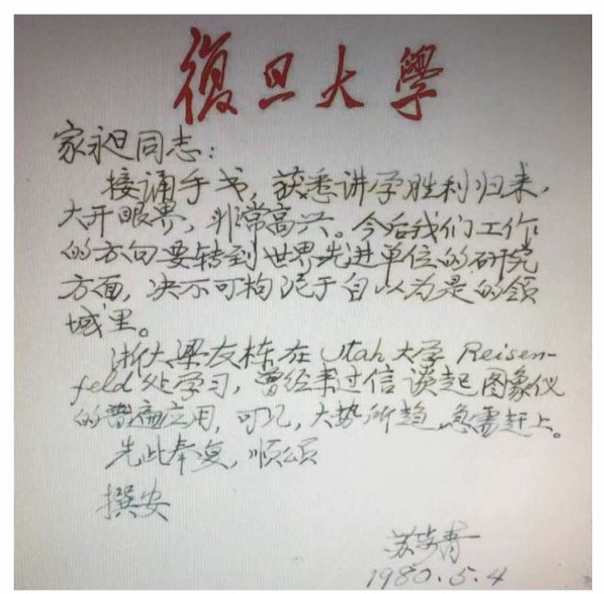
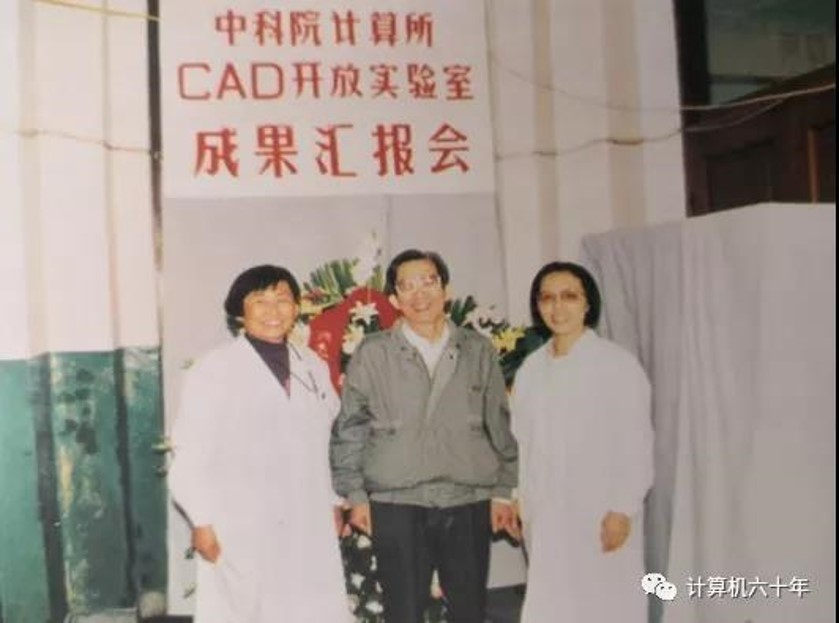
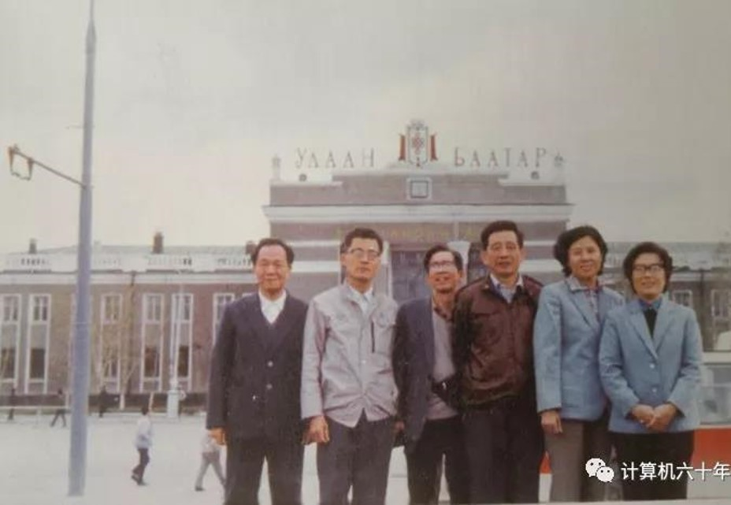
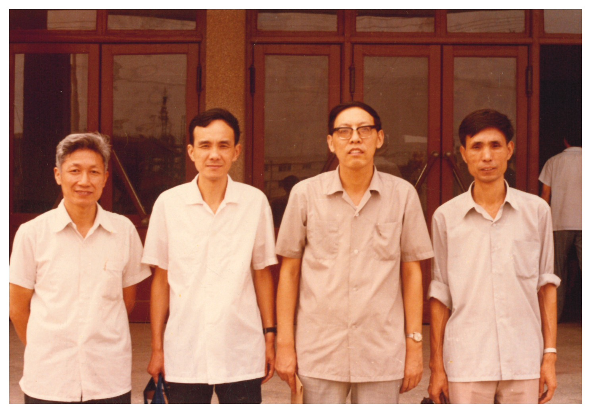
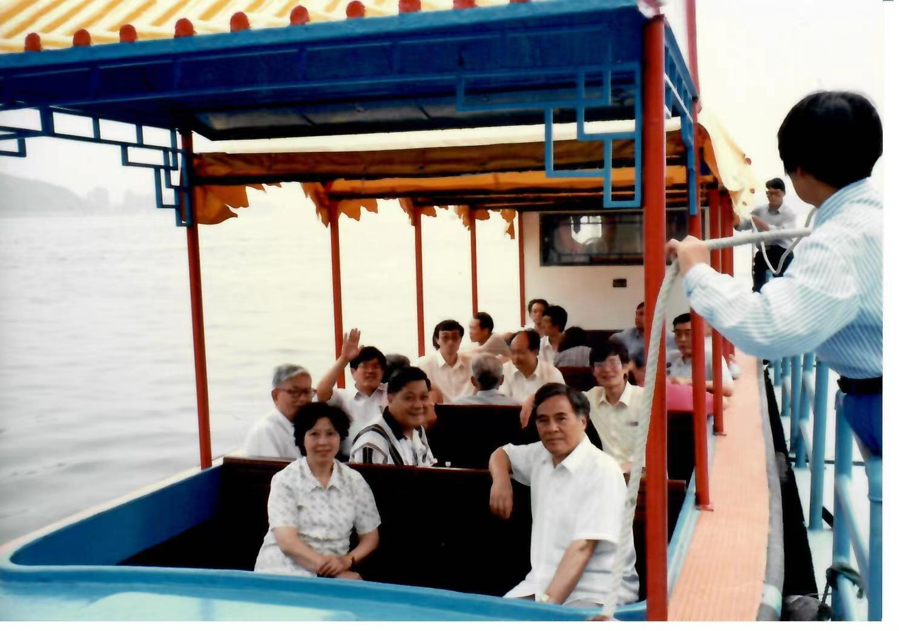
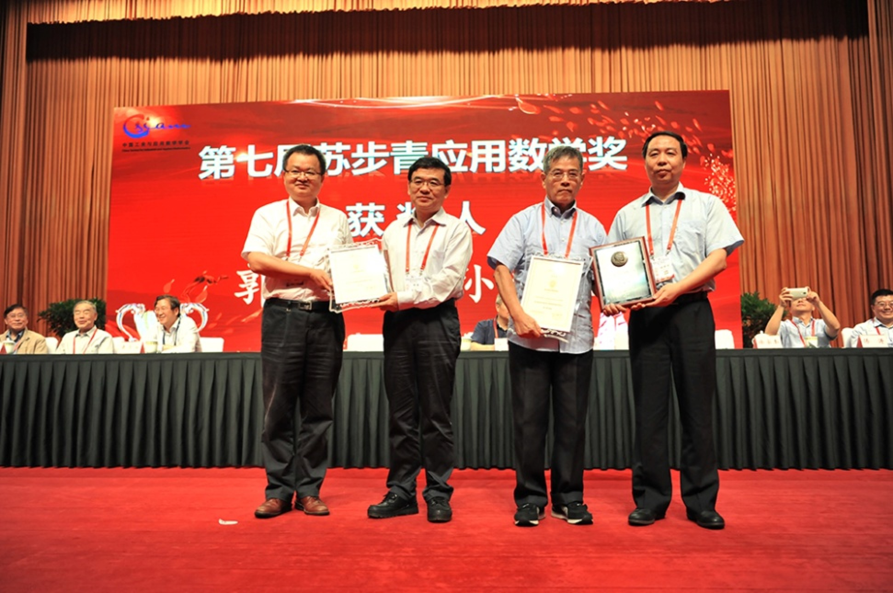

# 第9章　中科院系统：孙家昶与数值几何

> "今后我们工作的方向要转到世界先进单位的研究方面，决不可拘泥于自己原来的领域里。"
> ——苏步青致孙家昶，1980 年 5 月 4 日

---

## 9.1　从计算所到软件所：孙家昶的学术起点

把中国科学院放进中国计算几何的故事里，先要把单位讲清楚。一封 1980 年 5 月 4 日的信，是一个最方便的入口——苏步青从复旦寄出，落款"家昶同志"，信封上写的收件单位是"中科院计算所"。这一行字日后被王国瑾写进 2021 年那篇浙大学科史时，特别在旁边加了一行小注："早期单位"——意思是说，等到八十年代中期协作组首批成员名单确定下来时，孙家昶（1941—　[需核实生年]）已经在中科院软件研究所，而不再在计算所。1985 年中科院将原计算所的部分研究力量析出，单独组建软件研究所，孙家昶随之成为软件所的研究员 [需核实：具体所属沿革与析出年份]。本章在叙述时将以"中科院"作为统称，需要点明具体所名时按事件发生的时间为准——1980 年的那封信寄到的是计算所，1984 年协作组首批成员名单上写的则是软件所。

中科院与高校在体制上的差别，是理解本章主角与前几章主角差别的关键。计算所与后来从中析出的软件所，都属于研究院所而非教学单位，没有本科招生的负担，硕博培养也只在小范围内进行；它们承担的是国家级数值计算任务——气象数值预报、大型流体计算、核武器数值模拟等长期项目，自五十年代末计算所成立之初就已经成为院里几代研究人员的主业。这一份"数值计算传统"的底色，与高校数学系出身的梁友栋、刘鼎元等人那种"从微分几何走向 CAD"的路径并不一样：中科院学者面对几何问题时，第一反应是把它放在数值方法的框架里去看——稳定性、收敛性、复杂度、可计算性，这些来自数值分析的训练贯穿在他们对计算几何的理解中。

孙家昶最早一篇与计算几何相关的工作，发表得比 1982 年青岛会议还要早——1977 年他在《数学学报》上发表《局部坐标下的样条函数与圆弧样条曲线》，这是国内最早系统讨论圆弧样条的论文之一 [需核实：具体卷期与共同作者]。把"样条函数"与"圆弧样条曲线"放在同一篇论文标题里，对于 1977 年的中国数学界已经是一种相当前沿的姿态——它意味着作者既了解国际计算数学界正在推进的样条理论，也已经开始思考把这套数值工具用于工程几何对象。从这一篇论文起算，孙家昶进入计算几何方向的时间比 1978 年浙大恢复研究生招生还要再早一年。

1979 至 1980 年间，孙家昶赴美讲学 [需核实：具体邀请单位、停留时长与讲学课题]。这是改革开放之后中国学者最早一批走出国门的访学经历之一，与浙大梁友栋 1979 年夏天赴犹他大学 R.F. Riesenfeld 处、中科大常庚哲赴同校数学系 R. Barnhill 处、浙大汪国昭 1979 年 11 月赴英国东英格利亚大学（UEA）一起，构成了那两年中国计算几何学者集体出海的一个完整阵列。孙家昶归国后给苏步青写信报告"讲学胜利归来"，得到的便是本章开篇那封一百余字的回信——苏老把"今后我们工作的方向要转到世界先进单位的研究方面"作为整代人的方向性判断写下来，又把孙家昶的访美讲学和梁友栋在犹他大学的访学并置在同一封信里。第六章已经把这封信作为浙大主线下苏老学术胸襟的证据加以引用，在本章则需要从另一个方向再读一遍：信件的收信人是孙家昶，信里给出的"战略嘱托"也是给孙家昶的——"中科院线"与"浙大线"在苏老笔下被同时关心，而孙家昶恰好是中科院线上那个被点名的人。

*图 9-2　1980 年 5 月 4 日苏步青致中科院计算所孙家昶信扫描件（来源 book_004 page 12 / figures 库 2-7）——本章开篇引语的同期书证*

孙家昶赴美归来之后最重要的一项学术工作，是把样条函数理论与计算几何并列写进了一本书的标题。这本书就是日后被反复提起的《样条函数与计算几何》，由科学出版社纳入"计算方法丛书"出版——这套丛书是冯康院士开创的中国计算数学学派的权威系列，作者阵容包括李岳生、齐东旭、徐利治、周蕴时、孙家昶等数代代表人物。把"样条函数"（计算数学的核心工具）与"计算几何"（工程应用的新兴方向）并列写在书名上，本身就是一份学术宣言：以计算数学为基础发展计算几何，与苏步青学派从微分几何出发走向 CAGD 的路径形成"双轨并进"的格局。从这个意义上讲，孙家昶这本书与苏步青、刘鼎元 1981 年合著的《计算几何》——以及苏步青等 1986 年的《实用微分几何引论》——共同构成了 1980 年代中国计算几何最具方向性的一组著作。

*图 9-1　孙家昶《样条函数与计算几何》（科学出版社，"计算方法丛书"）——以"样条函数"与"计算几何"并列入书名，是中国计算数学学派对新兴学科最具方向性的一份学术宣言*

## 9.2　协作组里的"国家队"代表

1984 年高校计算几何协作组正式宣告成立时，首批成员名单里有一个特殊的名字。按王国瑾在 2021 年所作的回忆，1984 年协作组首批十二人左右的名单包括：苏步青任顾问，浙大梁友栋（1935— ）、金通洸（1934—2020）作为组长单位代表；其余成员有复旦的刘鼎元、华宣积（1939— ），中科大的常庚哲（1936—2018）、冯玉瑜（1940—2016），山大的汪嘉业（1937— ），吉大的齐东旭（1940— ），西北大学的穆玉杰，北航的唐荣锡（1928— ），以及"中国科学院软件研究所的孙家昶"。这份名单里，孙家昶是**唯一一位非高校代表**——其他十一位都是高校数学系或计算机系的教师，只有他一人来自中科院。这个细节在第五章已经作为"协作组三角格局"的注脚被点过一次，但放回到中科院这条主线上看，它的分量需要再说一遍：协作组从一开始就有意把"高校体系之外"的国家级研究力量拉进来，而拉进来的那个具体的人，是孙家昶。

孙家昶在协作组里承担的角色，不止"出席名单上一行字"这么简单。第六章引用过 book_004 提供的一份合影记录：苏步青八十年代在复旦主持计算几何讨论班，出席者按合影顺序为复旦华宣积、中科院孙家昶、苏老、复旦胡和生、山大汪嘉业、中科大常庚哲、复旦刘鼎元、浙大梁友栋共八人。在这份"为浙大学生王国瑾的论文初稿专门组织的全国级跨校讨论班"上，孙家昶是与苏老并肩而坐的几位评审者之一——这是一份跨复旦、浙大、山大、中科大、中科院五家的审稿名单，而中科院唯一在场的人就是孙家昶。再往后看，1985 年浙大数学系举办计算几何高校协作组学术研讨会留下的合影里，前排左起依次是"吉大齐东旭、中科院孙家昶、北航唐荣锡、苏老"，后排是西北大学穆玉杰、浙大金通洸、复旦刘鼎元等；会后部分成员的湖畔留影，孙家昶仍是九人中的一位。这两张合影把孙家昶在协作组里的位置具像化了——他不是名单上那个"中科院的代表"，而是讨论班上、会议合影里、湖畔留影中实际坐在那里的那一位。

[图待补：fig_TBA_001——苏步青八十年代在复旦主持的计算几何讨论班合影，8 人，含中科院孙家昶；来源 book_004 page 13；与 ch06 / ch08 共享]
*图 9-3　苏步青八十年代在复旦主持的计算几何讨论班 8 人合影——含中科院孙家昶（来源 book_004 page 13，与 ch06 / ch08 共享，**待新增**）*

孙家昶与协作组各家之间最具体的合作，发生在研究生培养这件事上。前述 book_004 第 2.6 节记录了一个细节：李善庆毕业于复旦数学系，文革后考取**中科院孙家昶**的 CAGD 硕士生；孙家昶赴美讲学期间，便把这位学生委托给苏步青在复旦代为指导；李善庆硕士毕业之后，调入浙大数学系代数几何教研室任教。一个学生的硕士培养跨越了三所机构——招生的导师在中科院，赴美期间的代理指导人在复旦，硕士毕业后的工作单位在浙大——这条轨迹是协作组"亲如一家人"那种工作伦理最具体的样本之一。它不是一种事后追忆里的修辞，而是一份发生在 1980 年代初的真实安排：导师出国讲学时把硕士生托付给另一位导师，毕业之后又顺势安排到第三家单位入职。这种安排在今天的研究生培养体制里几乎不可能发生，在 1980 年代的协作组里却被处理得如此自然——其中固然有苏老的学术权威作为兜底，但也意味着孙家昶作为协作组成员对其他几所单位的同行有充分信任。

孙家昶进入协作组带来的另一份"国家队视角"，与他在中科院承担的国家级数值计算任务直接相关。气象数值预报、大型流体力学计算、核武器数值模拟等长期项目所要求的数值方法——以稳定性、收敛性、复杂度为第一指标——和高校研究者偏重某一类几何对象（曲线、曲面、求交、裁剪）的工作侧重并不一样。在协作组的讨论班上，这两类思维风格相互校验：高校学者会被提醒"这条算法在量级一上去就不稳"，而中科院学者也会被提醒"这条几何对象在工程系统里到底是怎么用的"。这种校验在协作组那种"先把数学问题讨论透再决定是否写文章"的工作方式里得到了充分发挥，也是协作组比一般学术圈子更具方法弹性的内在原因之一。

## 9.3　1987：中科院 CAD 开放实验室

1987 年是中科院在中国计算几何史上的一个关键年份。这一年，中国科学院在计算技术研究所成立**CAD 开放研究实验室**——这是国家在 CAD 方向上设立的较早一批"开放实验室"之一，与浙大 CAD&CG 国家重点实验室（1985 年立项、1989 年列入国家建设计划、1992 年通过验收）几乎同期，但属于科学院系统而非高校系统。"开放"二字在 1980 年代的中国科研语境里有具体含义：实验室向外提供研究环境与设备资源，与高校、企业的研究人员通过课题合作、客座访问等方式共同开展工作；中科院 CAD 开放实验室自成立起就以"与国内高校及科研机构广泛开展合作"作为基本运作方式，这一点在日后的实验室年度成果汇报会以及一系列跨单位访问活动中得到了充分体现。

*图 9-4　中科院计算所 CAD 开放实验室年度成果汇报会现场（1987 年成立后，来源 figures 库 2-15-B）——实验室开放运作的视觉证据，本章核心配图*

实验室成立之初，已经具备了一支后来在国家 CAD 项目中持续活跃的人员队伍。从一份 1988 年的访问合影所留下的同期记录看，该实验室代表团在 1988 年赴苏联和东欧访问的成员包括魏道政、张守仁、刘慎权、林宗楷、李凤森、郭玉钗等人 [需核实：实验室首任主任及成立时的完整人员名单]。这份六人的访问名单大致可以视为中科院 CAD 实验室在筹建期与运作初期的核心团队——"刘慎权"等名字此后多次出现在中科院系统的 CAD 与图形学论著与会议组织中。把这一份 1988 年的访问名单与 1987 年实验室成立的事实放在一起读，可以看到中科院 CAD 实验室从成立伊始就同时展开了"对外（国际）"与"对内（高校协作）"两条工作线。

*图 9-5　1988 年中科院计算所 CAD 实验室代表团赴苏联与东欧访问合影——左起魏道政、张守仁、刘慎权、林宗楷、李凤森、郭玉钗（来源 figures 库 2-15-C）*

对内一线最有代表性的例证，是中科院 CAD 实验室与山东大学之间的密切互动。山大潘承洞校长在 1980 年代后期至 1990 年代初期曾专程拜访中科院 CAD 与图形学重点实验室——这两次访问留下了两张合影：一张是潘承洞校长与实验室领导的合影，另一张是潘校长与实验室工作人员的合影 [需核实：两次访问的具体日期与议题]。山大与中科院在 CAD 方向上的合作有具体的项目落点：1980 年代国家"七五"科技攻关计划下的 CAD 通用支撑软件攻关，以《VAX 系列（UNIX）机械产品 CAD 支持系统的研究》等课题为代表，由机械工业部投入近亿元，组织浙江大学、中科院沈阳计算所、北京自动化所、武汉外部设备所分别开发四套通用支撑软件，并由 34 家下属厂、所、校合作开发 24 种重点产品 [需核实：上述具体经费数字与单位分工的原始档案出处]。这一类课题的论证会是 1980 年代国家级 CAD 项目运作的典型场景——山大相关课题的论证会照片此前已在第六、第七章中作为浙大与山大的合作记录被引用 [需核实：fig_065、fig_066 系列论证会的主办单位是否包含中科院]。在中科院与山大的双边合作中，CAD 实验室的访问活动则是更为直接的形态：实验室代表团赴山东大学的两张合影里，可以看到山大潘承洞、汪嘉业等学者与中科院计算所学者同框，构成了 1980 年代后期"中科院—山大"互访线的视觉证据。

*图 9-6　中科院 CAD 实验室访问山东大学合影（一）（来源 figures 库 2-15-A0）——含山大潘承洞、汪嘉业等与中科院计算所学者*

*图 9-7　中科院 CAD 实验室访问山东大学合影（二）（来源 figures 库 2-15-A1）——与图 9-6 同批，呈现中科院-山大双边合作的另一面*

这些跨单位走动并不是"礼节性访问"那种只在合影里出现的轻量活动。它们是 1980 年代后期至 1990 年代初期国家在 CAD 通用支撑软件方向上分配研究力量的具体过程的一部分——四套通用软件由四家牵头单位负责，下属几十家研究所、高校与工厂参与共同开发，实际的协调工作很多就发生在两两单位之间的实验室访问与课题讨论里。中科院 CAD 开放实验室在这一段历史里所扮演的角色，更像是高校学派与院所体系之间的"合作枢纽"——既向高校开放自己的研究资源，又通过项目分工把高校的力量纳入到院所牵头的国家攻关任务里。从这一角度看，中科院 CAD 实验室的"开放"二字，并不是表面的口号，而是它在 1987–1990 年代中期那段国家 CAD 攻关任务高峰期的实际工作形态。

## 9.4　数值-几何的交叉传统

如果说浙大主线最具辨识度的标签是"以中国学者命名的国际成果"——Liang-Barsky 裁剪算法、Wang's formula、Wang-Ball 曲线、金通洸磨光定理；如果说山大主线最具辨识度的标签是"从船体放样到 CAD 系统实现"——那么中科院主线最具辨识度的标签，可以概括为"数值-几何的交叉传统"。这一传统的精神底色，是冯康院士开创的中国计算数学学派——以有限元方法、辛几何算法等理论工作为中心，强调数值方法的稳定性、相容性与几何/物理结构的内在一致性。孙家昶把这一传统带进了计算几何方向：从 1977 年的圆弧样条论文，到《样条函数与计算几何》一书，再到 1980 年代以后他在样条空间结构、并行算法等方向上的持续工作 [需核实：1980 年代后期至 1990 年代孙家昶的代表性论文清单]，所体现的并不是"做几何的人开始关心数值"，而是"做数值的人一直在意几何"——这是中科院线在协作组三角格局之外提供的第四个独特视角。

这种取向与高校学派的工作并不冲突，恰恰相反——它在很多具体问题上是后者的"互补面"。比如在曲面求交问题上，浙大学派的 Wang's formula 给出了一类基于细分迭代的几何收敛性结论，而中科院学派则更多关注同一类算法在浮点运算下的数值稳定性与误差累积——两类工作放在一起，才能构成一条从理论到实现的完整链路。再比如在 CAD 通用支撑软件的开发中，几何算法的可计算性、面对工业输入数据的鲁棒性、在大规模工程模型上的复杂度——这些问题在 1980 年代末到 1990 年代初的国家攻关项目里成为决定一套软件是否真正可用的关键，而它们恰恰是数值分析训练所擅长应对的问题。从这个意义上说，中科院线之于协作组，并不是"国家队"四个字所能完全概括的——它同时也是协作组方法论上的一个重要组成部分。

1998 年，中科院在京举办了一次计算几何专题讨论会，留下了一组合影 [需核实：会议主办单位、议程与参会名单]。这次讨论会的具体情况目前史料尚不完整，但从合影所反映的规模与人员构成看，它可以视为中科院系统在 1990 年代末对计算几何方向的一次正式集结。把这次会议放回到当时全国学科组织演变的节奏里看——1998 年距离 2001 年协作组归入"中国工业与应用数学学会"麾下、转型为"几何设计与计算专业委员会"（GDC）已经只剩三年——它在某种意义上为 GDC 转型期间的人脉与议题积累提供了一份中科院侧的预备工作。

*图 9-8　1998 年中科院计算几何专题讨论会合影——1990 年代末中科院系统对计算几何方向的一次正式集结，本节核心配图*

在协作组转型为 GDC 的过程中，中科院系统持续参与其中：2001 年 6 月浙大汪国昭、王国瑾等在清华大学参与组建 GDC 时，合影里就有"中科院高小山、李华"等中科院学者 [需核实：高小山、李华当时所属具体研究所与在 GDC 筹建过程中的角色]。高小山的完整学术轨迹将在后续涉及 GDC 与代数几何方向的章节中进一步展开，本章不再展开。孙家昶本人的工作在 1990 年代之后则更多回到了数值计算的国家任务主线上——以孙家昶为名的"应用数学奖"在 2000 年代以后被中国数学界设立为对其学科贡献的制度性纪念 [需核实：奖项设立年份、设奖单位与首届评审]。把这枚奖项与 1977 年那篇《数学学报》上的圆弧样条论文放在一起读，二十余年的学术轨迹之间是同一种贯穿到底的工作风格——从"局部坐标下的样条函数"出发，到"样条函数与计算几何"成书，再到八九十年代中科院 CAD 开放实验室时期的工程合作，再到 GDC 时代中科院新一代学者的加入——这是一条从数值出发、走向几何、又回到数值的完整学术弧线。

*图 9-9　孙家昶应用数学奖相关照片（来源 figures 库 6-1-B）——以奠基者命名的奖项作为学科贡献的制度性纪念，本章末尾配图*

把视角拉回到本章开篇那封信。1980 年苏步青给孙家昶写信时，提出的方向是"转到世界先进单位的研究方面，决不可拘泥于自己原来的领域里"。从 1980 年到 1998 年这十八年里，中科院线在中国计算几何史上做的事情，可以视为对这条嘱托的一份具体答卷：1977 年圆弧样条论文与《样条函数与计算几何》成书是"领域转向"的实证，1984 年作为协作组首批成员中唯一非高校代表是"跨界协作"的实证，1987 年 CAD 开放实验室与 1990 年代国家 CAD 攻关项目是"工程化落地"的实证，1998 年专题讨论会与 2001 年 GDC 转型期间的中科院学者参与则是"组织延续"的实证。这条主线在 1990 年代末至 2000 年代之后还将继续延伸——以中科院系统为依托的国家 CAD 与几何计算项目，在二十一世纪以后仍是中国计算几何工程化的重要一极，这部分故事将在本书后续涉及"国产 CAD 浪潮"的章节中继续展开。

---

::: tip 本章关键词
中科院 · 计算所 / 软件所 · 孙家昶（1941—） · 1977 圆弧样条论文 · 《样条函数与计算几何》 · 1979–1980 赴美讲学 · 1980 苏步青致孙家昶信 · 1984 协作组（唯一非高校代表） · 数值-几何交叉传统 · 1987 CAD 开放实验室 · "七五" CAD 攻关 · 1988 CAD 实验室赴苏东访问 · 山大-中科院互访 · 1998 中科院计算几何专题讨论会 · 孙家昶应用数学奖
:::

**→ 下一章：[第10章　北航：唐荣锡与国产 CAD 原型](./ch10)**

---

## 图说建议

- **图 9-1（fig_076）**：孙家昶《样条函数与计算几何》（科学出版社，"计算方法丛书"）封面——把"样条函数"与"计算几何"并列作为书名，是中国计算数学学派对新兴学科最具方向性的一份学术宣言；本章 9.1 节核心配图。已置入正文。
- **图 9-2（fig_085，9.1 节核心）**：1980 年 5 月 4 日苏步青致中科院计算所孙家昶信扫描件（来源 book_004 page 12 / figures 库 2-7）——本章开篇引语的同期书证。已置入正文。
- **图 9-4（fig_069，9.3 节核心）**：中科院计算所 CAD 开放实验室年度成果汇报会现场（来源 figures 库 2-15-B）——1987 年实验室成立后开放运作的视觉证据。已置入正文。
- **图 9-5（fig_070，9.3 节）**：1988 年中科院 CAD 实验室代表团赴苏联和东欧访问合影（左起魏道政、张守仁、刘慎权、林宗楷、李凤森、郭玉钗，来源 figures 库 2-15-C）——实验室成立初期国际访问线索。已置入正文。
- **图 9-6 / 图 9-7（fig_067 / fig_068，9.3 节）**：中科院 CAD 实验室访问山东大学合影（A0、A1，来源 figures 库 2-15-A0/A1），含山大潘承洞、汪嘉业与中科院计算所学者——双向合作的视觉证据。已置入正文。
- **图 9-8（fig_026，9.4 节核心）**：1998 年中科院计算几何专题讨论会合影——1990 年代末中科院系统对计算几何方向的一次正式集结。已置入正文。
- **图 9-9（fig_156，9.4 节）**：孙家昶应用数学奖相关照片（来源 figures 库 6-1-B）——以奠基者命名的奖项作为学科贡献的制度性纪念。已置入正文。

## 待新增图（fig_TBA 系列，建议起草后由 insert_figures 工作流补全）

- **图 9-3（fig_TBA_001，9.2 节）**：苏步青八十年代在复旦主持的计算几何讨论班 8 人合影，含中科院孙家昶（来源 book_004 page 13）；与 ch06 / ch08 共享。已在正文中以"待补"占位。
- **fig_198**（9.3 节）：潘承洞校长与中科院 CAD 与图形学重点实验室领导合影——山大-中科院跨单位学术外交的典型场景。
- **fig_199**（9.3 节）：潘承洞校长与中科院 CAD 与图形学重点工作室人员合影，与 fig_198 同批。

## 待核实清单

- 孙家昶生年（暂记 1941，待与本人简历或纪念文章核对）。
- 中科院计算所与软件所的具体析出年份与孙家昶在两所之间的所属沿革（1985 年左右软件所成立的具体节点待核）。
- 1979–1980 年孙家昶赴美讲学的具体邀请单位、停留时长与讲学课题；1980 年 5 月 4 日苏步青信中"讲学胜利归来"所指的具体行程信息。
- 1977 年《数学学报》《局部坐标下的样条函数与圆弧样条曲线》一文的具体卷期、合作者及与同年其他相关论文的关系。
- 《样条函数与计算几何》初版的精确出版年份（1980 年代某年）、首版印数与典藏版（2016）之间的版本关系。
- 中科院计算所 CAD 开放实验室 1987 年成立时的首任主任、组建文件、人员名单与挂靠关系。
- 1988 年中科院 CAD 实验室代表团赴苏联和东欧访问的具体日程、行程国家与回国后形成的合作成果。
- 1980 年代国家"七五" CAD 攻关计划下"四家牵头单位"分工与"34 家厂、所、校"参与名单的原始档案出处；中科院沈阳计算所与中科院计算所 CAD 开放实验室在该计划中的角色区别。
- fig_065 / fig_066 系列（《VAX 系列（UNIX）机械产品 CAD 支持系统的研究》课题论证会）的承担单位是否包含中科院线，以及与本章 9.3 节叙事的具体对应关系。
- 山大潘承洞校长拜访中科院 CAD 实验室的具体年份（fig_198 / fig_199）。
- 1998 年中科院计算几何专题讨论会（fig_026 系列）的主办单位、议程与参会名单，与 fig_026 metadata 中提到的"3-2-D 中科院 1998 研讨"系列照片的关系。
- 高小山、李华等中科院学者在 2001 年 GDC 筹建过程中的具体角色（与第 11 章共享待核实项）。
- 孙家昶应用数学奖的设立年份、设奖单位、首届评审与获奖者名单。
- note_001（孙家昶先生口述稿整理）与 note_010 的具体内容——若可获取孙家昶本人访谈或纪念文章，将大幅充实本章 9.1 与 9.4 节的史料密度。
