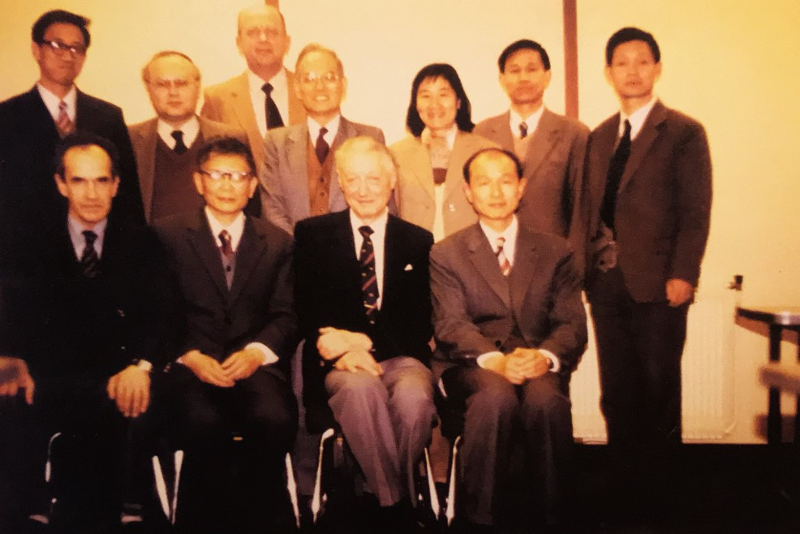
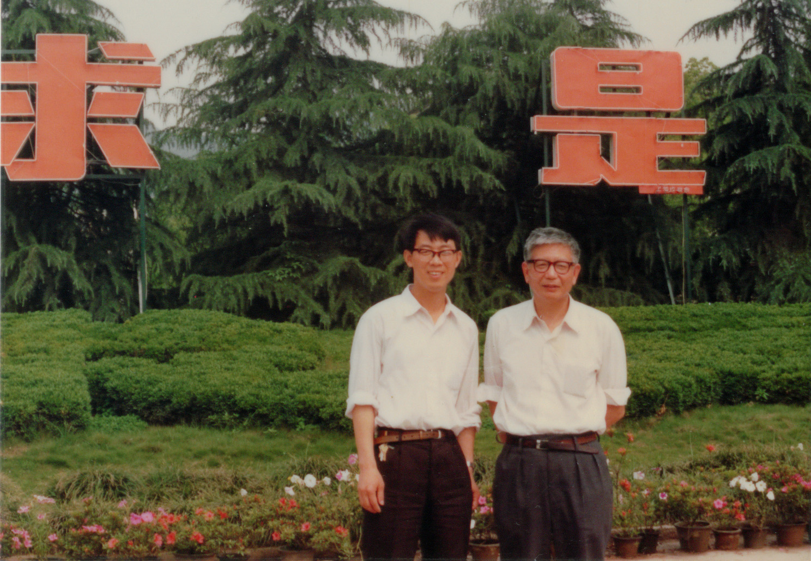

# 第10章　北航：唐荣锡与国产 CAD 原型

> "几何外形信息的计算机表示、分析与综合。"
> ——A.R. Forrest，1972

---

## 10.1　1976 年 6 月：北航的那场座谈会

把北京航空学院（即今天的北京航空航天大学，下文沿用当年名称"北航"）放进中国计算几何的故事里，最稳妥的入口不是一个人，也不是一台机器，而是一次会议。1976 年 6 月 17 日至 25 日，三机部飞机情报网下属的"飞机外形数学模型及绘图软件课题组"在北航召开了一次为期九天的座谈会，会议委托 011 基地技术情报站编辑出版了一册《资料汇编》，收录了与会者关于"前机身外形数学模型总结"、"数模在某型机上的应用情况"等若干专题报告。这是文化大革命尚未正式宣告结束之前，中国航空工业系统内部围绕"飞机外形数模"召开的一次相当规模的技术集结，参与的不仅有北航，也有国营 130 厂、国营 512 厂以及中科院计算所等单位。

北航在这次座谈会上的角色是双重的——既是会议东道主，也是研究主力之一。按《资料汇编》的署名，北航这一边的具体贡献者至少有两个名字值得记下：一位是张有荣，一位则是后来在协作组里被反复提起的"北航 502 小组"[需核实：502 小组的全称、组长以及与日后 703 教研组之间的沿革关系]。这两个名字之于北航，正如孙家昶之于中科院计算所——他们是同一时间窗口里、在同一组飞机外形问题上做工作的中国研究者。这次座谈会的存在本身，把中国计算几何的"工业线"上限提前到了 1976 年；与第二章已经写过的那批"下厂"故事相比，北航的特殊之处在于它不必"下"——飞机厂的几何问题就是它每天面对的本职工作。

更具体的工业实践发生在贵州。按王国瑾在 2021 年所撰的《浙江大学"计算几何学科"的发展历史》，1970 年代中期，**北航 703 教研组**与中科大数学系的常庚哲一同前往贵州安顺三线飞机厂，承担飞机机头罩与进气道的曲面数模设计任务。这条线索在浙大学派的回忆里只占一行字，但其分量并不下于复旦苏步青三赴江南造船厂、浙大梁友栋在六机部十一所的攻关。三线建设是 1960 年代中期至 1970 年代中后期中国出于战略安全考虑在西南、西北山区布局的一整套国防工业体系，贵州安顺正是其中航空板块的重要基地之一。北航 703 教研组深入安顺飞机厂蹲点的工作方式，与浙大梁友栋在上海船舶工艺研究所、金通洸在杭州机床厂、董光昌在江浙造船厂的"下厂"模式，同属那一代知识分子用专业知识接续工业现场的全国性图景；区别在于北航与航空工业本就同体——飞机外形数模不是"借来的题目"，而是它自身专业的延伸。

[图待补：fig_TBA_010_01——1970 年代中期北航 703 教研组赴贵州安顺三线飞机厂工作合影；来源待核实]
*图 10-1　1970 年代中期北航 703 教研组赴贵州安顺三线飞机厂蹲点——北航工程化路线在三线建设时期的具体落地（来源待核实，**待新增**）*

这便是 1976 至 1978 这一段北航的底色。当 1978 年苏步青在《数学的实践与认识》上发表《计算几何的兴起》，1979 年浙大梁友栋赴美、汪国昭赴英的同一个时间窗口，北航这一头的工作并不是从零起步，而是已经积累了至少四五年与飞机厂"现场对接"的经验。日后协作组组建时，北航能够立即拿出"工业系统视角"这一独立面向，正是这段经验的延伸。

## 10.2　唐荣锡：与 Bézier 同框的中国学者

把北航这条工程线接续到 1980 年代国际舞台上的人，是唐荣锡。按现有资料，唐荣锡（1928— ）是 1984 年高校计算几何协作组首批成员名单中年龄最长者——比组长梁友栋年长七岁，比金通洸年长六岁，比汪嘉业年长九岁。这一岁数差使他在协作组的日常运作中始终带着一种"老大哥"的气质，但他自己的工作姿态却完全不是退守式的。从 1970 年代中期起，他在北航开展飞机外形曲面的计算机辅助几何设计研究，是国内最早把"计算机辅助几何设计"这一术语从英文文献译介过来并落到实际工程任务上的少数学者之一。

唐荣锡之于中国 CAD 学界的标志性事件，发生在与国际同行的直接接触上。按中国计算机学会 CAD&CG 专业委员会所存的唐荣锡教授个人简历（note_007），**1979 年，唐荣锡邀请英国计算几何专家 A.R. Forrest 教授访华，推动了我国 CAD 研究向实体造型方向发展**。Forrest 是 1972 年正式给"计算几何"下定义的人——他在那一年提出了"几何外形信息的计算机表示、分析与综合"这一界说，至今仍被援引为这门学科的经典定义；而 1979 年这次访华，则把这一定义连同英国东英格利亚大学（UEA）实验室在曲面造型与实体造型方面的最新进展，第一次以"在场"的方式带到了中国学者面前。同年 11 月浙大汪国昭赴 UEA 访问，1983 年浙大彭群生在 Forrest 处获 CAD 博士学位回国，这些后续事件的国际链条，都可以追溯到 1979 年唐荣锡牵线邀请 Forrest 访华的那一次铺垫。在协作组里"国际接触"这条主线上，唐荣锡是最早一批主动伸手把国际权威请到中国来的学者。

更具有视觉冲击力的一张照片，是唐荣锡与 **Pierre Bézier** 的合影（fig_084）。Bézier 是法国雷诺汽车公司的工程师，"Bézier 曲线"、"Bézier 曲面"这两个 CAGD 学科里几乎无人不晓的术语正是以他姓氏命名的——他与美国通用汽车的 P. de Casteljau、波音公司的 W. Gordon、UEA 的 Forrest 一起，共同构成了 CAGD 学科的国际开创者群像。唐荣锡与 Bézier 的合影留下了前排左 3 的位置记录，照片本身的拍摄年代与具体场合，目前在协作组史料里仍待进一步核实[需核实：fig_084 拍摄年代、场合，是 Bézier 访华还是唐荣锡赴法]。但即便没有具体年份，这张照片承载的意义已经足够清晰——它是 1980 年代中国 CAD 学者与国际命名学者直接对话的一个标志性瞬间。把这张照片与浙大学派同时期"中国学者-国际开创者"群像并列，便是一组完整的国际对话坐标：唐荣锡与 Bézier、冯玉瑜与 Carl de Boor、汪国昭与彭群生先后在 UEA 与 Forrest，几条线索合在一起，是中国 CAGD 学界在 1980 年代最重要的国际化资本。

*图 10-2　唐荣锡与 Pierre Bézier 合影（前排左 3 为唐荣锡，来源 2-4-F）——1980 年代中国 CAD 学者与 CAGD 国际命名学者直接对话的标志性瞬间，本章核心图。〔具体年代与场合待核实：是 Bézier 访华还是唐荣锡赴法〕*

唐荣锡在协作组里的另一份重要资历，是 1982 年青岛会议上的"国际进展介绍人"身份。按李心灿在闭幕发言中的概括，会议期间"邀请了刚从国外回来的梁友栋副教授、汪嘉业副教授、唐荣锡教授及齐东旭、邓子琼老师，分别介绍了一些计算几何发展得较早较快的美、英、法、西德、加拿大等国的计算几何发展情况和理论及应用研究上的新进展、新动向"——这份五人名单里，唐荣锡是唯一以"教授"身份出现的（梁友栋、汪嘉业当时是副教授，齐东旭、邓子琼是"老师"），也是唯一来自工科院校的；他在青岛报告的具体内容应与法国 CAGD 进展和实体造型方向有关[需核实：青岛会议唐荣锡报告题目与具体内容]。1982 年梁友栋访美回国后在复旦数学系做学术报告留下的那张十一人合影中，唐荣锡也出现在前排左 3 的位置——浙大、中科大、复旦、北航、西北大学、上海船研所六家共五城聚于复旦，前排靠中间的那个位置上坐着的就是这位北航教授。这张合影在第六章已作详述，本章不再重复展示。

## 10.3　北航在协作组里的具体分工

1984 年协作组正式成立时，唐荣锡是首批十二人名单里北航的唯一代表。这种"一人一校"的代表方式，与浙大梁友栋、金通洸两人挂"组长单位代表"形成对比，但并不意味着北航在协作组里只有一个人——它意味着唐荣锡是北航在协作组台前的发言人，背后还有 703 教研组、502 小组等更长的人员清单。这种"一位资深学者代表一所工科院校"的格局，在 1980 年代协作组的人事结构里相当典型，也与北航本身作为工业部门直属高校的体制位置相符。

在协作组的日常运作里，唐荣锡的身影几乎覆盖了所有重要的合影场合。1985 年浙大数学系举办的那次协作组学术研讨会，前排四人合影里的左 3 是北航唐荣锡——他与吉大齐东旭、中科院孙家昶以及苏老并列站在那里；同一次研讨会的湖畔留影中，九位部分成员的第 5 位也是唐荣锡。八十年代初山东威海的那次协作组学术研讨会上，唐荣锡与复旦华宣积、中科大冯玉瑜、山大汪嘉业、浙大金通洸五人合影，唐荣锡在画面右端。1985 年还另有两张以"唐荣锡个人"为中心的合影留在了史料里——一张是与浙大彭群生的合影（fig_041），另一张是 1985 年与唐荣锡教授的合影（fig_168）；这两张照片虽然目前尚未在本书 assets 库中获得高清扫描件，但它们的存在本身就是 1985 年这一年北航与浙大、北航与协作组成员之间高频走动的具体物证。

*图 10-3　1985 年唐荣锡（北航）与彭群生（浙大）合影（来源 2-11-E4）——工程系统路线与图形学路线两条技术路径在 1985 年的具体交汇*

*图 10-4　1985 年与唐荣锡教授合影——与图 10-3 同属 1985 年北航与协作组成员之间高频走动的人物影像系列*

唐荣锡之于全国 CAD 教育的另一份具体贡献，则记录在两本教材的封面上。第一本是 1990 年 4 月由科学出版社出版的《计算机图形学教程》，由唐荣锡、汪嘉业、彭群生等联合编著——主编名单同时覆盖北航、山大、浙大三家协作组核心成员单位，是 1980 年代后半段协作组跨学派合作最具代表性的教材；该书初版后先后印刷七次，在 1995 年获电子工业部优秀教材奖[需核实：note_007 提及的"1996 年电子部全国优秀教材一等奖"与此奖项的关系]。这本教材在第五章已作详述（参见图 5-6），本章因北航主线需要，再次置入封面图作为唐荣锡作为协作组"教材人之二"的视觉锚点：协作组三家核心单位联合署名的教材，必须有唐荣锡的位置在前——这并不只是论资排辈的姓名顺序，更是协作组"工程系统视角必须出现在共同教科书里"的方法论自觉。

*图 10-5　唐荣锡、汪嘉业、彭群生等编著《计算机图形学教程》（科学出版社，1990）——主编阵容同时覆盖北航、山大、浙大三家协作组核心成员单位（与第五章图 5-6 同图，本章因北航主线再次置入）*

第二本是稍晚出版的《计算机图形学教程（修订版）》，由汪国昭与唐荣锡等合作完成；这本书把浙大主线（汪国昭）与北航主线（唐荣锡）在同一卷教材里进一步整合，成为 1990 年代后期国内 CAD/CG 课程的常用教材之一[需核实：修订版具体出版年与出版社]。除了《计算机图形学教程》之外，唐荣锡还主持编著了《CAD/CAM 技术》一书——这本书在内容上更进一步偏向工程系统，是北航工程化路线最直接的文字载体。

这些教材合起来，构成了唐荣锡在协作组里的"教材人"角色。如果说复旦刘鼎元因合著《计算几何》（1981）而被视为协作组的"教材人之一"，那么唐荣锡因主持编著《计算机图形学教程》（1990）和《CAD/CAM 技术》而成为协作组里"教材人之二"——前者偏向数学根基，后者偏向系统工程，二者合在一起恰好覆盖了协作组从理论到系统的整条线索。

## 10.4　PANDA：国产三维造型系统的第一次

把北航这条线推到 1980 年代最具标志性的一个事件，是 **PANDA** 的出现。按 note_007 所存唐荣锡教授个人简历的明确记载——"在他的主持下，北京航空航天大学于 80 年代初推出了我国第一个三维造型系统 PANDA，并向研究所和学校低价或无偿提供源程序，公开技术。"——这一句话里至少有三个关键信息需要展开：第一，PANDA 是中国第一个三维造型系统；第二，它出现在 1980 年代初，在时间上与浙大筹建 CAD&CG 国家重点实验室（1985 立项）几乎同步；第三，它的发布方式是"低价或无偿提供源程序、公开技术"，这是一种在今天看来极不寻常、但在协作组工作伦理里完全可以理解的开放姿态[需核实：PANDA 系统的具体发布年份、版本号、主要开发者名单、运行平台、所支持的几何核心特性]。

把 PANDA 放到当时的国际坐标里看，它的位置并不容易把握。1980 年代初国际上的实体造型系统正经历一次更新换代——英国剑桥的 BUILD（Ian Braid 团队）、罗切斯特大学的 PADL-1 与 PADL-2（Voelcker 团队）、纽约大学 NYU 的 GMSolid（Requicha 团队）等是当时国际上为数不多的几个有名的实体造型原型系统；商业 CAD 软件中真正具备实体造型能力的产品，到 1980 年代中后期才陆续问世。在这一国际背景下，北航在 1980 年代初推出 PANDA，意味着中国学者在国际实体造型的"原型系统时代"里几乎是与世界同步起步——这一点在日后被反复提及，但 PANDA 本身的源代码、版本号、参与开发的具体研究者名单等档案细节，目前在公开史料中尚未充分展开[需核实：北航 1980 年代档案中关于 PANDA 的立项书、验收报告、开发组成员名单是否仍存]。

PANDA 之外，唐荣锡在 1990 年还在国内率先提出过一个被广泛引用的判断——"CAD 系统要融三维线框、曲面、实体、特征技术为一体，以曲面裁剪和拼合为核心功能"（note_007）。这一判断的分量需要放回到 1990 年的国际语境里看：1980 年代国际上实体造型与曲面造型曾长期是两条互不交融的技术路径，前者强调拓扑严谨，后者强调形状自由；二者的真正融合是 1990 年代以后随着 NURBS 标准化与 ACIS、Parasolid 等几何核心商业化才逐步实现的。唐荣锡 1990 年的这一表述，把这一融合方向以学派宣言的方式提前写了下来——这并不是事后的总结，而是 1990 年那个时间点上一位中国 CAD 研究者对学科未来方向的判断。这一判断对 1990 年代后期国内 CAD 系统的发展方向，无论是高校 CAD 实验室的研究路线，还是工业软件的产品规划，都产生了实际影响[需核实：1990 年这一表述发表的具体场合，是讲座、论文还是教材引言]。

把 PANDA、Forrest 1979 访华、与 Bézier 合影、《计算机图形学教程》、《CAD/CAM 技术》、1990 年的"四位一体"判断这几件事拢到一起，唐荣锡在 1980 年代到 1990 年代初构成的这条北航主线，便有了一个相对完整的轮廓——这是一条从飞机外形数模出发、经过国际邀请与互访、最终落到原型系统与教材体系的"工程系统化"路线。在协作组的五条主要技术路径里，这条路线与浙大数学路径、复旦传播路径、山大系统路径、中科院数值路径并列，构成第五条独立的发展通道。

## 10.5　工程化路线的方法遗产

唐荣锡作为协作组里的"工程系统人"，其方法遗产并不止于 PANDA 本身。按 note_007 所记，"唐教授学术功底深厚，治学严谨。他在 CA/GD（包括曲面造型和实体造型）方面有很高的造诣……唐荣锡教授为人宽厚，平易近人，同国内外学术界保持着广泛的学术联系。我国从事 CAD&CG 研究的许多学者都曾得到过他的指点和帮助，是国内公认的这一领域的学科带头人。"——这一段评语在中国计算机学会 CAD&CG 专业委员会的官方资料里被作为对他的总体评价保留下来。

这段评语在事实层面有两个具体的注脚。第一个注脚是学生谱系。唐荣锡培养的学生中，一部分日后成为了浙大、中科院计算所等单位的学术骨干——其中最广为人知的是**彭群生**，他从北京机械学院本科毕业后在文革后考入北航唐荣锡门下读硕，硕士期间被公派至英国 UEA 在 A.R. Forrest 处获 CAD 博士学位，1983 年回国后加盟浙大应用数学系，被梁友栋派往新建中的 CAD&CG 国家重点实验室作为应数系代表，历任副主任与主任。在协作组的国际化历程里，彭群生的轨迹至少同时连接了三条线——北航的工程系统起点、UEA 的国际权威导师、浙大的国家重点实验室——这种多重身份的交汇，正是唐荣锡作为"老大哥"在协作组人脉网络里最具体的方法遗产之一。除彭群生之外，note_007 还明确提到的唐荣锡学生包括中科院计算所的**李华**研究员、**唐卫清**研究员等——这两位日后均成为国内 CAD&CG 领域的学术骨干。彭群生的故事在第六章已展开，李华、唐卫清的故事则将在中科院相关章节中续写，本章只在唐荣锡这条主线下点出他们共同的师承起点。

第二个注脚是 PANDA 的"低价或无偿提供源程序、公开技术"的发布方式本身。在 1980 年代版权与知识产权概念尚未在国内学术界普遍建立的阶段，主动把自己单位主持开发的原型系统的源代码以低价甚至无偿的方式向其他研究所与高校开放，这是一种带有强烈协作组工作伦理色彩的行为——它与协作组"不计较署名顺序"、"内部讲义彼此抄录"的合作伦理是同一种气质的延续。北航的工程化路线之所以可以在没有产品化压力的环境下走得相对深远，与这种"先公开、再积累"的做法直接相关；而它也为日后 1990 年代后期国产 CAD 软件浪潮的部分技术血脉留下了底层的可溯源性。

把这条工程化路线与协作组其他四条路径并置，北航的位置便清楚起来。浙大数学系的路径在 1985 年立项的 CAD&CG 国家重点实验室与 1988 年的 SIGGRAPH 论文中得到学术建制化；复旦的路径在苏步青《计算几何》教材与刘鼎元等人的讨论班里完成了奠基；山大的路径以汪嘉业从船体放样到系统实现的实际工作为代表；中科院计算所的路径在孙家昶的《样条函数与计算几何》与数值分析方向的延续上展开。北航这一条则以"飞机厂—座谈会—国际邀请—原型系统—教材—判断式宣言"的形式，把"工业部门内部的工程化"作为独立的第五条路径写进协作组的整体图景。它与浙大、复旦、山大、中科院四家最大的不同，并不在学术水平的高低，而在它的工作场景始终在工业系统的内部——飞机外形、机头罩、进气道，这些题目从一开始就不是借来的，而是它本来的工作。

到 1990 年代以后，国产 CAD 浪潮中北航的延续作用依然可以追到这一段 1980 年代的奠基里。本章不展开 1990 年代后的具体故事，只点一句：1990 年唐荣锡提出的"线框-曲面-实体-特征四位一体"判断，与 1980 年代初 PANDA 系统留下的"低价或无偿提供源程序"传统，是国内 1990 年代后高校 CAD 软件研发中一条隐线的两个端点；这条隐线将在本书后续关于 1990 年代国产 CAD 浪潮的章节里被重新拾起。

---

::: tip 本章关键词
北航 · 唐荣锡（1928— ）· 1976 飞机外形数模座谈会 · 张有荣 · 502 小组 · 703 教研组 · 贵州安顺三线飞机厂 · 常庚哲 · 1979 邀请 Forrest 访华 · 与 Bézier 合影 · 1982 青岛国际进展介绍人 · 1984 协作组首批成员 · PANDA 三维造型系统 · 《计算机图形学教程》 · 《CAD/CAM 技术》 · 1990"线框-曲面-实体-特征四位一体" · 彭群生 · 李华 · 唐卫清 · 工程化路线
:::

**→ 下一章：[第11章　清华大学：计算机学科视角下的几何计算](./ch11)**

---

## 图说建议

- **图 10-2（fig_084，10.2 节核心）**：唐荣锡与 Bézier 合影（前排左 3 为唐荣锡），来源 2-4-F。本章最珍贵图，是 1980 年代中国 CAD 学者与 CAGD 国际命名学者直接对话的标志性瞬间。已置入正文。具体年代与场合（Bézier 访华 vs 唐荣锡赴法）仍待核实。
- **图 10-3（fig_041，10.3 节）**：1985 年唐荣锡（北航）与彭群生（浙大）合影。工程系统路线与图形学路线两条技术路径在 1985 年的具体交汇。已置入正文。
- **图 10-4（fig_168，10.3 节）**：1985 年与唐荣锡教授合影。与图 10-3 形成 1985 年人物影像系列。已置入正文。
- **图 10-5（fig_062，10.3 节，与第五章图 5-6 同图）**：唐荣锡、汪嘉业、彭群生等编著《计算机图形学教程》（科学出版社，1990）。本章因北航主线需要，破例再次置入此图作为唐荣锡作为协作组"教材人之二"的视觉锚点。

## 待新增图（fig_TBA 系列）

- **图 10-1（fig_TBA_010_01，10.1 节）**：1970 年代中期北航 703 教研组赴贵州安顺三线飞机厂工作合影，来源待核实。已在正文中以"待补"占位。建议起草后由 insert_figures 工作流向北航档案与航空工业三线建设资料库追溯。
- **fig_TBA_010_02**（10.1 节备用）：1976 年 6 月 17–25 日三机部飞机情报网在北航召开"飞机外形数学模型及绘图软件座谈会"现场或合影；来源 011 基地技术情报站编辑出版的《资料汇编》（book_001/book_002/book_003 共同记载）。
- **fig_TBA_010_03**（10.4 节核心）：北航 PANDA 三维造型系统截图、源代码封面或开发组合影；来源待核实，建议查阅北航 1980 年代档案与唐荣锡个人资料。
- **fig_TBA_010_04**（10.5 节）：唐荣锡与彭群生、李华、唐卫清等学生合影；来源待核实。

## 待核实清单

- 北航"502 小组"的全称、组长以及与日后"703 教研组"之间的沿革关系（book_001/002/003 提及 502 小组在 1976 年北航座谈会的贡献，book_004 第 2.1 节提及 703 教研组赴贵州安顺）。
- 1970 年代中期北航 703 教研组赴贵州安顺三线飞机厂的具体工作内容、时间段、参与人员名单，以及与中科大常庚哲合作的具体分工。
- fig_084（唐荣锡与 Bézier 合影）的拍摄年代与具体场合——是 Bézier 访华还是唐荣锡赴法或赴第三国会议。
- 1979 年唐荣锡邀请 Forrest 访华的具体安排——访华城市、北航之外的其他参访单位、Forrest 在华讲座题目等。
- 1982 年青岛会议唐荣锡作为"国际进展介绍人"所介绍国家（按李心灿闭幕发言为美、英、法、西德、加拿大）的具体分工，以及他报告的具体题目与内容。
- PANDA 三维造型系统的具体发布年份、版本号、主要开发者名单、运行平台、所支持的几何核心特性、以及"低价或无偿提供源程序"的接收单位清单。
- 北航 1980 年代档案中关于 PANDA 的立项书、验收报告、开发组成员名单是否仍存。
- 1990 年唐荣锡"线框-曲面-实体-特征四位一体"判断发表的具体场合——是讲座、论文、教材引言还是其他形式。
- 《CAD/CAM 技术》一书的出版年、出版社、合著者名单。
- 《计算机图形学教程（修订版）》（汪国昭、唐荣锡等合作）的具体出版年与出版社。
- note_007 提及的"1996 年电子部全国优秀教材一等奖"与第五章所述"1995 年电子工业部优秀教材奖"是否为同一奖项；如不一致，需进一步核对。
- 唐荣锡先生本人若仍可访谈，其北航 703 教研组同事、PANDA 开发组成员、以及 1979 年陪同 Forrest 访华的接待人员的口述材料。
- book_001/002/003 中"北航 502 小组"参与 1976 年座谈会的具体人员名单与所提交报告题目。
