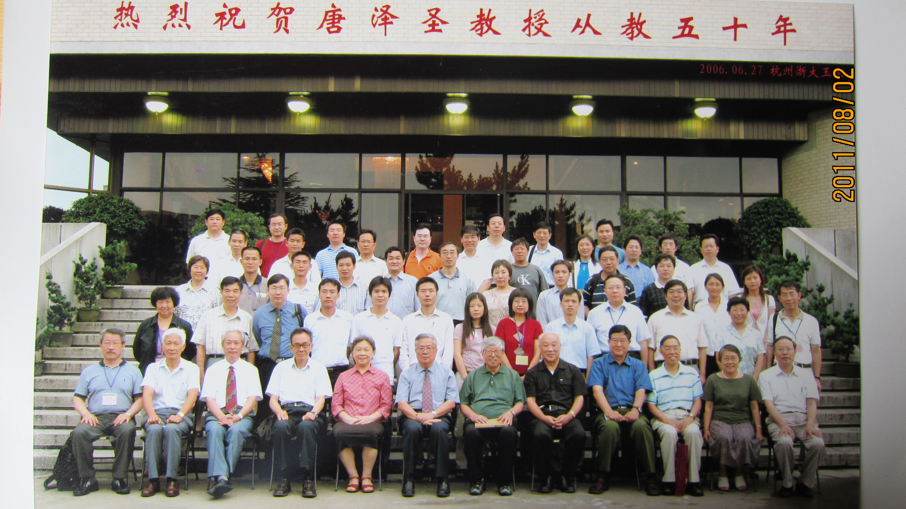
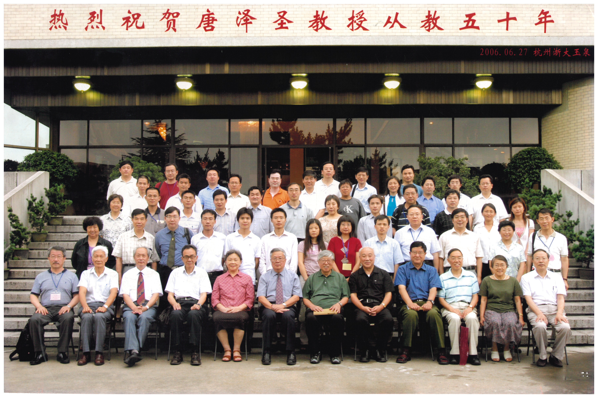

# 第11章　清华大学：计算机学科视角下的几何计算

> "在清华等单位的努力之下，终于把它归于 SIAM 即'中国工业与应用数学学会'麾下，在 2001 年，成立了 GDC。"
> ——王国瑾，2021

---

## 11.1　另一条入口：从计算机系出发

把清华大学放进中国计算几何的故事里，要先承认一件与前几章不同的事——这一支不是从数学系生长出来的。复旦由苏步青领衔的微分几何传统铺底，浙大经"应用数学系"承接苏老的学术血脉，山大数学系沿船体放样的工程脉络切入，吉大则由齐东旭从函数逼近论一路推进；唯独清华，**计算几何与计算机图形学这两件事，从一开始就更多地落在计算机系的教研室里**。这种"入口的不同"决定了清华路径的几个底色：问题来自图形系统、算法、数据结构，而不是来自曲面理论或微分几何；衡量成果的尺度更靠近 SIGGRAPH 这一类系统会议，而不是首先指向 CAGD 期刊；学生培养中"上机"的分量从一开始就比"推导"更显眼。

这一点的重要性，要放在第三章关于"协作组三角"基本叙事的语境里才看得清楚。本书前几章反复强调，1978 年研究生招生恢复之后中国计算几何能在短短几年内形成一个跨校共同体，根脉之一就在于复旦—浙大数学系师徒网络的存在；微分几何与函数逼近论这两套数学语言，是协作组成立初期共同的"通用语"。一旦把入口换到计算机系，"通用语"也随之改变——B 样条曲面的几何性质讨论会让位于图形流水线、显示算法、数据结构与系统实现的讨论。两套话语在 1980 年代各说各的，到 2001 年才在 GDC 的旗帜下被收束到同一张会议日程里。

这条入口在 1980 年代并非主流。本书第四、第五两章曾经把"协作组三角"——复旦、浙大、山大——的形成讲过一遍：1984 年王国瑾后来回忆的协作组首批名单里，列出的是浙大、复旦、中科大、山大、吉大、中科院、西北大学、北航这八家[需核实：1980 年复旦讲习班的参加单位名单（fig_087）中已经出现了"清华大学"的字样，但首批协作组成员名单中并未把清华列为正式成员单位——清华学者在 1980 年代具体以何种身份参与协作组活动，待核实]。这意味着，讨论"清华学派"不能套用复旦、浙大、山大那一套以 1982 年青岛会议为起点的叙事框架；它的故事更接近于一条**晚发力、却在国际舞台上后发突起**的延伸线，需要单独一章交代。换一个视角看，本章其实是在补足前面几章留下的一块空白——前几章按"数学系入口"的逻辑串起协作组主线，本章则要把"计算机系入口"这条平行线接上，使读者在进入第十三章吉大与本书第二部"传承篇"诸章之前，已经具备完整的两条入口图景。

清华的"晚一点"，不是因为这所学校来得迟，而是因为它进入这门学科的口径不同。1970 年代后半叶到 1980 年代初，清华在 CAD 与计算机图形学方向上已陆续有自己的工作积累——这些工作主要来自计算机系而非数学系，主导者也不是协作组三角里那批曾从复旦、浙大数学系出来的中生代；他们的师承谱系另起一线。等到 1990 年代清华图形学全面发力、再到 2001 年 GDC 在清华挂牌成立，这条另起的支线才与协作组主线汇合。把这一汇合写清楚，就是本章的任务。

## 11.2　唐泽圣与清华图形学的起步

清华计算机图形学最早被记下名字的人，是唐泽圣。**唐泽圣[需核实：完整生卒年]**，长期任教于清华大学计算机科学与技术系，是中国最早系统性开展计算机图形学研究与教学的学者之一。书中现存的关键证据是 2006 年 6 月 27 日在浙江大学举办的"唐泽圣从教五十周年"纪念活动——按这一年份倒推，唐先生大约在 1956 年开始从事教学工作。这一时间点本身已经说明问题：在协作组三角于 1980 年代初成形之前的二十多年，唐泽圣已经在清华开始了他的教学生涯；当浙大 1978 年恢复研究生招生、1982 年三家在青岛集结之时，他已是站在另一条学科入口上的资深教师。

*图 11-1　2006 年 6 月 27 日，唐泽圣从教五十周年纪念活动在浙江大学举行——以"在浙大办清华教授的从教纪念"为形态，这场活动本身就是清华学派与浙大学派之间长期学术友谊的一个具体注脚*

*图 11-2　庆祝唐泽圣教授从教五十年（与图 11-1 同属 2006 年纪念活动）——本书把唐泽圣作为清华学派的旗帜性人物，与浙大梁友栋、山大汪嘉业、复旦刘鼎元、吉大齐东旭并列写入"协作组同代人"群像*

唐泽圣在清华的具体工作包括三条主线：第一条是计算机图形学的教学与教材建设——清华计算机系最早的图形学课程由其主持开出[需核实：开课的具体年份与首批选修学生群体]；第二条是医学图像可视化与体可视化方向的研究，这条线在国内外都属于较早的探索之一[需核实：代表论文与时间节点]；第三条则是博士生培养——他指导毕业的博士生中，有数位日后成为清华以及国内其他高校图形学方向的骨干[需核实：完整的毕业生名单]。这三条线索使得清华计算机图形学在 1990 年代以前虽没有直接进入协作组三角的视野，却已经在自己的轨道上完成了人员、课程、方向三方面的铺垫。

把唐泽圣放回到协作组同代人的群像里——他与浙大梁友栋（1935—）、复旦刘鼎元、山大汪嘉业（1937—）、吉大齐东旭（1940—）、北航唐荣锡（1928—）、中科大常庚哲（1936—2018）、中科院孙家昶大体处于同一辈份，但学术入口完全不同：协作组三角里的主帅们是从微分几何、函数逼近论、CAGD 这条数学一侧切进来的，唐泽圣则是从计算机图形学这条系统一侧切进来的。两条入口在 1980 年代各自发展，到 2001 年 GDC 成立时才在制度上正式归到同一个屋檐下。

[图待补：清华大学计算机系早期图形学/CAD 教研室合影——本节核心待补图，建议起草后由访谈与档案搜集补全]

需要坦诚说明的是，本章在这一节遇到的史料瓶颈是全书最严重的——浙大主线由王国瑾在 2021 年所撰系统回忆 book_004 提供了完整的人员、年代与事件，复旦、山大、中科大、吉大、北航各家也都有不同程度的口述与文献依托，**唯独清华一线目前缺乏一份与 book_004 相对应的同等密度的本位回忆**。本章在唐泽圣生平、清华计算机系图形学/CAD 教研室建系史、1980 年代清华参与协作组活动的具体形态等几条关键脉络上，都不得不留下大量 [需核实] 的标注。这些缺口是后续访谈与档案核实优先级最高的工作。

## 11.3　1980 年代清华在协作组中的位置

1980 年代清华学者在协作组活动中究竟以何种身份、参与到何种程度，目前的史料只能给出一个较粗的轮廓。最早的一份可作旁证的文本，是 fig_087 所记载的 1980 年复旦大学计算几何讲习班的参加单位名单——名单中所列"华东师范大学、东北师范大学、郑州大学、河南大学、延边大学、湖北大学、西北大学、北方交通大学、南京航空学院、吉林工业大学、哈尔滨工业大学、西北工业大学、华中师范学院、天津大学、清华大学、山东大学、湘潭大学、湖南大学、上海柴油机研究所、湖南大学、吉林大学"中，**清华大学作为参加单位之一被明确写入**。这是目前可以确认的、清华以单位名义出现在中国计算几何最早一批共同体活动里的最直接证据。具体派出的教师姓名、所授听的内容、回校之后是否在清华内部组织过对应的传达讲习——这三个问题在现有材料里都还没有答案[需核实]。

1980 年的复旦讲习班对清华参与者意味着什么，要放在那一年复旦数学系的整体氛围里看才显得具体。本书第三章曾把这次讲习班描述为"恢复研究生招生第二年之后，全国学术网络第一次以计算几何为主题的集中亮相"——苏步青在讲习班上系统讲授曲线曲面理论，同期下厂攻关的几位中生代教师把船体放样、机床加工、螺杆泵设计等工程问题摆在台面上和与会单位代表交换；对清华的参加者而言，这次讲习班大概率是他们第一次以"清华大学"这一单位名义、与复旦—浙大—山大这条数学系主线在同一会场对坐。无论参加者是数学系还是计算机系教师，这一次的同框，至少在档案意义上把清华纳入了协作组共同体的视野，比 1984 年的首批协作组名单还要早四年。

到 1982 年青岛会议，情况变得更难判断。按苏步青在会议序言中的统计，到会的是全国六十八个单位、约一百三十名代表；论文集汇编了十七篇论文。本书在第四章已逐一列出了主要报告人——梁友栋、汪嘉业、唐荣锡、齐东旭、邓子琼，以及国内线上的徐叔贤、刘鼎元、金通洸、汪嘉业、齐东旭、唐荣锡、郭会琳、徐微、肖宏恩、丁秋林——这份名单里并未出现清华学者的姓名[需核实：青岛会议六十八个单位中清华是否在列；若在列，派出代表姓名与是否做学术报告均待核实]。这与 1980 年复旦讲习班"清华作为单位出现"的记录形成对照——青岛之于清华，目前只能说"无法证实参与的具体形态"，而不是"明确无缘"。

王国瑾在 2021 年回忆中给出的 1984 年协作组首批成员名单里，也未把清华列为正式发起单位。这一事实需要做两层解读：第一层，协作组的首批"组长单位"和"发起单位"的边界，本身就是一种对前几年非正式合作格局的事后追认，名单的精确性依赖于各方记忆——在没有教育部正式批文出现之前，"是否在 1984 年首批名单内"这个问题本身就具有一定弹性[需核实]。第二层，更具体地说，清华学派在 1980 年代的研究力量主要集中在计算机系，而协作组三角的根基则集中在数学系；两者之间在 1980 年代尚未形成稳定的合作通道，是一种学科入口分立的自然结果，而非清华"被排除"的反向叙事。

把这一节作如下小结较为稳妥：1980 年代的清华，在中国计算几何的整体版图中是一支"延伸力量"——它已经具备了独立发展的人员与方向，但尚未与协作组三角建立日常化的合作；这支延伸力量在 1990 年代才会通过博士生培养、跨校合作课题、国家级项目申报等具体路径，逐步与协作组主线汇合。这一节中所有结论都建立在现有有限史料之上，**详细的年代、人员、课程、合作课题等具体内容，是后续访谈与档案工作最关键的补全方向**。

## 11.4　浙大—清华学术谱系：胡事民及其同辈

清华学派与协作组主线汇合最具体的一条人员通道，是从浙江大学到清华大学的研究生培养路径。其中最具代表性的一位，是胡事民。

**胡事民[需核实：生年]**，1990 年代中期之前在浙江大学接受了完整的硕士与博士训练——按王国瑾 2021 年的回忆，胡事民 1993 年是浙大金以文教授的硕士生，1996 年成为浙大金通洸（1934—2020）的博士生。这条"浙大硕士—浙大博士—清华教职"的路径，并非孤例：第六章已经写过浙大数学系计算几何专业团队培养出的"国家级人才"群——一位院士谭建荣、五位国家杰青（谭建荣、马利庄、鲍虎军、胡事民、刘利刚）、三位 973 首席科学家（胡事民、鲍虎军、谭建荣）、两位国家重点实验室主任（鲍虎军主持 CAD&CG 国家重点实验室、胡事民主持虚拟现实国家重点实验室）——胡事民是其中**毕业后任教清华**的那一位。第六章把他作为浙大培养产出的代表写入；本章把他作为清华学派的接力者再写一次。同一个人，在两章里两个角色，这是协作组制度下中国学者人员流动的一个真实模式。

胡事民在清华的工作可以用几条公开节点串起来：2002 年获得国家杰出青年科学基金；2006 年担任 973 计划项目首席科学家；2011 年获国家技术发明二等奖；2015 年获国家自然科学二等奖；2018 年获国家科技进步二等奖；2018 年起出任虚拟现实国家重点实验室主任；2019 年获 CCF 王选奖。把这一组国家级头衔放在一个人身上，本身就是中国计算机图形学过去二十年发展速度的一个缩影；把这同一个人放到本书的章节脉络里看，则是协作组—GDC 平台所培养的人才在 21 世纪初登上国家科技舞台中央的具体写照。

[图待补：胡事民在清华工作场景的代表性照片]

胡事民不是孤例，而是一个谱系上的代表节点。1990 年代到 2010 年代之间，浙大数学系计算几何专业团队培养的硕士、博士中，多人毕业后赴清华、北大、中科院软件所、中科院计算所、中科大等高校与研究院任教；其中部分人在清华完成了从助教到正高、再到学术领导岗位的成长路径[需核实：完整名单与各人具体的浙大学位年份、清华入职年份、研究方向]。这种"由浙大数学系培养、在清华计算机系任教"的模式，在协作组—GDC 的人际网络中并不少见；它一方面延续了 1980 年代协作组"不计较署名顺序"的合作伦理，另一方面把这种伦理嵌入到了 1990 年代以后大学对国家级人才计划的竞争结构里，使之转化为一种**跨校共同培养国家级学者**的制度成果。

第六章已经写过浙大主线在国际舞台上"以中国学者命名"的四个名字——梁友栋的 Liang-Barsky 裁剪算法、汪国昭的 Wang's formula、王国瑾的 Wang-Ball 曲线、金通洸与苏步青合作的金通洸磨光定理。本章则要在这个名单之外补一句：**中国计算机图形学在 21 世纪初的国家级与国际级声誉，相当一部分由浙大培养、在清华任教的这一代人共同支撑**。胡事民是这一支的一个旗帜，但远不只他一人。具体的展开，将留到本书"流派篇"的后续清华专章与"当代发展"诸章里继续；本书第十三章吉大、第十四章中科院系统与第二部"传承篇"诸章中关于 GDC 历届主任、973 项目、国家重点实验室的叙述，也会反复回到这条由清华—浙大共同支撑的人才链上。

## 11.5　2001：清华作为 GDC 成立地

把这一切最终汇到一处的，是 2001 年。这一年，从 1984 年算起、走过了十六个年头的"高校计算几何协作组"，在清华等单位的努力之下，归入"中国工业与应用数学学会（CSIAM）"麾下，转型为正式的"几何设计与计算专业委员会"——也就是今天通称的 GDC。这次成立大会的具体地点是清华大学[需核实：会议的具体日期、会场与会议议程]。王国瑾在 2021 年的回忆中把这一过程概括为一句话：高校计算几何协作组历经十六年，其成员逐年扩大，最后，"在清华等单位的努力之下，终于把它归于 SIAM 即'中国工业与应用数学学会'麾下，在 2001 年，成立了 GDC"——本章篇首引语用的就是这一句。从学科治理的视角看，"高校协作组"这一身份在 1980—1990 年代的合法性主要来自教育部、各校校系的非正式默认与每年的合作惯例，并没有一个全国学会层面的建制化身份；2001 年的转型把这种"惯例性合法性"升级为"学会建制合法性"——而这一关键升级所选择的承办地，是清华。这本身是一种治理意义上的标志：清华作为一所在 1980 年代"非首批"的延伸单位，到 2001 年已经具备了承担学会专委会成立这种全国性事务的学术信誉与组织能力。

王国瑾在 2021 年回忆中保留了关于这次成立的一张关键合影：2001 年 6 月汪国昭、王国瑾在清华大学参与组建 GDC 时的合影，**左起**清华胡事民、浙大汪国昭、浙大王国瑾、中科院高小山、北方工大齐东旭、中科大冯玉瑜、中科大陈发来、中科院李华。这张八人合影是一份信息密度极高的史料：它**第一次**把清华、浙大、中科院（数学院系统）、北方工大（齐东旭从吉大转入北方工大后任教）、中科大、中科院（软件所/计算所系统）这六家单位的代表共同写入了一个学会组织的初始名单里——而合影的拍摄地点是清华，左起第一人是胡事民。这些细节单独看都是琐碎的，合在一起则提示了一个事实：协作组从 1984 年到 2001 年这十六年里，组长单位（浙大）的"组长式连续性"得以延续，而**承办地从 1980 年代浙大、山大、复旦三家轮换的格局，扩展到了清华作为一个新的核心节点**。

*图 11-3　2001 年 6 月 GDC 在清华大学成立时的合影——左起清华胡事民、浙大汪国昭、浙大王国瑾、中科院高小山、北方工大齐东旭、中科大冯玉瑜、中科大陈发来、中科院李华。这张八人合影本身就是协作组从"非编制合作体"过渡到"学会专委会"的视觉证据*

GDC 首届主任由浙大汪国昭出任。这种"组长单位领衔、承办地另设"的安排，本身是协作组—GDC 转型期最具特征的一个组织结构：**领衔权延续了浙大自 1984 年以来作为组长单位的传统，承办权则反映了清华在 1990 年代以后学科地位的上升**。两者并不冲突，而是一种"老组长单位 × 新核心节点"的搭配——这一搭配形态，到 2023 年原浙大团队负责人刘利刚接任 GDC 主任之时仍然延续[需核实：刘利刚接任的具体月份与场合，本书第六章已留为待核实项]。

把"为什么是清华作为承办地"这一问题再追问一层，可以给出三条理由：第一，清华在 1990 年代后期已通过胡事民等一批新生代学者在国家级人才计划与国际期刊上获得了显著存在感，承办一次全国性专委会成立会议在学术地位上已属合宜；第二，清华作为一所同时拥有计算机系与数学系强势学科的综合性大学，承担学会专委会的运作所需的行政与场地资源较为充足；第三，从协作组三角（复旦、浙大、山大）扩展到 GDC（覆盖清华、北方工大、中科院、中科大等更广坐标），承办地的转移本身就是这种扩展的一个外显信号。三条理由叠在一起，使得"2001 年 GDC 在清华成立"既是清华学派在中国计算几何叙事中正式登场的标志，也是协作组主线本身完成组织化升级的标志。

落点是双向的。对清华来说，2001 年是它从"延伸力量"上升为"枢纽节点"的关键一年；对协作组主线来说，2001 年是它把人员、合作、组织三方面在 1980—1990 年代积累的全部能量，正式压铸为一种学会建制的关键一年。从这一年开始，"协作组"作为一个非正式名词逐步被"GDC"作为一个学会专委会名词所替代；而清华，无论是作为承办地、还是作为胡事民等一批新生代学者的工作单位，都成为这次转型最具体的舞台。本书在此后"传承篇"与"繁荣篇"的诸章里，将继续沿着这条由清华参与塑造的 GDC 主线，把 2001 年之后的故事写下去。

---

::: tip 本章关键词
清华大学 · 计算机系入口 · 唐泽圣 · 1956 从教 · 2006 从教五十周年 · 1980 复旦讲习班(清华参加单位) · 1984 协作组(清华非首批) · 浙大-清华学术谱系 · 胡事民 · 1993 金以文硕士生 · 1996 金通洸博士生 · 2002 杰青 · 2006 973 首席 · 2018 虚拟现实国家重点实验室主任 · 2001 GDC 在清华成立 · 老组长单位×新核心节点
:::

**→ 下一章：[第12章　吉林大学：CAD 几何核心的北方根据地](./ch12)**

---

## 图说建议

- **图 11-1（fig_091）**：2006 年 6 月 27 日唐泽圣从教五十周年纪念活动在浙江大学举行的合影。本章核心配图，是清华学派与浙大学派学术友谊的具体注脚。已置入正文。
- **图 11-2（fig_176）**：庆祝唐泽圣教授从教五十年活动照片，与图 11-1 同属 2006 年纪念活动，搭配使用。已置入正文。
- **图 11-3（fig_133）**：2001 年 6 月 GDC 在清华大学成立时的八人合影。本章 11.5 节核心配图，是清华作为 GDC 承办地的视觉证据，与第六章 fig_TBA_004 共享。已置入正文。

### 待新增图（fig_TBA 系列，建议起草后由 insert_figures 工作流补全）

- **fig_TBA_011_001**（11.2 节）：唐泽圣早期工作场景照片或代表性著作封面（若有），用于本节人物主线配图。
- **fig_TBA_011_002**（11.2 节）：清华大学计算机系早期图形学/CAD 教研室合影或建系史档案（若有），用于本节制度主线配图。
- **fig_TBA_011_003**（11.4 节）：胡事民在清华工作场景代表性照片（若有），用于本节"清华接力者"主线配图。
- **fig_TBA_011_004**（11.5 节）：2001 年 GDC 在清华成立的会场或议程文件（若有），与图 11-3 互为印证。
- **fig_TBA_011_005**（11.4 节）：浙大—清华学术谱系图（拟绘示意图，标注主要人员的浙大学位年份与清华入职年份）。

## 待核实清单

- 唐泽圣的完整生卒年、籍贯、学术训练背景（本科/研究生/留学经历）。
- 清华大学计算机系最早开设计算机图形学/计算几何课程的具体年份、首批主讲教师与首批选修学生群体。
- 清华大学计算机系建系史中图形学/CAD 教研室的成立年份、负责人与首批教师名单。
- 唐泽圣指导毕业的博士生完整名单及其后续学术轨迹。
- 1980 年复旦计算几何讲习班（fig_087 名单中已列出"清华大学"为参加单位）中清华派出的具体教师姓名与所听内容。
- 1982 年青岛会议六十八个单位中清华是否在列；若在列，派出代表姓名与是否做学术报告。
- 1984 年协作组成立时清华的具体身份——是否曾被作为"延伸力量"非正式参与协作组活动，相关记录待核实。
- 1980 年代清华在协作组日常活动（年度交流会、暑期讨论班、跨校合作课题）中的具体参与情况。
- 胡事民的完整生卒年、本科学历背景、博士论文题目与具体毕业年份（2021 年王国瑾回忆给出的"1996 年金通洸博士生"是入学年还是毕业年待核实）。
- 1990—2010 年代浙大数学系计算几何专业团队培养、毕业后任教清华的研究生完整名单及各人浙大学位年份与清华入职年份。
- 孙家广是否在清华任职、其在清华 CAD 与计算几何方向上的具体角色，与唐泽圣的合作关系。
- 2001 年 6 月 GDC 在清华成立大会的具体日期、会议地点（清华校内具体场所）、议程、与会名单全文。
- fig_091（2006 年唐泽圣从教五十周年）与 fig_176（庆祝唐泽圣教授从教五十年）是否为同一次活动的两张照片，或同一系列纪念活动的不同场次。
- note_009、note_012、note_013（bundle 中标注内容待补的笔记）若涉及清华人物，需追加调取。
- 清华作为 GDC 之后的承办单位之一，1990 年代后期与 2000 年代前期参与协作组—GDC 转型筹备的具体内部档案。
