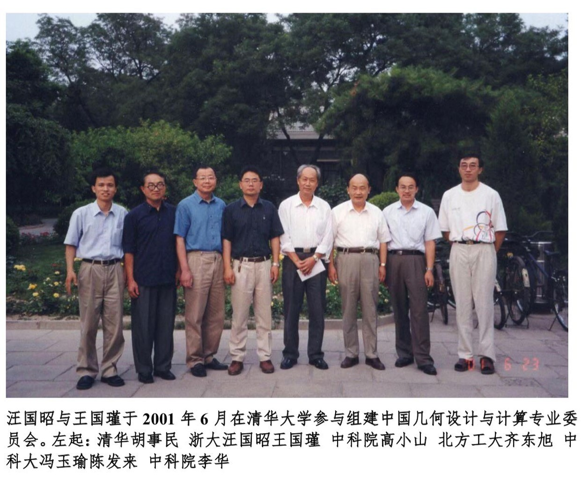

# 第12章　吉林大学：CAD 几何核心的北方根据地

> "咦？石油、地震勘探、沃尔什函数……就这样，齐东旭第一次接触了沃尔什函数。"
> ——陈伟，《与沃尔什函数共舞五十年——纪念我的导师齐东旭教授》（2023）

---

## 12.1　吉大数学传统与齐东旭的成长

把吉林大学放进中国计算几何的故事里，几乎一开口就要提到齐东旭（1940.12—2023.2.4）这个名字。但齐东旭的出现，不是某一位海归学者从天而降，而是从吉大数学系自己的代数与分析底子里一步步走出来的——这一点和浙大数学系从苏步青、陈建功一脉传下来的微分几何底色，颇有几分对照。

齐东旭 1940 年 12 月生于辽宁昌图。1958 年考入吉林大学计算数学专业，1963 年毕业并留校任教。这一年他二十三岁。在六十年代初的吉大数学系里，"计算数学专业"作为一个独立专业方向，本身就是一件并非每所综合大学都具备的事——东北的工业基地需要计算技术，而吉大数学系的代数、分析底子又恰好为计算数学的展开留出了从基础理论到应用算法的充裕空间[需核实：吉林大学计算数学专业的精确建系年份与首任负责人]。江泽坚、王湘浩等老一辈数学家在吉大长期奠基，其学术风格虽以代数与分析为主，但也滋养了后来一批进入计算数学方向的学生[需核实：王湘浩、江泽坚与计算数学专业建立的具体关系]。这种"以代数、分析底子为根，向计算与应用方向开枝"的格局，在 1960 年代的国内综合大学数学系里并不多见——它既不同于复旦数学系自苏步青以下以微分几何为主线的传统（参见第二、第四章），也不同于浙大数学系自陈建功以下以函数论与几何分析为主线的传统（参见第四章），更接近于"基础理论扎实但向工程开放"的一种北方风格。

把这条北方支线放在 1960 年代的中国版图上看，它的地理位置同样不可忽视——长春位居东北腹地，紧邻一汽、长春光机所等工业与科研重镇，吉大数学系的计算数学专业从立专业之初就与本地的工业计算需求保持着一种自然的联系。这一点在齐东旭后来 1976 年那次因"押车送苞米"而偶遇沃尔什函数的故事里得到了某种意外的回响——油田、地震勘探、工厂技术室寄来的资料卷，能够辗转抵达吉大数学系资料室，本身就说明这条"工业-计算数学"的通路在当时是真实存在的。

留校之后的十余年，齐东旭的学术路线与那一代知识分子的命运并无两样——课堂、资料室、再加上 1970 年代的下放劳动。1978 年，齐东旭与复旦数学系的"船体数学放样"项目、浙大金通洸的"螺杆泵螺杆简易近似加工方法"一同获得全国科学大会奖（fig_014 待补）；这一年他三十八岁，已经是吉大计算数学专业里的一位中年骨干。同一时期，与齐东旭年龄相差三五岁的另几位吉大数学系师生——王仁宏（1937—）、周蕴时等——也在样条函数、多元逼近的方向上各自起步，与齐东旭一道，把吉大数学系拽进了一条更靠近"工程"和"图形"的支线。

[图待补：fig_TBA_jlu_001——齐东旭肖像（来自 book_005 刊首），章首图，**待新增**]

## 12.2　唐山大地震前夜：1976 年的偶遇

吉大主线里最具戏剧性的一段史料，发生在 1976 年 7 月。这段叙述完全来自陈伟 2023 年所撰《与沃尔什函数共舞五十年》——陈伟是齐东旭后来的学生，这一段故事是他从齐东旭"生前回忆"里听来并整理出来的，不少细节无独立史料佐证，下面的引述特意保留了陈伟原文里的转述语气。

1970 年代中期，齐东旭被下放到吉林省伊通县的五七干校劳动改造。1976 年 7 月的某一天，齐东旭正在干校农场劳动，农场负责人喊："有谁呀？来一个。押车回校送苞米。"看到齐东旭离他最近，直接说："就你吧。"齐东旭由此趁机回了一趟吉林大学，顺便绕去数学系资料室。资料室工作人员陈祖继按惯例把外地寄来的各种邮件资料放在显眼的地方，其中一份**已被撕破的纸卷**夹在中间。除了印有"抓革命促生产"的口号外，纸上还有"某油田技术室"字样，破损的页面上还有几条模糊的数学公式与锯齿状图形。出于好奇，齐东旭把这几张"破纸"带回了五七干校。

回到干校之后，他随手把纸扔在桌角。还没来得及细看，第二天凌晨四点多，便发生了震惊中外的唐山大地震（1976 年 7 月 28 日凌晨）。距离震中一千多里的伊通震感强烈，房屋摇晃得很厉害，那几张纸被滚落到地上。陈伟在文章里这样写道：

> 强烈的晃动震醒了熟睡中的齐东旭，迷迷糊糊醒来后的他没有立即冲出屋外逃难，而是下意识地捡起地上的一沓纸，并稀里糊涂地瞧了一眼。咦？石油、地震勘探、沃尔什函数……就这样，齐东旭第一次接触了沃尔什函数。

沃尔什函数（Walsh function）由美国数学家 Joseph L. Walsh 于 1923 年提出（*A closed of normal orthogonal functions*, *American Journal of Mathematics*, 1923, 45: 5–24），它仅取 +1 与 -1 两值，波形不断跳跃，在很长一段时间里几乎被国际数学界遗忘——连作者本人都不欣赏自己的这一创造，在为庆祝其七十寿辰出版的论文集中竟没有收入这篇 1923 年的论文。1970 年代随着半导体技术与大规模集成电路的出现，沃尔什函数有了物理实现的可能，在哈尔姆斯（H. F. Harmuth）等人的鼓动下，国际上掀起了持续近十年的"沃尔什函数热"，甚至有人预言"沃尔什分析将导致一场革命，就像十七八世纪牛顿的微积分那样"。陈伟在文章中所引述的这些国际背景，恰恰是齐东旭那几张"破纸"为何会从某油田技术室一路辗转到吉大数学系资料室的远因——石油勘探与地震信号处理对二值正交函数的工程需求，与国际上正在兴起的沃尔什热潮在中国的工业现场以这样一种近乎偶然的方式碰头，而后又在五七干校的桌角与一场强震的摇晃中被一位年轻的吉大数学讲师无意间拾起。

地震后的那几个月里，齐东旭在干校与吉大之间反复推公式、查文献、做笔记，对沃尔什函数的了解不断加深，并萌生了"把沃尔什函数推广到任意 k 次多项式"的想法。这个想法后来在威斯康辛大学的暴风雪之夜里变成了 U-系统——这是后话。

## 12.3　1979《样条函数方法》：中国样条理论的奠基

把视线从沃尔什函数那条暗线拉回到 1970 年代后半期吉大数学系的明面工作，齐东旭那几年的主战场其实是样条函数。这一段工作的最重要成果，是他**协助李岳生撰写**的《样条函数方法》——1976 年定稿，1979 年由科学出版社出版，是冯康主编的"计算方法丛书"（现已更名为"信息与科学计算丛书"）的**第一本**。

*图 12-1　李岳生、齐东旭著《样条函数方法》（科学出版社，1979）——"计算方法丛书"第一本*

这本不到三百页的小书，今天看仍然是中国样条理论的奠基性著作之一。其特色被该书前言概括为三条：第一，把样条函数与 δ 函数的内在联系作为整本书的中轴，提倡 δ-基函数插值法；第二，把保凸拟合与磨光法作为面向工业应用的两条主线；第三，对偶次样条函数理论开展初步研究，并把样条函数方法在微分、积分方程数值解上的应用作为示范，并在每章末附 ALGOL 程序与算例。冯康主编的"计算方法丛书"开篇第一卷选了这本书，本身就是一种学派姿态——它把样条函数这门起源于工业现场的数学工具明确推上了中国计算数学的"经典著作"行列。

把《样条函数方法》（1979）与上海科技出版社 1981 年出版的苏步青、刘鼎元《计算几何》（参见第二章）、以及由唐荣锡、汪嘉业、彭群生联合编著、1990 年由科学出版社出版的《计算机图形学教程》（参见第五章图 5-6）并列起来看，这三部作品恰好构成了 1980 年代中国 CAGD 教材的"三本基石"——一本管样条理论的内在数学基础、一本管计算几何的几何观点教学、一本管图形学的工程实现。三本书背后分别对应着三所大学（吉大、复旦/浙大、北航/山大/浙大），也分别对应着三种学术取向（计算数学、微分几何、计算机图形学），合在一起把中国 CAGD 的教材生态在十年之内立起来了。值得一提的是，这"三本基石"在出版时序上也恰好首尾相接——1979 年吉大《样条函数方法》先出，1981 年复旦/浙大《计算几何》紧随，1990 年北航/山大/浙大《计算机图形学教程》收尾——前后跨越十一年，恰与协作组从 1982 年青岛短训班到 1988 年威海会议、再到 1990 年代初教材外推的这条主线在时间上严密咬合。

[图待补：fig_TBA_jlu_002——李岳生肖像（吉大-中山大学）；本节侧引人物，**待新增**]

## 12.4　MRC 三剑客与 U-系统

1979 年 1 月 1 日中美正式建交。齐东旭很快入选**中美建交后的第一批出国留学人员名单**，于 **1980 年 1 月**抵达美国威斯康辛大学麦迪逊分校的数学研究中心（Mathematics Research Center, MRC）做访问学者。临行前他特意带上了自己学习沃尔什函数所作的几本笔记，以及一份明确的研究课题——"把沃尔什函数推广到任意 k 次多项式"。

MRC 是当时国际上样条函数与逼近论研究的重镇——Schoenberg、Carl de Boor 等人都常驻或长期访问于此。把齐东旭这条吉大支线放进第三章已展开的 1979–1982 年集体出国群像里，恰好与梁友栋（犹他大学，Riesenfeld 处）、常庚哲（犹他大学数学系，Barnhill 处）、汪国昭（英国 UEA）、彭群生（英国 UEA）等人的访学构成同期；几条支线在不同的"美式 CAGD 重镇"与"英式 CAGD 重镇"里同步展开，是中美建交后第一年那一批 CAGD 学者集体走出国门最完整的一张分布图。

几乎与齐东旭同时来到 MRC 的，还有另外两名内地学者——湖南大学的**周叔子**与中国科学技术大学的**冯玉瑜**。三人都出生于 1940 年，都属龙，性情相投，常聚在一起热烈讨论数学问题，被 MRC 周围的学者们称为"**MRC 三剑客**"。这"三剑客"的故事在陈伟的纪念文章里被反复提及，成为 1980 年代初中国访学者群像里少有的几个有姓有名、有具体场景的小群体之一。按陈伟的描述，三人在麦迪逊的日常并不只是各自伏案推公式——他们会在 MRC 的走廊里、在校园食堂里、在彼此的公寓里聚谈数学，时而为某条引理争论不休，时而又互相提示新读到的文献线索，那种彼此砥砺的气氛使得 U-系统这一类原本卡在某条引理上的工作，得以在三人闲聊的过程中找到突破口。

合作研究的契机来自一次闲聊。某一天三人聚谈科研选题，冯玉瑜正为寻找满意的课题焦急，齐东旭则因论证一条引理未果而上火。在周叔子的建议下，**冯齐二人随即开始了 U-系统的合作研究**——把齐东旭从 1976 年那几张"破纸"开始想了好几年的"沃尔什函数推广"，与冯玉瑜在样条函数方面的训练对接到了一起。

> 据齐东旭生前回忆，U-系统的主要定理诞生于 **1980 年圣诞节前夕的一个暴风雪之夜**。
> ——陈伟，《与沃尔什函数共舞五十年》

U-系统的内涵，按陈伟在文章中给出的定义，是**将沃尔什函数推广到任意 k 次（k 为非负整数）多项式之后，得到的一类完备正交分段多项式函数系**——通常的沃尔什函数只是 k=0 时的特殊情形。这个定义把沃尔什函数、样条、多项式、正交函数、分形、小波这些原本看似无关的概念有机串起来。U-系统于 1981 年首次在 MRC 的 Technical Summary Report（编号 2217、2229）公开报告，同年投稿至 *SIAM Journal of Mathematical Analysis*，1984 年正式发表——Feng Y Y, Qi D X. *A Sequence of piecewise orthogonal polynomials*. *SIAM Journal of Mathematical Analysis*, 1984, 15(4): 834–844；同时也在《中国科技大学学报》和《吉林大学学报》上发表了相关结果。

[图待补：fig_TBA_jlu_003——齐东旭与样条函数理论奠基者 Schoenberg（中）及 Carl de Boor（右）在威斯康辛大学数学研究中心合影（1980），来源 book_005 图 5；**待新增**，极珍贵]

[图待补：fig_TBA_jlu_004——U-系统论文（Feng Y Y, Qi D X. SIAM J. Math. Anal., 1984, 15(4): 834–844）首页，来源 book_005 图 6；**待新增**]

[图待补：fig_TBA_jlu_005——齐东旭与冯玉瑜合影，来源 book_005 图 7；**待新增**，MRC 三剑客中的两位]

U-系统的国际影响在小波分析兴起之后才完整显现。小波热潮始于 1986 年——法国数学家 Yves F. Meyer（2017 年阿贝尔奖得主）构造出具有衰减性的光滑函数。陈伟在纪念文章里特地点明：U-系统中已包含了小波的关键"基因"——通过对母函数的压缩与平移变换形成正交基底。因此当小波分析兴起后，美国数学家 Charles A. Micchelli 等人在 1994 年的一篇论文里把 U-系统称为"**预小波（pre-wavelet）**"（Micchelli C A, Xu Y S. *Using the matrix refinement equation for the construction of wavelets on invariant sets*. *Applied and Computational Harmonic Analysis*, 1994, 1(4): 391–401）。一项 1980 年圣诞前夕暴风雪之夜里诞生的中国-美国合作工作，在十多年后被国际同行以"预小波"之名重新发现并加以引用——这是吉大（齐东旭）与中科大（冯玉瑜）跨校合作在国际学术地图上留下的最分量的一笔。从时间轴上看，U-系统 1980 年定理诞生、1981 年 MRC Technical Summary Report 公开、1984 年 SIAM 论文正式发表，恰好处在 Yves Meyer 1986 年构造正交小波之前的"前夜窗口"——这一时间差也是"预小波"这一命名在历史叙述上得以成立的根据。

## 12.5　1982 回国，协作组首批成员，与 1988 转出

**1982 年 1 月，齐东旭按期回国**——与梁友栋（同月从犹他大学回浙大）、汪国昭（同期从 UEA 回浙大）几乎同步。陈伟在文章里把那段时期称为"激情燃烧的岁月"——"当时正值国际上计算机辅助设计（CAD）及计算机辅助制造（CAM）火热的时期，大家急切地想把在国外学到的先进东西引进国内"。齐东旭随即加入了**全国高校计算几何协作组**，成为最早期的成员之一[需注意：陈伟在文章中将协作组成立时间记为"1982 年 1 月由苏步青先生倡导成立"，本书依王国瑾 2021 年回忆采用 1984 年正式成立说，参见第四、第五章；陈伟所记可视为苏步青开始倡导的时间点]。

把齐东旭这条吉大支线接进协作组的全国脉络，几个具体节点值得点出。其一，1982 年 7 月青岛"计算几何讨论会、短训班"上，齐东旭与梁友栋、汪嘉业、唐荣锡、邓子琼等"刚从国外回来"的学者一道，承担了介绍美、英、法、西德、加拿大等国国际进展的任务（参见第四章李心灿闭幕发言）。其二，1984 年协作组正式宣告成立时，王国瑾 2021 年所列的首批十二人名单中，齐东旭明确以**吉林大学**代表的身份出现（参见第五章 5.1 节）。其三，1985 年浙大计算几何学术讨论班、1986 年千岛湖会议、1988 年威海会议等八十年代协作组的几次主要集结里，吉大齐东旭都是与会者之一——这些合影在第五章已主用，本章不再重复配图。

*图 12-2　1980 年复旦大学计算几何讲习班名单——名单所列单位中包括吉林大学、吉林工业大学、哈尔滨工业大学等多所东北高校，是吉大数学系与早期协作组人脉网络衔接的一份直接物证*

值得在本章另写一笔的是吉大数学系内部的另一支力量——王仁宏（1937—）。王仁宏 1959 年毕业于吉林大学数学系并留校任教，长期专注于多元样条函数与多元逼近的理论研究，是中国"多元样条函数理论"的主要开拓者；他在吉大任教近三十年，至 1989 年才调入大连理工大学。这条"吉大-大工"学派的延伸线，与齐东旭的"吉大-北方工大-澳门"学派延伸线一道，构成了吉大数学系在 1980 年代后期"双线外迁"的局面。王仁宏的代表作《多元样条函数及其应用》（科学出版社，"纯粹数学与应用数学专著"系列）以及周蕴时、苏志勋、奚涌江、程少春合著的《CAGD 中的曲线与曲面》（吉林大学出版社）（fig_109、fig_110、fig_111 待补，参见 ch14/ch15 图说）共同构成了吉大学派在 1990 年代教材建设方面的代表性产物，与齐东旭后续在分形几何方向的《分形及其计算机生成》（科学出版社）一道，把吉大-计算几何这条学派的著作脉络延续到了 1990 年代中期。

转折点出现在 1988 年。**齐东旭从吉林大学转入北方工业大学，任 CAD 研究中心主任**，1988–2000 年期间又任副校长[需核实：1988 年从吉大转入北方工大的具体调动背景与原因]。这一转出对吉大计算几何方向是一次重大变故——本章从 12.1 一路写到 12.4 的那条以齐东旭为骨架的主线，自此被"半截切走"了。1988 年之后齐东旭在北方工大期间完成的工作，包括沃尔什函数在数字图像处理、隐藏术、二维条码等方面的应用研究，以及参与 CAD 国家重点实验室的建设，按本书的章节边界，将分别归入第十六章（九十年代国产 CAD）与第二十二章（持续繁荣期）展开，本章不再延伸。

吉大本校在 1988 年齐东旭、1989 年王仁宏先后转出之后，计算几何方向的延续状况是本章最大的史料缺口[需核实：1988 年齐东旭、1989 年王仁宏先后转出之后，吉大计算几何方向的延续学者与课题——周蕴时、苏志勋等是否构成本校的接续力量]。从 ch14、ch15 图说线索来看，周蕴时、苏志勋、奚涌江、程少春在 1990 年代以《CAGD 中的曲线与曲面》（吉林大学出版社）为代表延续了吉大本校的 CAGD 教材建设；但更具体的研究项目、博士培养与学派建制，则需要进一步访谈与档案核实。换一个角度看，1988、1989 这两次连续转出，对吉大本校固然是减员，对北方工大与大连理工大学却是各得一翼——齐东旭把沃尔什函数与 U-系统这条主线带去了北方工大，王仁宏把多元样条函数这条主线带去了大连理工大学，吉大这条根脉因此在 1990 年代呈现出"母校受损、外延开花"的格局，这条格局如何回流本校则有待进一步史料补充[需核实：1990 年代吉大本校 CAGD 方向是否曾与北方工大、大连理工大学的两位老校友保持稳定的人才与课题往来]。

落点回到齐东旭这条吉大主线。1988 年从吉大走出之后，齐东旭历经北方工大（1988–2000）、澳门科技大学（2001–2013）两站，2010 年获中国计算机图形学贡献奖，2013 年获中国工业与应用数学学会"几何设计与计算杰出贡献奖"，**2023 年 2 月 4 日（立春之日）在南京逝世**。从 1963 年留校吉大算起，到 2023 年立春逝世，整整六十年。陈伟在纪念文章开篇写下的那一句——"我敬爱的导师齐东旭教授安详去世。离开了他终生热爱的数学事业，离开了他无比眷恋的亲朋好友，也离开了他爱护有加的弟子学生"——这是对这条从吉林走出又回到长江下游的学术生命最朴素的定位。从 1976 年那几张"破纸"开始，到 1980 年圣诞前夕的暴风雪之夜，再到 1984 年 SIAM 论文的正式发表，再到 1994 年 Micchelli 把 U-系统重新命名为"预小波"——这条以一位吉林大学计算数学专业 1963 届毕业生为骨架的学术线索，正是中国计算几何"北方根据地"在 1980 年代留下的最完整的一份样本。

*图 12-3　2001 年 6 月 GDC 在清华大学组建时的合影——左起清华胡事民、浙大汪国昭、浙大王国瑾、中科院高小山、北方工大齐东旭、中科大冯玉瑜、中科大陈发来、中科院李华。本章作为吉大主线（齐东旭以北方工大代表身份出席）再次置入此图（与第十一章图 11-3 同图，本章因吉大主线再次置入）*

---

::: tip 本章关键词
吉林大学 · 计算数学专业 · 齐东旭(1940—2023) · 李岳生 · 王仁宏 · 周蕴时 · 1976 唐山地震前夜 · 沃尔什函数(Walsh function) · 《样条函数方法》(1979, "计算方法丛书"第一本) · 1980 MRC · MRC 三剑客(齐东旭/冯玉瑜/周叔子) · U-系统 · 1980 圣诞暴风雪之夜 · SIAM J. Math. Anal. 1984 · pre-wavelet · 1984 协作组(吉大代表) · 1988 转入北方工大 · 立春之日逝世
:::

**→ 下一章：[第13章　其他院校与机构：协作组中的更多身影](./ch13)**

---

## 图说建议

- **图 12-1（fig_011）**：李岳生、齐东旭著《样条函数方法》（科学出版社，1979）——冯康主编"计算方法丛书"第一本，中国样条理论的奠基性著作。
- **图 12-2（fig_087）**：1980 年复旦大学计算几何讲习班名单——名单中包含吉林大学、吉林工业大学、哈尔滨工业大学等多所东北高校，是吉大数学系与早期协作组人脉网络衔接的物证。

## 待新增图（fig_TBA_jlu 系列，建议起草后由 insert_figures 工作流补全）

- **fig_TBA_jlu_001**（章首/12.1 节）：齐东旭肖像（来自 book_005 刊首）。
- **fig_TBA_jlu_002**（12.3 节）：李岳生肖像（吉大-中山大学）。
- **fig_TBA_jlu_003**（12.4 节核心，**极珍贵**）：齐东旭与样条函数理论奠基者 Schoenberg（中）及 Carl de Boor（右）在威斯康辛大学数学研究中心合影（1980）。来源 book_005 图 5。
- **fig_TBA_jlu_004**（12.4 节）：U-系统论文 Feng Y Y, Qi D X, *A Sequence of piecewise orthogonal polynomials*, *SIAM J. Math. Anal.*, 1984, 15(4): 834–844 首页。来源 book_005 图 6。
- **fig_TBA_jlu_005**（12.4 节）：齐东旭与冯玉瑜合影（MRC 三剑客中的两位）。来源 book_005 图 7。
- **fig_TBA_jlu_006**（12.5 节末，可选）：1978 年全国科学大会知识分子代表合影——齐东旭与复旦船体放样、浙大金通洸螺杆泵简易加工法同获大会奖。可对应 fig_014（目前未在 assets 中），**待新增/核实**。
- **图 12-3（fig_133，12.5 节末）**：2001 年 6 月 GDC 在清华成立合影——齐东旭以北方工大代表身份在列。与第十一章图 11-3 同图，本章因吉大主线（齐东旭）再次置入。已置入正文。
- **吉大学派著作三联**：周蕴时等《CAGD 中的曲线与曲面》（吉林大学出版社，fig_109）、王仁宏《多元样条函数及其应用》（科学出版社，fig_110）、齐东旭《分形及其计算机生成》（科学出版社，fig_111）——本章只在文字中点出，主用归属 ch14/ch15。

## 待核实清单

- 吉林大学计算数学专业的精确建系年份与首任负责人；王湘浩、江泽坚等老一辈数学家与计算数学专业建立的具体关系。
- 1976 年 7 月齐东旭"押车送苞米"回吉大数学系资料室、偶遇沃尔什函数破纸卷的细节——本节叙述完全基于陈伟 2023 年纪念文章对齐东旭"生前回忆"的转述，部分细节（农场负责人原话、纸卷被撕破的状态、资料室工作人员陈祖继等）无独立史料佐证。
- 1980 年圣诞前夕"暴风雪之夜 U-系统主要定理诞生"的具体场景——同上为陈伟转述齐东旭"生前回忆"。
- 协助李岳生撰写《样条函数方法》的具体分工与署名情况——李岳生为第一作者、齐东旭"协助撰写"的具体含义在 book_005 中未细化。
- 李岳生的完整生平与学术贡献（吉大-中山大学双重身份），本章 12.3 仅作侧引人物处理。
- 1988 年齐东旭从吉林大学转入北方工业大学的具体调动背景与原因。
- 1989 年王仁宏从吉林大学调入大连理工大学的具体背景。
- **本章最大史料缺口**：1988 年齐东旭、1989 年王仁宏先后转出之后，吉林大学计算几何方向在本校的延续学者、课题与建制——周蕴时、苏志勋、奚涌江、程少春等在 1990 年代是否构成本校接续力量；该方向在 21 世纪初的状况。
- 陈伟（齐东旭学生）的师承时间、单位与现职，便于评估 book_005 作为史料的视角偏向。
- book_005 后续页（目前只提供前 5 页）所涉及的齐东旭 1980 年代后期至 2010 年代的工作（沃尔什函数在数字图像处理、隐藏术、二维条码方面的应用；北方工大 CAD 研究中心的具体项目；澳门科技大学时期等），建议补全。
- fig_011 在本书 figures 库中的 chapter_candidates 标注为 ch01/ch02，本章作为吉大主线再次引用，与第二章是否冲突——按现有 ch02/ch04 的引用情况，本章作为"流派篇·吉大主线"再次引用应不与前章冲突，但需在最终出版前统一。
