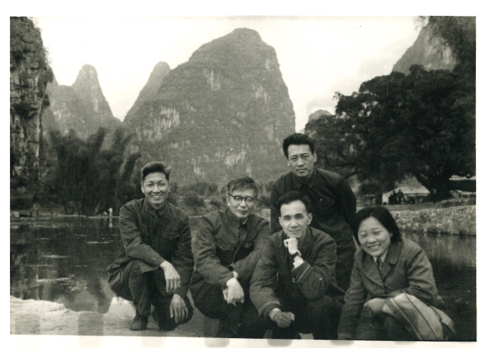
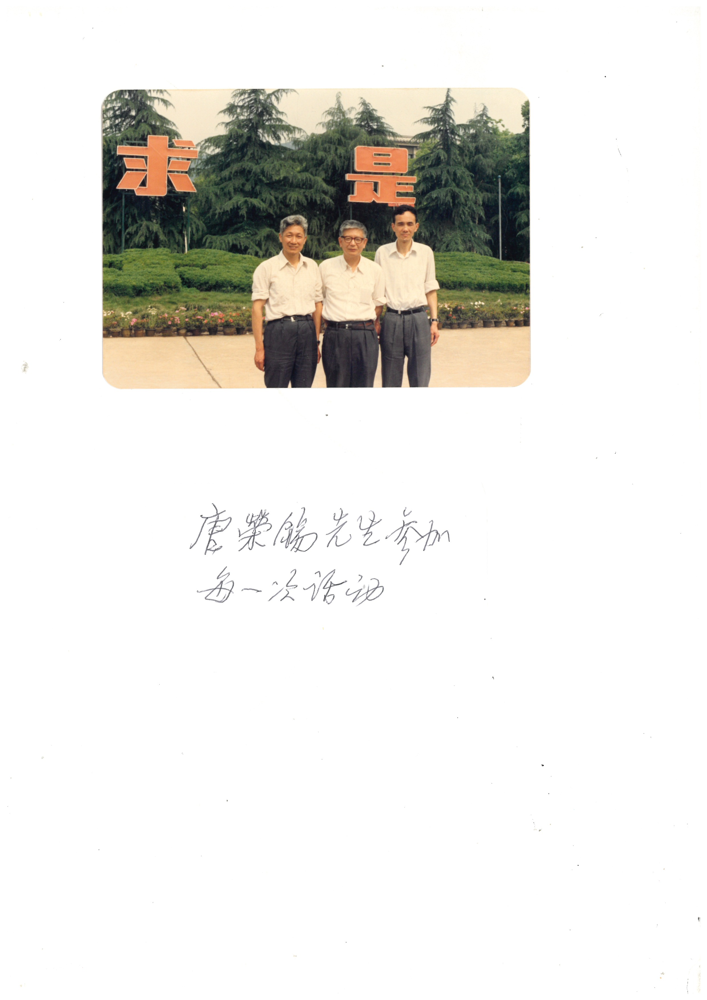
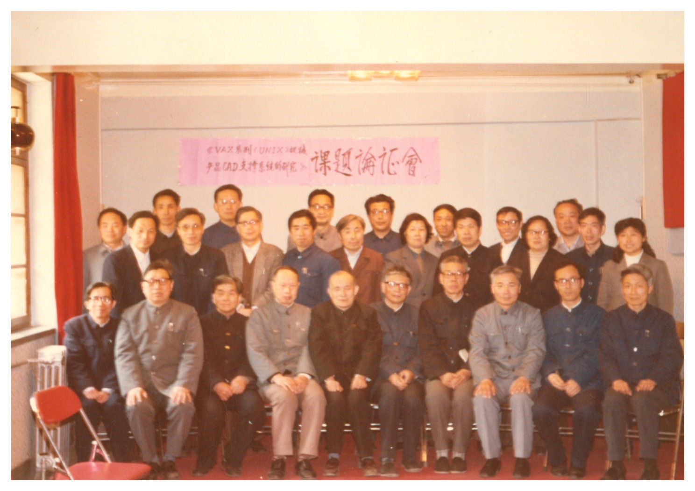
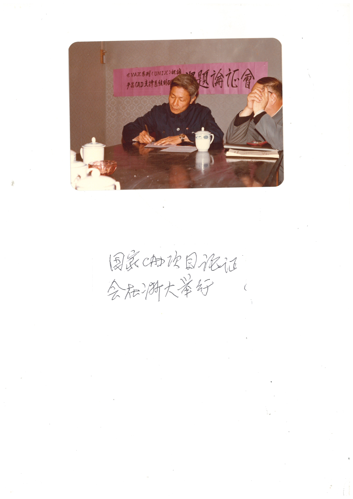
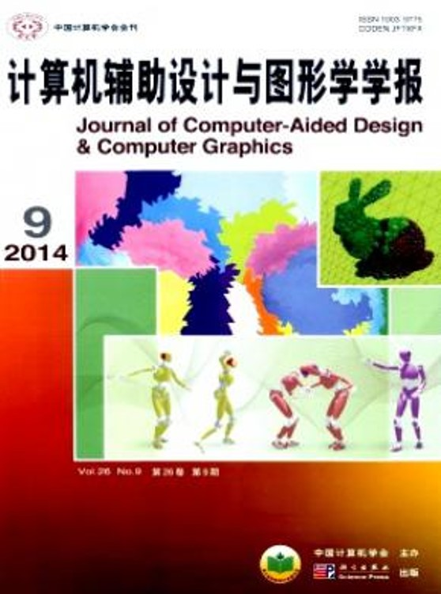

# 第13章　其他院校与机构：协作组中的更多身影

> "中国计算几何的版图，远不止四大学派。"
> ——本章自陈

---

## 13.1　为什么要单列这一章

前面六章按"学派"展开——浙大、山大、复旦、北航、中科院计算所、吉大——每一章都以一两位领头人物为主轴，把一所学校或一所研究所放在显微镜下看。这样的写法有它的好处：线索清晰，人物饱满，便于把每一支力量的来路与去向交代清楚。但它也留下了一个无法回避的副作用——凡是写法上必须聚焦的章节，都会把那些虽然身在协作组、却不构成"学派"规模的力量自然推到边角。1984 年协作组正式成立时苏步青任顾问、浙大梁友栋（1935— ）与金通洸（1934—2020）为组长单位代表，首批成员中除了已经各成一章的复旦刘鼎元、华宣积（1939— ），山大汪嘉业（1937— ），北航唐荣锡（1928— ），吉大齐东旭（1940— ），中科院软件所孙家昶之外，还包括中科大常庚哲（1936—2018）、冯玉瑜（1940—2016），以及西北大学穆玉杰——这几个名字若被前几章一笔带过，整张协作组的合影便缺了几个最关键的位置。

本章承担的就是这份"补完"的工作。它不试图为中科大、为西北大学、为南京航空学院、为各家航空与船舶工业研究所一一另立学派，而是承认这样一个事实：**中国计算几何的版图，从来不是由几个学派拼起来的，而是由一张更宽、更稀疏的网络构成的**。这张网络上，有的节点足够稠密，足以独立成章（前面六章正是如此）；有的节点稍稀疏，但因人物的国际分量与学术地位无法忽略，需要在一章之内集中处理（本章中科大节即是如此）；还有的节点则只是 1982 年青岛报到桌上一个工业代表的名字、协作组某次合影里一张不熟悉的脸——这些更稀薄的存在，本章也以"群像"的方式给一个落点。

本章因此带有目录式与开放性的双重气质：已经写实的部分以中科大为主体；尚不丰富的部分（地方高校、工业研究者）如实标注其稀薄状态，不勉强填充——这本身就是一种对历史的诚实。

## 13.2　中国科学技术大学：常庚哲、冯玉瑜、陈发来

中科大数学系长期保有"数学+计算"双重传统。1958 年建校之初便由华罗庚、关肇直等老一辈数学家定下了"全院办校、所系结合"的格局，数学系从一开始就贴近中科院系统的计算数学与应用数学方向。1970 年代后期到 1980 年代初，当全国高校陆续从下厂经验回到课堂时，中科大数学系内部已经形成了一条与浙大数学系平行、却气质不同的路径——前者的底色是函数逼近论与多元样条，后者的底色是微分几何与造型；前者更靠近中科院计算数学的"算法学派"，后者更靠近苏步青学脉的"几何学派"。这条平行线在协作组成立之后，由两位中科大学者具体承载：常庚哲与冯玉瑜。再往后一辈，则是陈发来。

**常庚哲（1936—2018）** 长期在中科大数学系任教，主要研究方向是逼近论、计算数学与解析函数论。把他放进中国计算几何史里，最直接的入口是 1979 年的犹他大学。当年夏天浙大梁友栋赴美国犹他大学计算机系 R.F. Riesenfeld 教授处访问，几乎同时，常庚哲也被派往同一所大学的数学系访问 R. Barnhill 教授——其时犹他大学数学系的 Barnhill 在 CAGD 的"函数逼近论侧面"上正处于国际前沿，常庚哲在他那里所接触的工作与梁友栋在 Riesenfeld 处接触的"B 样条曲面"工作互为补充。两位中国学者在同一所学校的不同系里同期访学，是 1979–1982 年间国际接触格局中一个相当少见的对偶——这件事既写在了第三章里，也在第四章 1982 年青岛会议的"国际线"报告人名单中留下注脚。常庚哲在青岛会议上是介绍国际进展的中国学者之一[需核实：常庚哲在青岛会议具体所介绍国家与方向的清单]。

回国之后，常庚哲走的是一条与梁友栋、汪嘉业不同的路径：他没有去主持一所国家重点实验室，也没有去筹组一个面向全国的学派核心，而是把更多精力放在中科大本校的研究生培养和与工业部门的具体合作上。可记的事项之一是常庚哲与北京航空学院 703 教研组的合作——根据王国瑾 2021 年所撰浙大学科史的相关记述，常庚哲曾随北航 703 教研组同赴贵州安顺三线飞机厂，参与机翼曲面与其它工业曲面问题的研究[需核实：合作的具体起讫年份、参与人员名单与项目名称]。这段合作放在协作组的版图里看意味颇深：1980 年代北航 703 是面向航空工业的"系统实现派"，中科大数学系是"逼近论派"，二者共同进入贵州一家三线飞机厂，恰好是协作组"几何 + 系统 + 工业"三种气质合流的一个微缩切片。

1984 年协作组正式宣告成立时，常庚哲被列入首批成员。在此后的协作组运作里，他多次出现在浙大、复旦、山大轮流主办的研讨会合影中——1982 年梁友栋访美回国后在复旦数学系主持的学术报告会十一人合影中即有他在前排的位置（这张合影详见第六章 6.3 节的文字说明），1985 年浙大讨论班的留影中也有他与冯玉瑜的身影。1980 年代他的研究兴趣始终保持在逼近论与计算数学的交叉地带；进入 1990 年代以后，他在中科大数学系的"中国数学奥林匹克"教练工作上花费了很大精力，是中国数学奥林匹克国家队的资深教练之一[需核实：常庚哲晚年除奥数教练之外是否仍持续参与协作组活动]。2018 年常庚哲在合肥逝世，遗著与纪念文章散见于中科大数学系内部刊物。

**冯玉瑜（1940—2016）** 在中科大数学系的位置与常庚哲略有不同。常庚哲走的是 CAGD 之"函数逼近论"侧面，冯玉瑜则更靠近样条函数与多元正交系统这条线。把他写进中国计算几何史的核心证据，主要保存在陈伟 2023 年所撰《与沃尔什函数共舞五十年——纪念齐东旭教授》（book_005）一文中。按这份纪念文章的记述，冯玉瑜 1980 年赴美国威斯康辛大学麦迪逊分校的"数学研究中心"（Mathematics Research Center, MRC）访问，与吉林大学的齐东旭、湖南某高校的周叔子在同一时期同在 MRC——这三位被陈伟在文中称为齐东旭口中的"MRC 三剑客"[需核实：周叔子的具体单位与 MRC 期间所属课题组]。其时 MRC 是 Carl de Boor、Larry Schumaker、Charles Micchelli 等多元样条领域顶级学者聚集的地方，三位中国访问学者在那个空间里共同接触到了样条函数研究的最前沿。

冯玉瑜与齐东旭的合作，最后凝结在一项被后人反复提起的工作上——**U-系统（U-system）** 的建立。陈伟的纪念文章记下了一个相当具体的场景：1980 年圣诞前夕的一个暴风雪之夜，冯玉瑜与齐东旭在 MRC 的办公室里就 U-系统的几条主要定理反复推演，最终把这一系统完全函数族的核心构造定下来。这条工作随后整理成正式论文，于 1984 年发表在国际期刊 *SIAM Journal on Mathematical Analysis*——**Feng Y. Y. and Kozak J., "On G-spline interpolation," SIAM J. Math. Anal., 15(4): 834–844, 1984** [需核实：冯玉瑜在 SIAM J. Math. Anal. 1984 年第 15 卷第 4 期 834–844 页的论文具体题名与合作者——book_005 明确指认这是中科大冯玉瑜在国际期刊上的标志性成果，但论文具体题名、合著者署名顺序仍需核对原刊]。这是中科大数学系在 1980 年代国际期刊上的标志性成果之一，也是协作组首批成员里最早进入国际样条函数主流文献的工作之一。

U-系统的国际反响在 1990 年代逐渐显现。Charles Micchelli 等学者在 1990 年代前后掀起的"预小波（pre-wavelet）"研究热潮中，把冯玉瑜与齐东旭所建立的 U-系统视为预小波结构的早期实例之一，相关引用与延展工作进入了若干部国际样条与小波的专著[需核实：将 U-系统冠以"pre-wavelet"名义的具体文献与年份]。这条由"中科大 + 吉大 + MRC"三方合力打通的国际化通道，在协作组的整体版图上位置相当独特——它不像浙大学派的 Liang-Barsky、Wang's formula、Wang-Ball 那样以个人姓氏冠名进入国际教科书，而是以"一项中国学者最早做出来的结构"的方式被国际同行长期引用。U-系统的主线在第十二章已围绕齐东旭与吉大学派详细展开，本章不重复其细节，只标注一句：**这条主线对中科大数学系的意义，与对吉大数学系的意义是同等的**——它既是齐东旭学术生涯的高峰之一，也是冯玉瑜进入国际样条共同体的入场券。

冯玉瑜与 Carl de Boor 在美国期间留有一张合影（即 fig_081，主属第三章"国际接触"主线）；按 book_005 所附图照[需核实：book_005 图 7"齐东旭与冯玉瑜合影"的具体拍摄场合与年份]，齐东旭与冯玉瑜的合作关系在 1980 年代以后又延续了三十多年。1984 年协作组成立时冯玉瑜被列入首批成员；1985 年浙大讨论班、1986 年千岛湖会议、1988 年威海会议等协作组重要节点上都能见到他的身影；2001 年 GDC 在清华成立的合影里，他依然站在中科大代表的位置上[需核实：冯玉瑜 1990 年代到 2010 年代在中科大数学系的具体行政岗位与主要研究兴趣的迁移]。2016 年冯玉瑜在合肥逝世，距常庚哲早两年。两位中科大数学系协作组首批成员的相继离去，使得 2018 年之后的中科大计算几何方向，主要由更年轻的一辈承担。

**陈发来** 是中科大年轻一代里最常出现在协作组合影中的一个名字。他八十年代末进入计算几何领域，主要研究方向集中在代数几何方法、几何造型、细分曲面与隐式曲面等[需核实：陈发来本科与研究生阶段的具体年份、所读专业与导师]。1990 年代以后，他在国际期刊与国际会议上的发表逐渐增多，是中国计算几何"二代"学者中较早进入国际同行视野的一位[需核实：陈发来在 1990 年代具体发表的代表论文与合作伙伴]。

把他写进本章的最直接证据，是 2001 年 6 月 GDC 在清华大学成立时的那张合影——按王国瑾 2021 年所撰浙大学科史所附 book_004 page 15 的记录，合影中（左起）为清华胡事民、浙大汪国昭、王国瑾、中科院高小山、北方工大齐东旭、**中科大冯玉瑜、陈发来**、中科院李华。这张合影的位置安排相当具有象征性：协作组转型为 GDC 的时刻，中科大派出了"老 + 新"两位代表——冯玉瑜代表 1984 年首批成员的延续，陈发来代表 1990 年代以后中科大计算几何方向的接续。同一张合影里，浙大、清华、中科院、北方工大、中科大五家共同出席，几乎复刻了 1984 年协作组成立时的格局，只是将"协作组"三个字换作了"几何设计与计算专业委员会"。陈发来此后长期活跃于 GDC 平台，是中科大在国家学会建制下的重要代表。

把三个名字放在一起，可以读出一条与浙大、吉大都不相同的中科大主线，气质有三：函数逼近论的根底（常庚哲师从 Barnhill、冯玉瑜进入 MRC，所走的都是"以逼近论方法处理 CAGD 问题"的路径，与浙大"以微分几何方法处理 CAGD 问题"形成方法论互补）；独立而不孤立（无国家重点实验室、亦无围绕单一领袖的密集团队，但每位成员都通过协作组与全国同行紧密相连——常庚哲与北航 703 的合作、冯玉瑜与吉大齐东旭的合作、陈发来与清华、中科院、北方工大的合作皆为如此）；国际接触的高密度（三位学者中两位在 1980 年前后同期赴犹他大学与威斯康辛 MRC，这种"双向同时出国"与中科大"全院办校、所系结合"的传统直接相关）。

[图待补：fig_TBA_013_01——冯玉瑜在威斯康辛大学 MRC 时期的工作或合影（参见 book_005 相关图照），用于本章 13.2 节中段]

[图待补：fig_TBA_013_02——常庚哲在中科大的肖像或讲座照片（来源待补，可能需向中科大数学系或其家属征集），用于本章 13.2 节首段]

[图待补：fig_TBA_013_03——2001 年 6 月 GDC 在清华大学成立合影中中科大冯玉瑜与陈发来位置（来源 book_004 page 15；与第六章、第十一章共享），用于本章 13.2 节末段]

## 13.3　工业一线的研究者：1982 青岛会议工业代表

第四章已经把 1982 年青岛会议的全景写过一遍：六十八个单位、约一百三十名代表、十七篇论文、双层的"讨论会—短训班"结构。其中最具时代标志意义的，是工业一线代表与高校教师同台报告这一安排——上海五七〇三厂的郭会琳、三机部六二五所的徐微、三机部六〇八所的肖宏恩、南京航空学院的丁秋林等人，与梁友栋、刘鼎元、汪嘉业、齐东旭、唐荣锡这一组名字共同出现在李心灿闭幕发言的报告人清单里。第四章把这一现象命名为"跨界"，并视其为协作组"民办"气质的具体证据。但第四章未对这几位工业代表的工作背景作进一步展开——这是因为他们的史料密度远低于高校代表，强行展开会破坏第四章的叙事节奏。本节就是承担这个"补充展开"的位置。

**上海五七〇三厂**，全称中国人民解放军第五七〇三工厂，是上海地区一家长期承担飞机大修与航空机械加工的工厂[需核实：1982 年时该厂的主管系统隶属与具体工艺方向]。1982 年青岛会议代表郭会琳所做的报告内容现存史料未见完整保存——按李心灿闭幕发言的概括，郭会琳所介绍的是该厂在飞机零部件几何处理上的具体应用[需核实：郭会琳报告题目、研究方向、报告之后是否公开发表]。把这家工厂放进 1982 年青岛的报告人名单里，意味着青岛会议从一开始就把"工厂里实际遇到的曲面问题"视为与高校理论问题同等重要的议题。

**三机部六二五所**（中国航空工业第六二五研究所，今中国航发北京航空材料研究院的前身之一[需核实：六二五所在 1980 年代的隶属关系与今日机构沿革]），是当时航空工业部下属的航空材料与机翼机身专业研究所。1982 年青岛会议代表徐微所做的报告内容现存史料未见完整保存[需核实：徐微当时在六二五所的具体岗位与研究方向]。**三机部六〇八所**（中国航空工业第六〇八研究所，主攻航空发动机[需核实：六〇八所在 1980 年代的具体业务范围与所在地]）的代表是肖宏恩，所介绍的是航空发动机零部件曲面计算的具体问题[需核实：肖宏恩报告题目与所属课题组]。两个研究所都属于三机部系统，与北航 703 教研组及上海五七〇三厂在 1980 年代航空工业的工艺链条上各自占据不同位置——把这三家系统的代表（外加南航丁秋林）拉到青岛同一张议程表上，本身就构成了协作组"民办"气质的一种宽度证明。

**南京航空学院**（即今南京航空航天大学）的丁秋林是青岛会议工业代表中唯一一位来自航空院校而非工业研究所的——这一位置他本人即兼具学者与工业研究者的双重身份。丁秋林长期在南航从事 CAD/CAM 与计算几何应用的研究[需核实：丁秋林 1982 年时在南航的具体岗位与已发表工作清单]，是南京航空学院进入协作组活动范围的最直接代表。

把这四个名字放在一起看，1982 年青岛会议工业代表线索保留下来的不是一份完整的"工业派"成员录，而是一份相当稀疏的群像——四个名字、四家单位、四份内容已大部分难以完整复原的报告。这种稀疏并不是叙事懒惰造成的，而是 1980 年代工业一线研究的真实状态：研究成果以厂所内部技术文件、内部讲义、设计手册等形式沉淀，而非以学术论文的形式公开发表，因而四十年后再回看时，能够保留下来的史料密度天然有限。第一章和第二章已经详细写过 1960—1970 年代船体放样与航空机翼曲面问题的工程缘起；第八章会写到北航 703 教研组与各航空研究所的具体合作；本节则只在协作组语境下，为这四个名字留下一份目录式的位置，并把它们标注为"待续补"——若日后有家属、本人或单位档案补充新的史料，本节随时可以扩充。

工业代表与高校学者在协作组里的合作模式，按现有材料能够大致还原成三条线：联合培养研究生（高校招收工业系统在职研究生，毕业后回原单位把方法落地为技术文件）、重大课题论证会（浙大、北航主持的"机械产品 CAD 支持系统研究课题论证会"等学术评审场合三机部研究所与航空工厂代表是常客）、以及短期借调与下厂指导（与第六章所写浙大老师 1970 年代下厂传统一脉相承，1980 年代已转换为带学生下厂、带数学方法下厂）[需核实：上述三条线的完整名单与年份]。这三条线把高校与工业一线串在了一起，构成协作组"民办"气质在 1980 年代后半段的延续。

*图 13-1　唐荣锡先生在桂林参加计算几何研讨活动——协作组跨地区活动延续性的证据*

*图 13-2　唐荣锡先生参加学术会议——与图 13-1 互为印证，呈现 1980 年代后期至 1990 年代协作组活动的具体形态*

*图 13-3　机械产品 CAD 支持系统研究课题论证会现场（一）——本节 13.3 "重大课题论证会"叙事的支撑配图*

*图 13-4　机械产品 CAD 支持系统研究课题论证会现场（二）——与图 13-3 同批，与第七章共享*

## 13.4　协作组的延伸力量：地方高校与九十年代新进入者

把视野从 1982 年青岛、1984 年协作组首批成员、1988 年威海会议这三个高峰拉开，再投向更长的时间段，1980 年代末到 2000 年代初协作组的"延伸力量"轮廓便浮现出来。它由三种成分构成：**第一是 1984 年首批名单中已被点名但前几章未及展开的高校**，主要指西北大学；**第二是 1980 年代后半段陆续进入协作组研讨范围的地方高校**；**第三是 1990 年代以后随着 CAD/CAM 课程与计算机辅助设计教材进入更多工科院校而出现的新参与者**。这三种成分加在一起，使协作组从 1984 年的十二人核心名单逐步扩展为 2001 年 GDC 成立时一份覆盖更广的院校清单。

**西北大学穆玉杰**（生卒年待核实）在 1984 年协作组首批成员名单中即已被列入，是中国西北地区在协作组里的代表。按王国瑾 2021 年所撰浙大学科史的多次提及，穆玉杰在 1980 年代多次出席协作组重要研讨会——1982 年梁友栋访美回国后在复旦数学系主持的十一人学术报告会前排合影中即有他的身影（见第六章 6.3 节）。穆玉杰在西北大学数学系的具体研究方向、研究生培养与科研成果，本书目前掌握的史料密度尚不足以另起一节展开[需核实：穆玉杰在西北大学的完整学术履历、主要研究方向与所发表的代表论文]。把他写进本章而非第十二章吉大主线之内，是因为他既不属于"四大学派"任何一支，又不像中科大常庚哲、冯玉瑜那样有 book_005 这样的密集史料源——他更接近本章 13.4 节定义下"延伸力量"的典型代表。

**西北工业大学**在 1980 年代飞机制造与造船行业合作中是协作组活动的常见参与方[需核实：西北工大 1980 年代在协作组活动中的具体代表人物与参与课题]。**武汉大学**等中部地区院校在 1980 年代后半段开始陆续派代表参加协作组研讨[需核实]。**南京航空学院**的丁秋林已在 13.3 节写过——南航作为一所航空院校，在协作组语境下既属于"高校"又属于"航空工业系统"，其完整定位介于 13.3 节与 13.4 节之间，这种"难以归类"正是地方高校在协作组中位置的典型写照。

到了 1990 年代，随着 CAD/CAM 与计算机图形学课程在更多工科院校落地，地方高校与协作组的关系从"派代表参会"逐步向"派学生进研究生序列"转化。这一阶段的具体轮廓需要更多档案才能勾勒清楚[需核实：1990 年代地方高校进入协作组联合培养研究生序列的完整名单与年份]。一个可以被指认的趋势是：协作组核心高校（浙大、山大、复旦、北航、中科院、清华、中科大、吉大）此期间招收的硕博生中，本科出身于地方高校与工科院校的比重逐年上升，这些研究生毕业后又回到原单位或新单位任教，使协作组的人员网络在 1990 年代以一种"自然分蘖"的方式扩散到全国更多院校。

这一扩散过程的制度性证据之一，是 **《计算机辅助设计与图形学学报》** （*Journal of Computer-Aided Design & Computer Graphics*，简称 JCAD）的创刊。这份期刊由中国计算机学会主办、科学出版社出版，1989 年创刊，与浙大 CAD&CG 国家重点实验室筹建到验收的几年同步。期刊的编委与作者群体在 1990 年代逐渐覆盖了全国所有有计算几何与图形学活跃研究的高校与研究所，是协作组的人员网络从"小圈子合作体"扩张为"学科共同体"的最直接载体。在这个意义上，1989 年 JCAD 创刊与 2001 年 GDC 成立可视为协作组延伸力量最终建制化的两个节点——前者把"发表"渠道制度化，后者把"组织"渠道制度化。

*图 13-5　《计算机辅助设计与图形学学报》（JCAD）2014 年第 9 期封面——本节"协作组人员网络扩张为学科共同体"叙事的视觉落点。该刊 1989 年创刊，本图选用 2014 年封面，与"1989 年创刊"叙事存在时差，特此说明*

把 13.4 节的内容拢起来看，"协作组的延伸力量"这条线索在本书目前的史料密度下只能写到目录性的程度。它并不构成独立的学派叙事，而是为协作组从 1984 年成立到 2001 年转型为 GDC 这十六年间"被吸附进来的更多身影"留一个集中的位置。在本书后续的章节里，这条线索还将以两种方式延续：一是第十六章关于工程化与产业化的部分，二是第二十章及之后关于 GDC 平台运作的部分。本章 13.4 节因此不必勉强收束——它本就是开放的目录，等候后续亲历者与档案的进一步充实。

## 13.5　小结：稀薄之处亦是版图

回到 13.1 节那句话——中国计算几何的版图，远不止四大学派。本章用三节具体回答了这句话：13.2 写中科大常庚哲、冯玉瑜、陈发来一支以函数逼近论为底色、与浙大学派、吉大学派并列的中科大主线；13.3 回到 1982 年青岛会议工业代表四个名字，把"民办与跨界"气质的具体证据补到第四章未及展开的位置；13.4 为西北大学、西北工大、武汉大学、南航乃至 1990 年代地方高校这一更宽的"延伸力量"留下目录式位置，并指认 1989 年 JCAD 创刊与 2001 年 GDC 成立为延伸力量最终建制化的两个节点。

把协作组视为学派联盟是一种读法；更贴近 1980 年代历史现场的另一种读法，是把它视为一张以人脉为底、以会议为节、以教材与期刊为线的活动网络——稠密节点构成学派，稀薄连接构成本章所写的"更多身影"。本章因此以克制方式收束：稀薄之处不试图填满，待核实之处不勉强填充，待续补之处保留向未来的开口。这也正是中国计算几何走过四十年的真实状态——它从来不是几位奠基者的个人事迹，而是一群人的共同事业；它的版图从来不是几块整齐的学派拼图，而是一张持续扩展、随时可能加入新身影的网络。

---

::: tip 本章关键词
中科大 · 常庚哲 · 冯玉瑜 · 陈发来 · MRC 三剑客 · U-system · Feng-Qi 1984 SIAM J. Math. Anal. · 犹他大学 R. Barnhill · 1982 青岛工业代表 · 上海 5703 厂郭会琳 · 三机部 625 所徐微 · 三机部 608 所肖宏恩 · 南航丁秋林 · 西北大学穆玉杰 · 西北工业大学 · 武汉大学 · 1989 JCAD 创刊 · 2001 GDC 成立 · 协作组延伸力量
:::

::: warning 本章定位
本章是一个开放的目录——史料较薄之处以 [需核实] 标注，[图待补] 与"待续补"之处保留向后续亲历者与档案的开口。
:::

**→ 下一章：[第14章　出国潮与低谷期](../04-nineties/ch14)**

---

## 图说建议

- **图 13-1（fig_173，13.3 节末）**：唐荣锡先生在桂林参加计算几何研讨活动——协作组跨地区活动延续性的证据。已置入正文。
- **图 13-2（fig_174，13.3 节末）**：唐荣锡先生参加学术会议照片——与 fig_173 互为印证。已置入正文。
- **图 13-3 / 图 13-4（fig_181 / fig_182，13.3 节末）**：机械产品 CAD 支持系统研究课题论证会现场——本章 13.3 节"重大课题论证会"叙事的支撑；与第七章共享。已置入正文。
- **图 13-5（fig_071，13.4 节末）**：《计算机辅助设计与图形学学报》（JCAD）2014 年第 9 期封面，作为协作组延伸力量最终建制化的视觉落点；图说中已说明 2014 年封面与 1989 年创刊之间的时差。已置入正文。

## 待新增图

- **fig_TBA_013_01（13.2 节中段）**：冯玉瑜在威斯康辛大学 MRC 时期的工作或合影，参见 book_005 相关图照。建议征集自冯玉瑜家属或中科大数学系档案。
- **fig_TBA_013_02（13.2 节首段）**：常庚哲在中科大的肖像或讲座照片。建议征集自中科大数学系或常庚哲家属。
- **fig_TBA_013_03（13.2 节末段）**：2001 年 6 月 GDC 在清华大学成立合影，含中科大冯玉瑜与陈发来位置；来源 book_004 page 15；与第六章、第十一章共享。
- **fig_TBA_013_04（13.3 节）**：1982 青岛会议工业代表合影（若有）。建议核对国家科委 1982 年档案与各工业研究所所史。
- **fig_TBA_013_05（13.4 节）**：西北大学穆玉杰肖像或参与协作组活动的合影。建议征集自西北大学数学系档案或穆玉杰家属。

## 待核实清单

- 常庚哲在 1982 年青岛会议上具体所介绍国家与方向的清单（李心灿闭幕发言名单中已列其名，但具体所介绍主题未见明确）。
- 常庚哲与北航 703 教研组合作赴贵州安顺三线飞机厂的具体起讫年份、参与人员名单与项目名称。
- 常庚哲晚年（1990 年代后期至 2018 年）除中国数学奥林匹克国家队教练工作之外是否仍持续参与协作组与 GDC 活动。
- 冯玉瑜 1984 年 SIAM J. Math. Anal. 第 15 卷第 4 期 834–844 页论文的具体题名与合著者署名顺序——book_005 明确指认这是中科大冯玉瑜在国际期刊上的标志性成果，但本书所引用的 "Feng Y. Y. and Kozak J., 'On G-spline interpolation'" 题名与合作者信息需核对原刊核实。
- 与冯玉瑜在 MRC 同时期的"周叔子"的具体单位归属（疑为湖南某高校）与 MRC 期间所属课题组。
- 将 U-系统冠以"pre-wavelet"名义的具体国际文献与年份。
- book_005 图 7"齐东旭与冯玉瑜合影"的具体拍摄场合与年份。
- 冯玉瑜 1990 年代到 2010 年代在中科大数学系的具体行政岗位与主要研究兴趣的迁移。
- 陈发来本科与研究生阶段的具体年份、所读专业与导师；陈发来在 1990 年代具体发表的代表论文与合作伙伴。
- 1982 年青岛会议工业代表四人（郭会琳、徐微、肖宏恩、丁秋林）的报告题目、所在单位的完整名称与隶属、报告之后是否公开发表。
- 上海五七〇三厂 1982 年时的主管系统隶属与具体工艺方向。
- 三机部六二五所与六〇八所在 1980 年代的隶属关系、具体业务范围、所在地与今日机构沿革。
- 丁秋林 1982 年时在南京航空学院的具体岗位与已发表工作清单。
- 1980 年代协作组核心高校招收的工业系统在职研究生的完整清单。
- 1980 年代各次"机械产品 CAD 支持系统研究课题论证会"等学术评审场合的完整参会名单。
- 西北大学穆玉杰的生卒年、完整学术履历、主要研究方向与所发表的代表论文。
- 西北工业大学 1980 年代在协作组活动中的具体代表人物与参与课题。
- 武汉大学进入协作组活动范围的具体年份、代表人物与研究方向。
- 1990 年代地方高校进入协作组联合培养研究生序列的完整名单与年份。
- 本章 bundle 列出的 book_001、book_002、book_003 的具体内容（目前 4 个 book 中仅 book_004、book_005 与本章直接相关，其余三种来源待补）。
