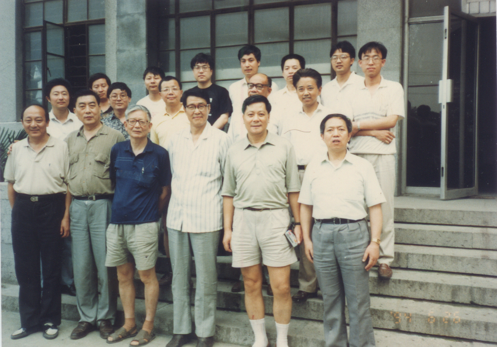
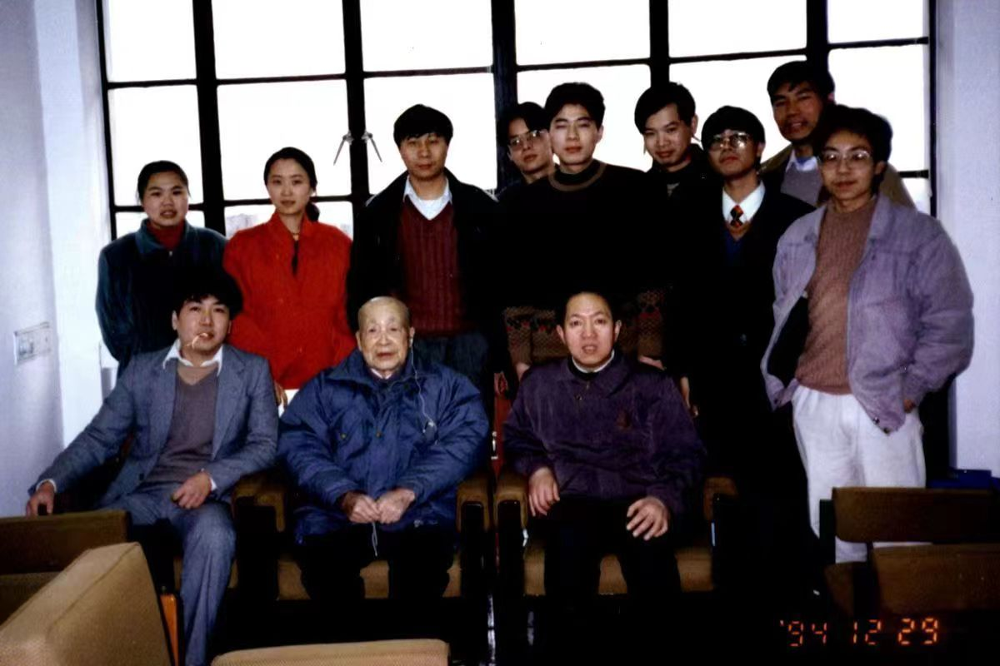
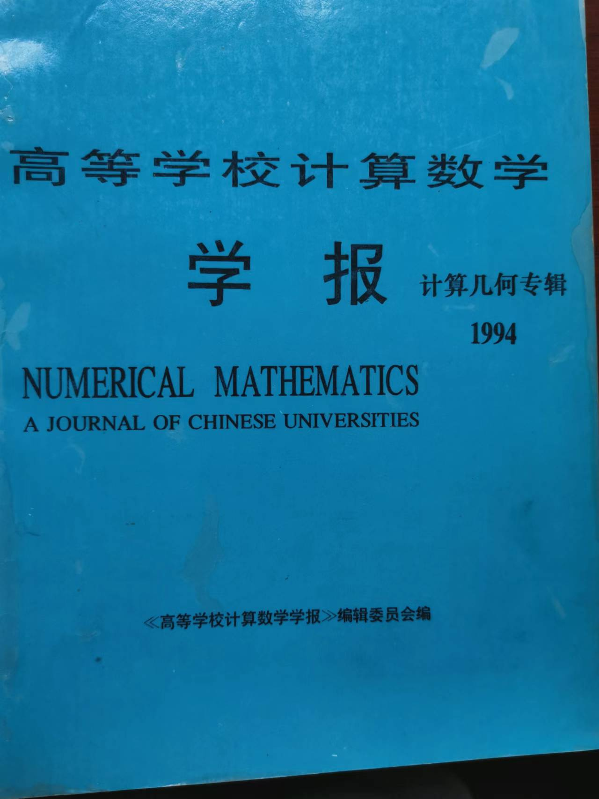
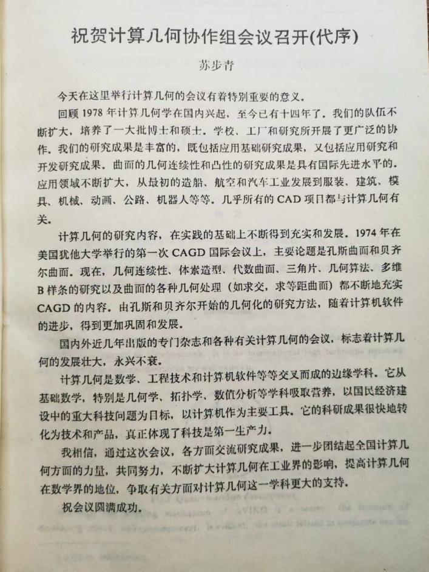
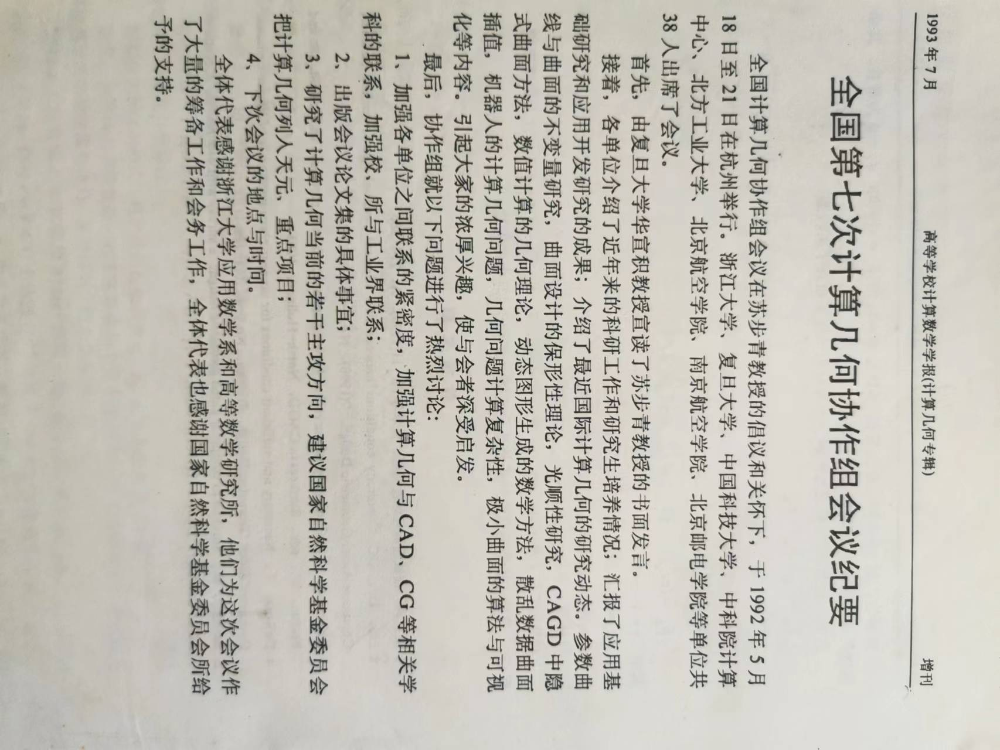
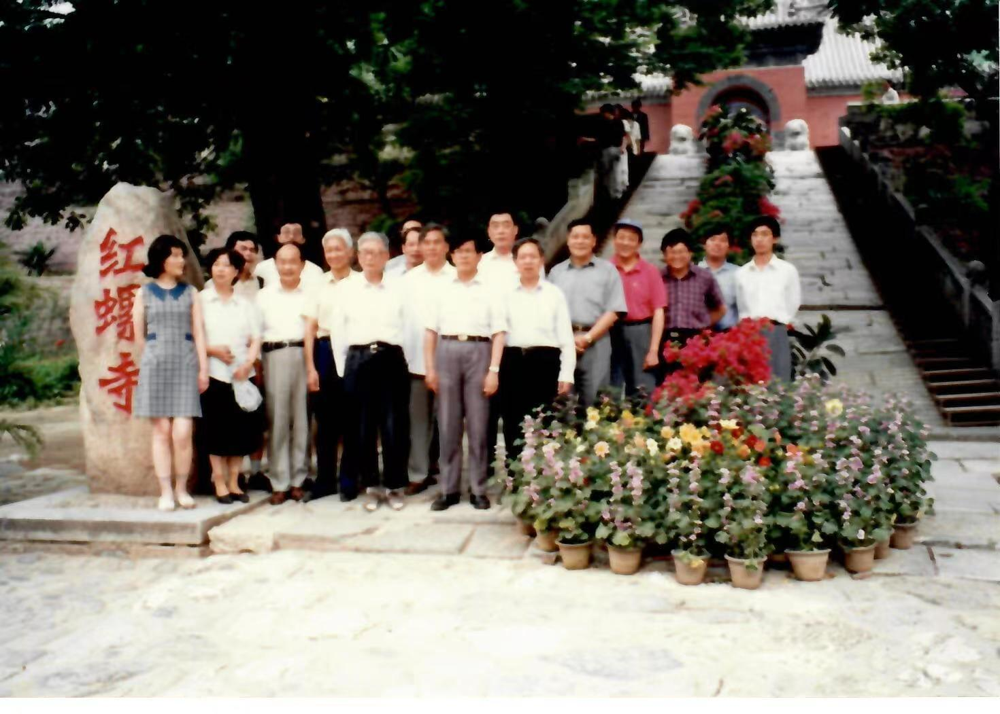

# 第15章　守与变：协作组的持续运作

---

## 15.1　各地研讨会与"把火守住的人"

九十年代的低谷是真实的，但有一件事始终没有发生：全国计算几何协作组的研讨会，没有中断过。出国潮带走了人，经费体制的转变带走了从容，可每一年，会议的通知仍会发出，仍会有人从各地赶来。规模确实小了——八十年代那种数十乃至上百人聚首的盛况不再，参与者三三两两，但门始终开着。

这些年会常常办在条件简陋的地方。一所普通高校的招待所，几十个人，两三天的日程，茶水、黑板、油印的论文集，就是全部的排场。一个领域是否还"活着"，有时并不取决于它产出了多少耀眼的成果，而取决于它的人是否还按时聚到一起、是否还把彼此当作同行。研讨会就是这个共同体的脉搏——跳得轻了，但没有停。

*图 15-1　九十年代上海计算几何会议——简朴的场地、有限的规模，却是低谷期共同体未曾中断的脉搏*

把这脉搏维持下来的，是一批可以称为"守火人"的人。他们未必在这十年里做出了最重要的研究，但他们做了一件同样重要的事：让会继续开下去。在复旦、在浙大、在山东大学这些早年的核心点上，总有人愿意承担那些琐碎而不出彩的事务——张罗场地，联络同行，编印论文集，招呼远道而来的年轻人。火种就是这样被一只手接给另一只手的。

*图 15-2　1994 年复旦大学计算几何课题组合影——前排从右往左为华宣积、苏步青、吴宗敏，最后排右一为汪国平。在低谷期，正是这样一批人维持着研讨会的延续*

*图 15-3　1992 年杭州会议论文集封面——低谷期学术活动留下的实物见证之一*

*图 15-4　苏步青《祝贺计算几何协作组会议召开（代序）》（1992 年杭州会议论文集）——前辈以"代序"形式为低谷中的研讨会背书*

*图 15-5　《全国第七次计算几何协作组会议纪要》（《高等学校计算数学学报·计算几何专辑》增刊，1993.7）——协作组年会在 1990 年代仍按届次稳定举办的纸面证据*

## 15.2　苏步青等前辈的鼓励与坚持

在这段历史中，几位前辈学者扮演了特殊的角色。他们年事已高，多数已不在研究第一线，但他们的声望与热情本身，就是一种支撑。

苏步青是其中的代表。作为中国微分几何的奠基者之一，也是计算几何协作组精神上的源头，他对这个领域的关切一直没有减退。

*图 15-6　1995 年底部分协作组成员看望苏步青先生——前辈的关切是低谷中真实的支撑*

九十年代中期，一些协作组成员仍会专程去看望他；据素材记载，1997 年他还曾在华东医院约见学生，谈的仍是这个领域的人与事。〔待核实：约见的具体情形、在场者、谈话内容，需据访谈或档案确认〕一位老人，在病榻边仍记挂着一个学科的存续——这种关切对当时身处困境的研究者而言，是难以量化却极为真实的鼓舞。

*图 15-7　1997 年苏步青在华东医院约见学生——病榻边仍记挂着一个学科的存续*

苏步青之外，另有几位前辈以各自的方式守望着这个领域。〔待填：常先生及其他前辈的姓名、单位、具体事迹——原草稿提及"常先生等人",需补全〕他们用声望为年轻人壮胆，用出席为研讨会背书，用一句"这个方向不能丢"为犹豫者定心。这种精神层面的支撑，在今天看来或许难以写进任何成果统计，但对当时的人是真实的。

*图 15-8　潘承洞校长看望王仁宏老师——前辈守望年轻一代的另一种具体形态*

*图 15-9　苏步青先生来杭州——前辈与浙大主线之间未曾中断的走动*

## 15.3　协作组的自我调适

低谷期的协作组并非只是被动地"守"。在维持基本运作的同时，它也在悄悄地"变"——做着一种关乎存续的自我调适。

最明显的变化是研究方向的重心偏移。八十年代的计算几何，问题大多来自造船、航空这类传统制造业；进入九十年代，随着计算机图形学在全球兴起，协作组的研究兴趣开始向图形学一侧适度倾斜，以接住新技术浪潮带来的新问题。与此同时，它与产业的联系也在拓宽——不再只面向造船与航空，而是伸向更广泛的制造业，乃至正在萌芽的 IT 产业。还有一部分成员开始走出国门，参与国际会议，把图形学的新趋势带回国内。这三股调整彼此呼应：方向的转、联系的宽、视野的开，本质上是同一件事——一个共同体在为下一个十年寻找自己的位置。

这种调适在当时是低调甚至不易察觉的，但回头看，它为下一个十年的重组埋下了伏笔。守住的是火,变换的是柴薪——正因为协作组在低谷里既没有散掉,也没有僵住,它才能在世纪之交完成那场从"协作组"到"专委会"的转身。

*图 15-10　1997 年浙江大学计算几何讨论班——华宣积（前排左一）、冯玉瑜（前排左二）、吴宗敏（前排左三）、高小山（右一）、李华等。低谷期协作组在维持运作的同时悄然调整方向*

*图 15-11　1998 年中科院计算几何专题讨论会留影——与图 15-10 互为印证，呈现 1990 年代末协作组自我调适的具体场景*

---

::: tip 本章关键词
协作组年会 · 守火人 · 九十年代坚守 · 研究方向调整
:::

**→ 下一章：[第16章　新方向的出现](./ch16)**
