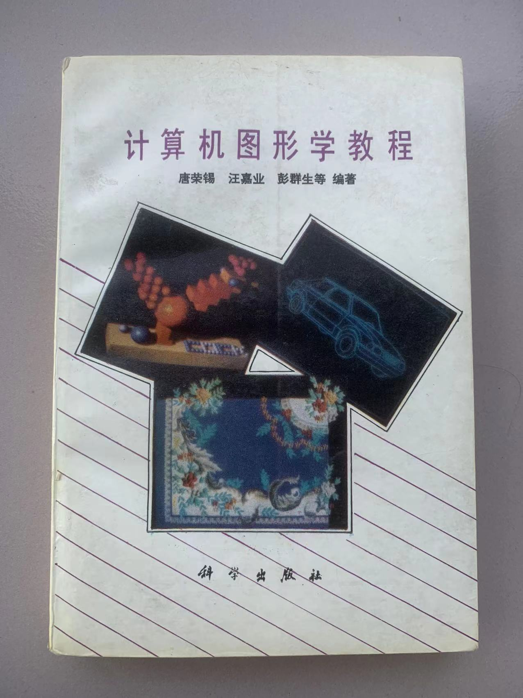

# 第16章　新方向的出现

---

## 16.1　计算机图形学的兴起

进入九十年代，当中国的计算几何正经历它的低谷时，世界的另一端，计算机图形学正迎来一场爆发。SIGGRAPH 从一个专业聚会成长为全球最受瞩目的技术会议之一；实时三维渲染、计算机动画、逐渐成形的游戏引擎——这些新兴方向像磁石一样，吸走了大量的人才与资金。一个旧领域的低谷，恰与一个新领域的高潮在同一时间发生，这并非偶然：它们争夺的，本就是同一批聪明的头脑。

在中国，这股浪潮稍晚到来，却同样迅猛。个人电脑开始进入实验室与家庭，互联网的雏形初现，计算机图形学随之在高校中迅速扩张。它与传统的计算几何之间，关系是微妙的：既有交集，也有张力。交集在于，图形学要让物体在屏幕上成形，靠的正是曲线、曲面与几何造型这套数学语言；张力则在于，图形学更年轻、更热闹、更靠近产业与大众，它吸引资源和学生的能力，是当时的计算几何难以比拟的。对计算几何的研究者来说，这股新浪潮既是机会，也是一种需要重新定位自己的压力。

*图 16-1　浙江大学 CAD&CG 国家重点实验室揭幕典礼——九十年代图形学在中国高校迅速扩张的标志之一*

## 16.2　Chinagraph 的起步

九十年代中期，中国计算机图形学的学术共同体开始凝聚，Chinagraph——中国计算机图形学大会——逐渐成形。〔待核实：Chinagraph 的首届年份、发起单位、主要推动者，原草稿未给出，需据档案确认〕与计算几何协作组那种小而紧密的圈子不同，Chinagraph 从一开始就是一个更宽阔的平台，把图形学、可视化、计算几何等多个方向汇聚在同一屋檐下。

对计算几何的研究者而言，这个更大的舞台意味着身份的微妙转变。他们开始出现在 Chinagraph 的会场上——有时作为核心，带来几何造型方向的报告；有时作为支撑者，为图形学同行提供几何算法这一层底层工具。无论哪种角色，都说明了一件事：计算几何不再是一个自我循环的小天地，它的价值，越来越多地要在与图形学的连接中体现出来。

## 16.3　几何问题的新舞台

新的应用场景，带来了一批形态全新的几何问题。

它们大多围绕着对真实三维世界的捕捉与处理展开。三角网格成了图形学描述形体的通用语言，于是网格的简化、光滑与参数化成为亟待解决的课题；动画与特效需要灵活可变的形体，隐式曲面、隐函数建模因此受到重视；早期的三维扫描设备开始把现实物体数字化，点云的处理与重建随之兴起；而要让虚拟物体的运动显得真实，碰撞检测背后那套几何算法又变得不可或缺。网格处理、隐式曲面、点云、物理仿真——这些名词在八十年代的计算几何词典里几乎不存在。

它们与八十年代船体放样所面对的问题，在形式上判若两个世界。可一旦深入到数学本质，二者之间却有着深刻的血缘：归根结底，都是在追问如何用有限的数据精确地表达和操纵一个自由的形体。正因如此，那些能够跨越两个时代、两种范式的学者——既懂样条与造型的老问题，又能进入网格与点云的新语境——在这场转变中显示出了格外的价值。他们是两个领域之间的摆渡人，而一个领域能否平稳地走进新时代，往往就取决于有没有这样的摆渡人。

*图 16-2　《计算机图形学》第一版封面——新一代教材的出现，标志着图形学在中国进入系统化阶段*

---

::: tip 本章关键词
计算机图形学 · Chinagraph · 网格处理 · 学科融合 · 新应用场景
:::

**→ 下一章：[第17章　2001：GDC 专委会的成立](../05-inheritance/ch17)**
