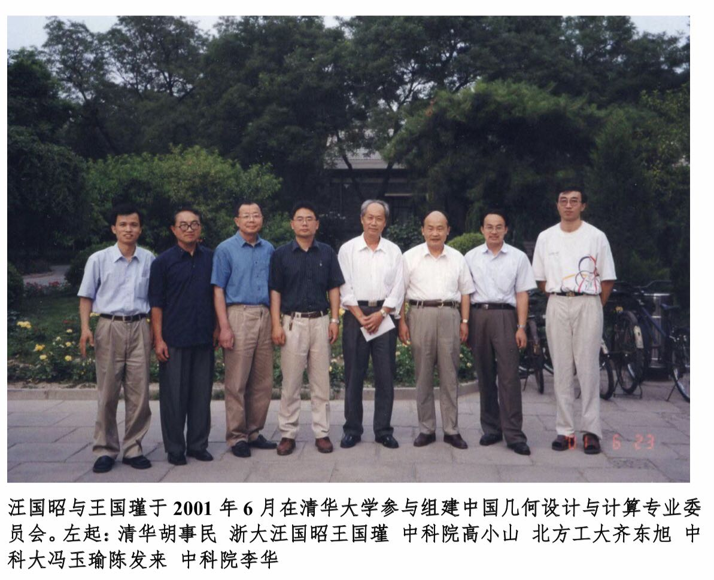
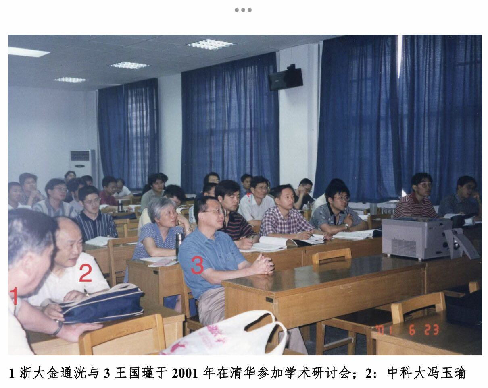
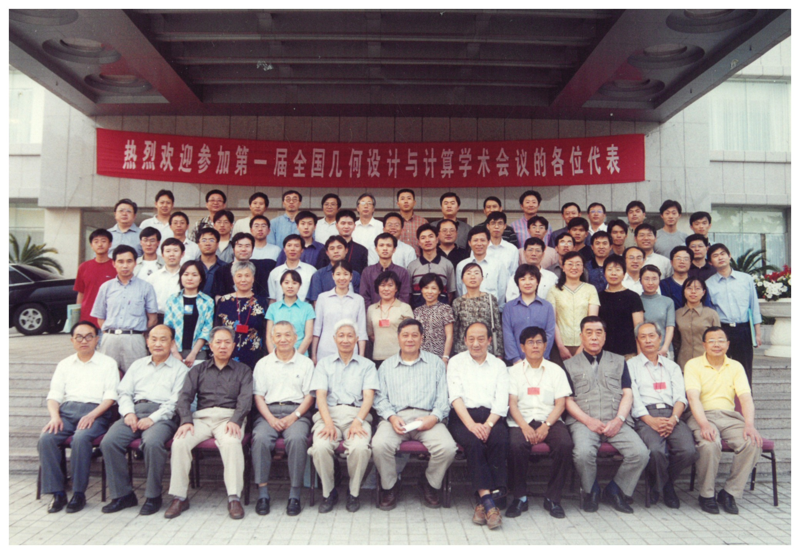
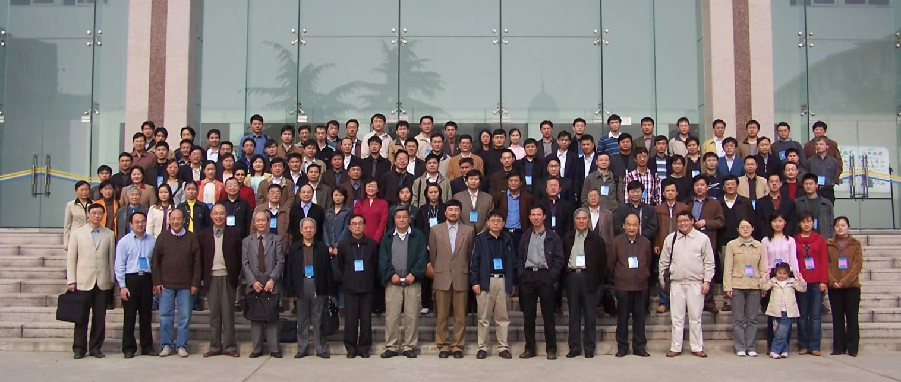

# 第17章　2001：GDC 专委会的成立

> "从'协作组'到'专委会'，不只是名字的改变，是一代人完成了交接。"

---

## 17.1　为什么要从"协作组"走向"专委会"

进入二十一世纪，全国计算几何协作组已经运行了将近二十年。它走过了八十年代的开创，也熬过了九十年代的低谷，是一个有功劳、有韧性的组织。但也正因为走得够久，它的结构性短板暴露得越来越清楚：协作组始终是一个松散的联合体，没有正式的组织架构，没有稳定的资金来源，它的活动能不能办、办得好不好，高度依赖少数几位核心人物的个人威望与个人投入。这种模式在创业期是优点——灵活、低成本、靠情谊驱动；可一旦这批核心人物年事渐高，它就成了隐忧：组织的延续不能永远押在某几个人的肩膀上。

与此同时，外部的制度环境正在成熟。中国的学会与专业委员会体系日趋完善，为一个领域从"非正式协作"升级为"正式建制"提供了现成的框架。〔待核实：原草稿提及"中国计算机学会(CCF)学科分支体系",而成立后的专委会实际挂靠 CSIAM(中国工业与应用数学学会)——两处机构需核对，确认推动过程中 CCF 与 CSIAM 各自的角色〕在多方推动下，2001 年前后，几何设计与计算专业委员会——通称 GDC 专委会——正式成立，挂靠中国工业与应用数学学会。一个靠情谊维系了二十年的圈子，终于有了自己的章程、名册与建制。

*图 17-1　2001 年中国几何设计与计算专委会成立合影（一）——一个靠情谊维系了二十年的圈子，终于有了自己的章程、名册与建制*

*图 17-2　2001 年中国几何设计与计算专委会成立合影（二）——与图 17-1 同批，呈现成立时的更多面孔*

## 17.2　清华会议与学科共识的形成

GDC 专委会成立前后，在清华大学举办了一次重要的学术会议。它的意义不止于一次寻常的学术交流——它更像是新老两代学者之间的一场共识确认，几个关乎学科命运的判断，在这次会议上被摆上桌面并取得了一致。

第一项共识关乎身份：计算几何在中国有它独立存在的价值，不应当被完全并入图形学。九十年代图形学的强势,曾让这个问题变得真切而紧迫,而清华会议给出了明确的回答。第二项共识关乎方向：几何设计面向工业的应用——CAD/CAM——仍然是这个领域的核心,不能因为追逐新热点而丢掉根本。第三项共识关乎人:必须主动吸引新一代学者进入,形成有梯队、能接替的人才结构。这三点合起来,等于为新生的专委会定下了基调:守住独立性,守住工业根脉,同时向年轻人敞开大门。

某种意义上，这次清华会议是 1982 年青岛短训班精神上的续集。青岛短训班是这个领域在中国的第一次集结，而清华会议则是它在世纪之交的又一次重新出发——同样是一群人坐到一起，确认"我们是谁、我们要往哪里去"。

*图 17-3　第一届 GDC（全国几何设计与计算学术会议）现场——青岛短训班精神的世纪之交续篇*

*图 17-4　"热烈欢迎参加第一届全国几何设计与计算学术会议的各方代表"欢迎横幅——专委会成立后第一次大会的现场标识*

这次交接也有了具体的人。专委会成立初期走上前台的，是一批正当盛年的学者——清华大学的胡事民、中国科学技术大学的陈发来、山东大学的张彩明等人,成为新组织的骨干;而像孙家广这样的资深学者,则以支持者的身份为这次代际交接背书。〔待核实：上述四人在专委会成立初期的确切职务（主任/副主任/秘书长等），原 bundle 仅给出"核心人物""支持者"的笼统说法，需据首届名册确认〕老一辈确认方向，中生代接过担子——"一代人完成了交接",说的正是这一刻。

*图 17-5　第一届 GDC 会议现场（来源 figures 库 4-4-1）——清华会议把"协作组"上升为"专委会"的具体场所记录*

## 17.3　新的组织架构与运作方式

与松散的协作组相比，GDC 专委会从一开始就是一个规范得多的组织。

它有明确的委员会成员名单和任期制度，组织的延续不再系于个别人的去留，而是写进了章程；它定期举办正式的全国学术年会，也就是后来一届接一届的 GDC 会议，使这个共同体有了稳定的聚首节奏；它主动与国际学术组织建立联系，把自己接入更大的网络；它还推动专业教材与学术论著的出版，为人才培养打下文本基础。这几件事合起来，标志着这个领域在中国完成了一次从"非正式"到"建制化"的关键跃迁。

建制化的意义，要在时间里才能完全显现。一个靠情谊运转的圈子，热度取决于人;一个靠制度运转的组织,延续取决于章程。从协作组到专委会的这一步,把这个领域的未来从"人在事在"的脆弱状态,带到了"人换事续"的稳定状态。此后二十余年专委会的持续运作——直至今天仍在更替的委员名册、仍在举办的年会与品牌活动——都可以追溯到 2001 年的这次转身。

*图 17-6　2005 年 GDC 会议——专委会成立后，全国年会形成稳定的举办节奏（后续历届见第 19 章）*

## 17.4　专委会简介与现任架构

几何设计与计算专业委员会，是经科技部和民政部批准成立的全国学术性群众团体，隶属中国工业与应用数学学会，由从事几何设计与计算的教学、研究、开发、应用、生产及经营的人员与单位组成，为自愿结成的非营利性社会组织。其宗旨是推动国内计算机辅助几何设计的研究与应用发展，促进几何设计工作者与工程技术人员、企业管理人员的结合，助力解决经济发展和技术进步面临的相关问题。专委会的品牌活动包括"CSIAM-GDC 走进企业"、"走进高校"、前沿讲习班，以及月度简讯。

下表为专委会**当前**架构（非 2001 年成立时架构；历届主任、副主任、秘书长名单待补）：

| 职务 | 成员 |
| --- | --- |
| 主任委员 | 刘利刚（中国科学技术大学） |
| 副主任委员 | 徐凯；刘秀平（大连理工大学）；贾晓红（中国科学院数学与系统科学研究院）；屠长河（山东大学）；李宾（广联达科技股份有限公司） |
| 秘书长 | 张松海（清华大学） |
| 副秘书长 | 朱晨阳；陈仁杰（中国科学技术大学） |
| 荣誉委员 | 梁学章（吉林大学）；王国瑾（浙江大学）；汪国昭（浙江大学）；韩旭里（中南大学）；张彩明（山东大学） |

---

::: tip 本章关键词
GDC 专委会 · 2001 · CSIAM · 清华会议 · 学科重组 · 制度化
:::

**→ 下一章：[第18章　新一代学者与研究格局](./ch18)**
