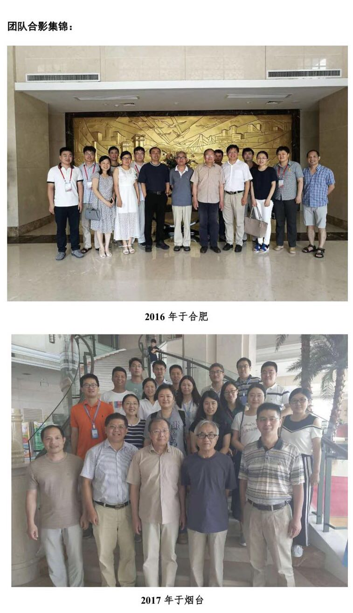
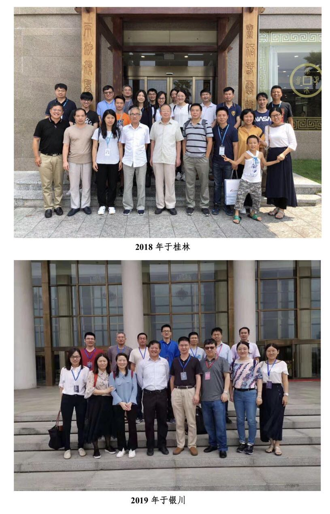
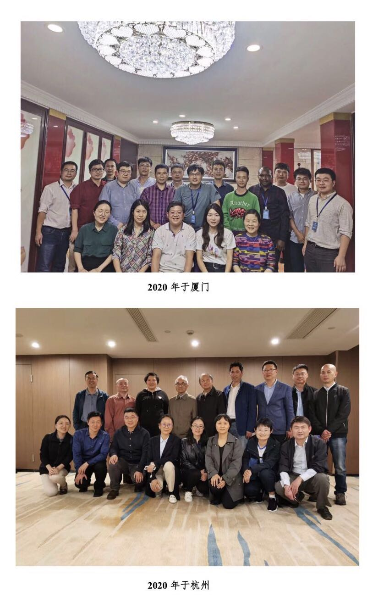
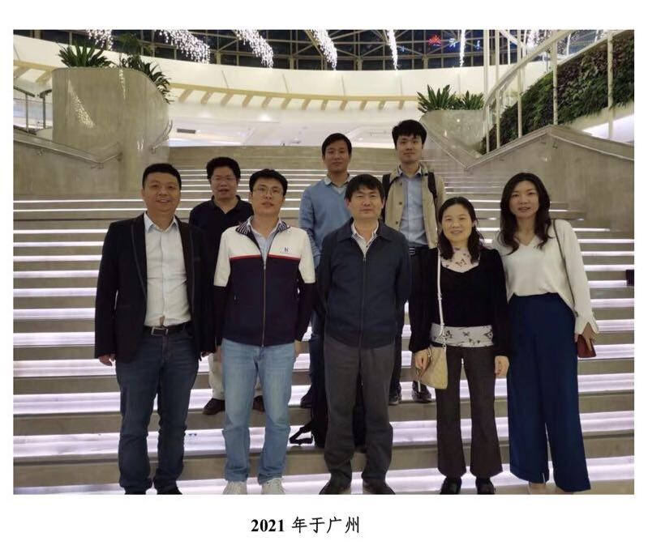
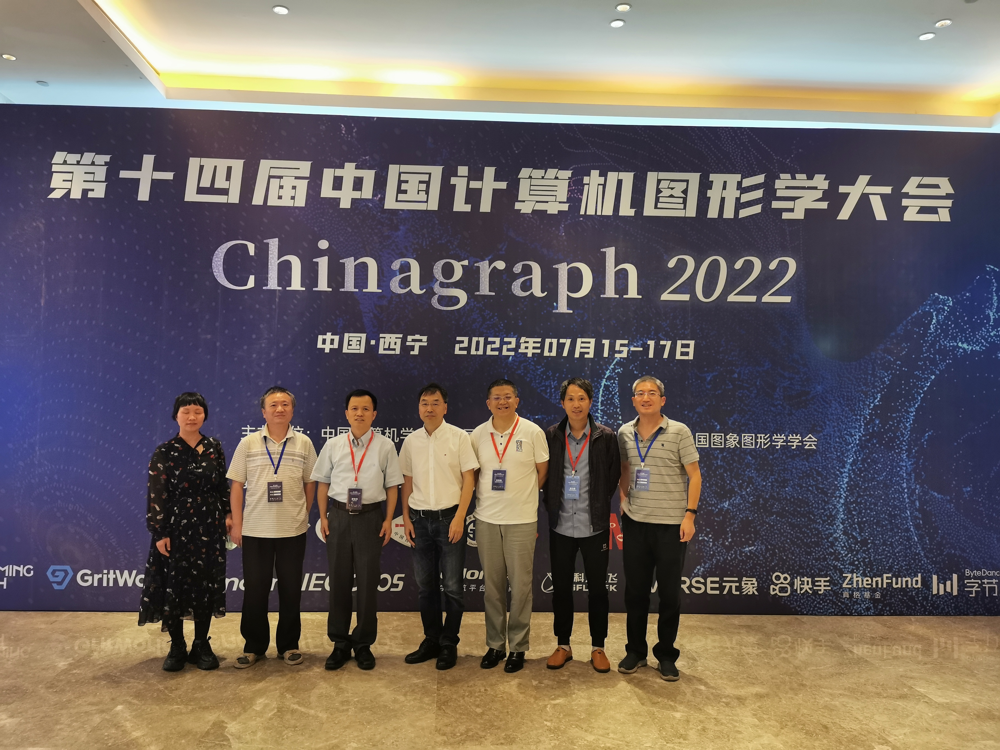
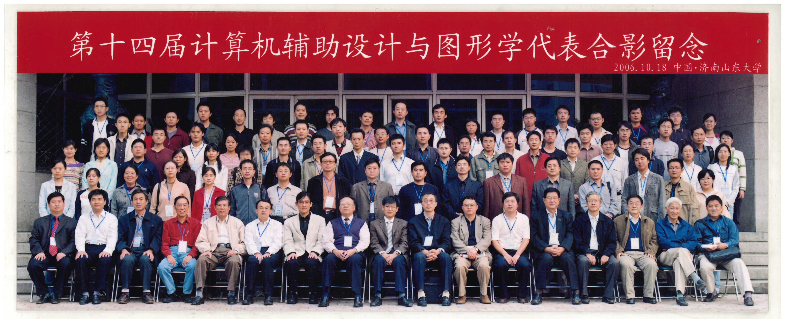
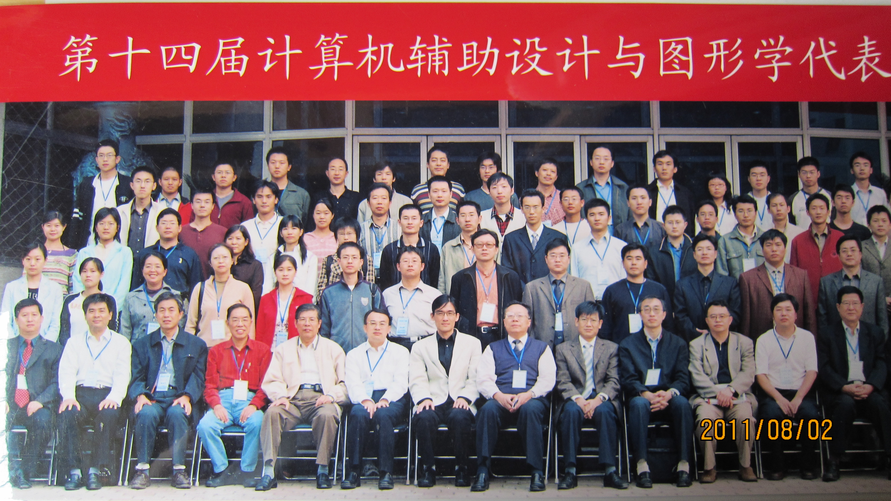
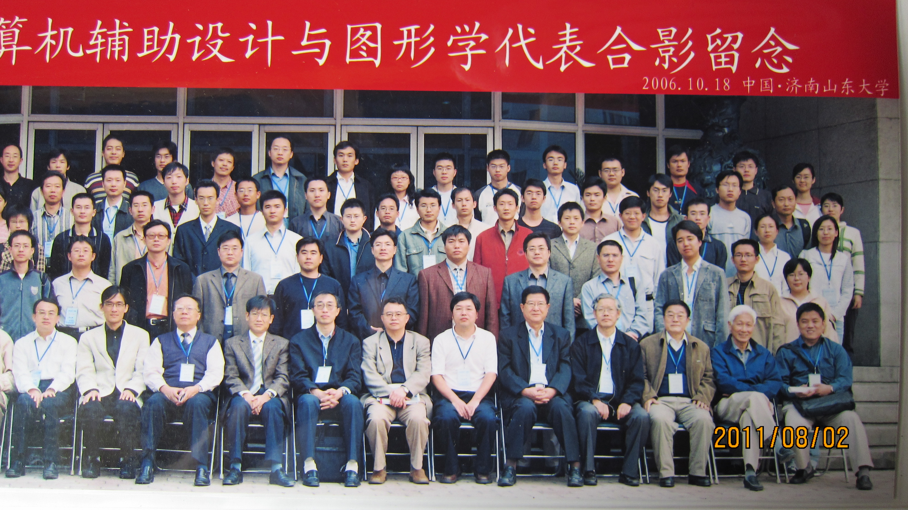

# 第18章　新一代学者与研究格局

---

## 18.1　清华大学：胡事民、唐泽圣等

进入二十一世纪，清华大学计算机系成为计算几何与图形学领域一支重要的新兴力量。这里有深厚的积累——唐泽圣在计算机图形学的系统研究上耕耘多年，是奠基性的人物；也有锐气正盛的中生代——胡事民在网格处理与几何建模方面的研究开始在国际上引起关注。一老一新，构成了清华在这个方向上的厚度。

清华的加入，给 GDC 专委会带来的不只是又一个强力的节点，更是一种新的学术风格。与发源于造船、航空、扎根于应用数学传统的老一代相比，清华的研究更靠近计算机科学的本位，更看重在国际顶级会议与期刊上发表，也更主动地去追逐那些新兴的几何计算问题。这种风格上的差异并非取代，而是补充——它让中国的计算几何共同体在原有的工业应用底色之上，又增添了一抹更国际化、更计算机科学化的色彩。

*图 18-1　庆祝唐泽圣教授从教五十年——清华学派与浙大学派之间长期学术友谊的具体注脚（与第十一章图 11-2 同图，本章因清华主线再次置入）*

## 18.2　浙江大学的持续影响

如果说清华代表的是新加入的力量，那么浙江大学代表的就是一种不曾中断的延续。从八十年代起，浙大就是中国计算几何的核心重镇，进入二十一世纪，它依然稳稳地守在这个位置上。汪国昭、王国瑾等人的研究持续推进，没有因为代际更替而出现断层。

*图 18-2　王国瑾——浙江大学计算几何学术谱系的代表性人物之一*

浙大更深远的影响，在于它的"谱系"。一代一代的学生在这里被培养出来，又一批一批地走向全国各地的高校与研究机构。这种持续的人才输出，使浙大不只是一个研究中心，更像是一个学术的"母体"——中国计算几何版图上许多新的点，追溯上去都连着浙大这条根。

*图 18-3　王国瑾团队 2016 合肥—2017 烟台活动——浙大学术谱系持续向全国扩散的缩影之一*

*图 18-4　王国瑾团队 2018 桂林—2019 银川活动——同一谱系跨年的连续节点*

*图 18-5　王国瑾团队 2020 厦门—2020 杭州活动——疫情前后的两次聚首*

*图 18-6　王国瑾团队 2021 广州活动*

*图 18-7　王国瑾团队 2022 西宁活动——王国瑾团队历年活动（2016—2022）合在一起，是浙大"母体"持续向全国输出人才的具体证据*

## 18.3　中科院计算所的新角色

中国科学院计算技术研究所在这个阶段找到了一个与高校略有不同的定位。相比大学偏重基础研究与人才培养，计算所更多地承担了以工程系统为导向的几何计算研究。这种定位让它成为一个关键的连接点：一头连着学术界的理论成果，一头连着产业界的实际需求。在"从学术到产业"这条后来变得格外重要的链条上，计算所很早就站在了中间的位置。

## 18.4　吉林大学、中国科大等单位的加入

研究格局在这一阶段明显地向外扩展，越来越多的高校加入到 GDC 的学术社区中来。吉林大学在 CAD 几何核心与工业软件方向上有着持续的投入，是这条偏工程、偏底层路线上的重要力量；中国科学技术大学则在几何处理与图形学的基础研究方面崭露头角，逐渐成长为新的活跃中心。除此之外，分布在各地的高校里，一批又一批从事图形学与 CAD 方向的研究者也陆续汇入，形成了一个比以往宽广得多的参与群体。这个领域不再属于少数几所学校，它的地图上开始密集地出现新的标记。

## 18.5　研究格局的变化

把这些变化放在一起看，一条清晰的演变线索就浮现出来了。八十年代的中国计算几何，格局可以概括为一个"三角"——复旦、浙大、山大三足鼎立，力量高度集中在少数几个点上。而到了二十一世纪初，这个三角已经舒展成一张多中心的网络：清华、浙大、中科院、吉大、中科大，以及更多分布各地的高校，共同支撑起这个领域。

从集中到分散，这不是力量的稀释，而是一种更健康的生态。集中意味着脆弱——少数几个点一旦受挫，整个领域就会动摇，九十年代的低谷已经印证过这一点。分散则意味着韧性：根系扎得更深、铺得更广，个别节点的起伏不再能撼动全局。中国计算几何用二十年时间走完的这段从"三角"到"多中心"的路，本质上是一个学科真正成熟的标志。

*图 18-8　2006 年济南 CAD/Graphics 会议——多中心格局成形期的一次全国性聚会*

*图 18-9　2006 年 10 月济南全国 CAD 会议合影（一）*

*图 18-10　2006 年 10 月济南全国 CAD 会议合影（二）——与图 18-8、图 18-9 共同记录 2006 年济南这一组核心会议*

---

::: tip 本章关键词
胡事民 · 唐泽圣 · 清华大学 · 多中心格局 · 新一代学者
:::

**→ 下一章：[第19章　会议、教材与社区](./ch19)**
