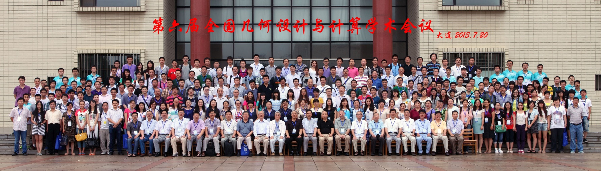
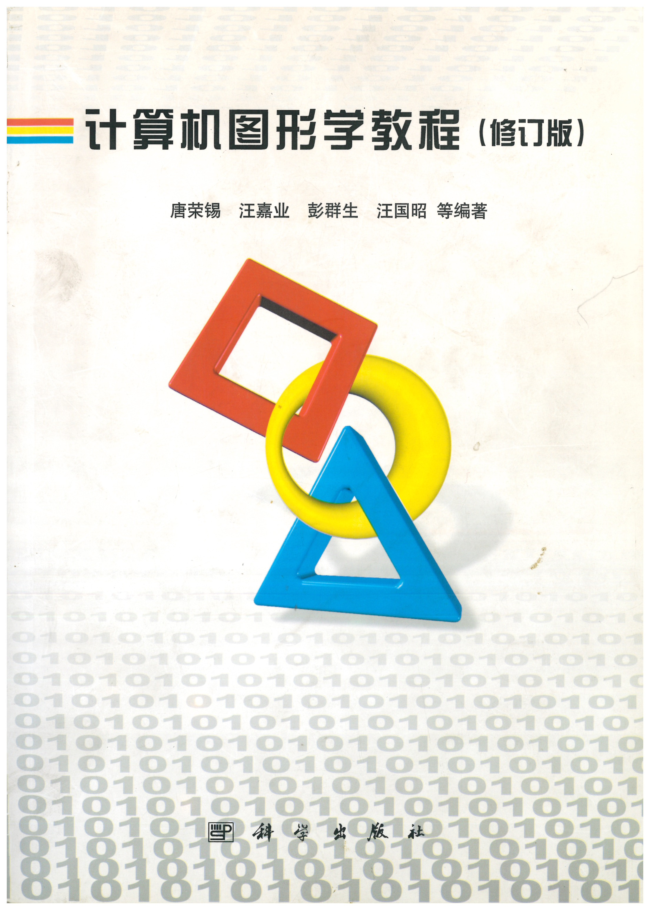
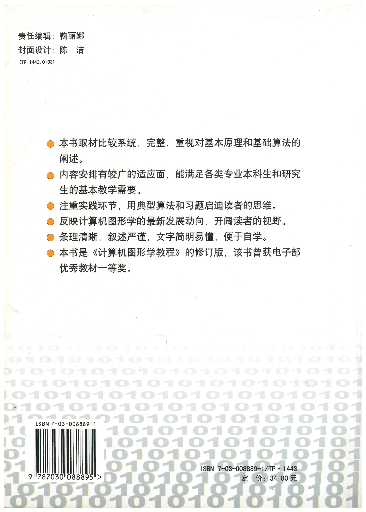
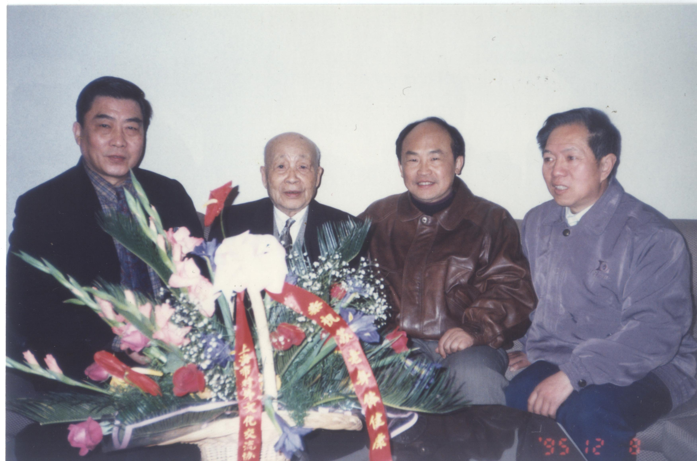
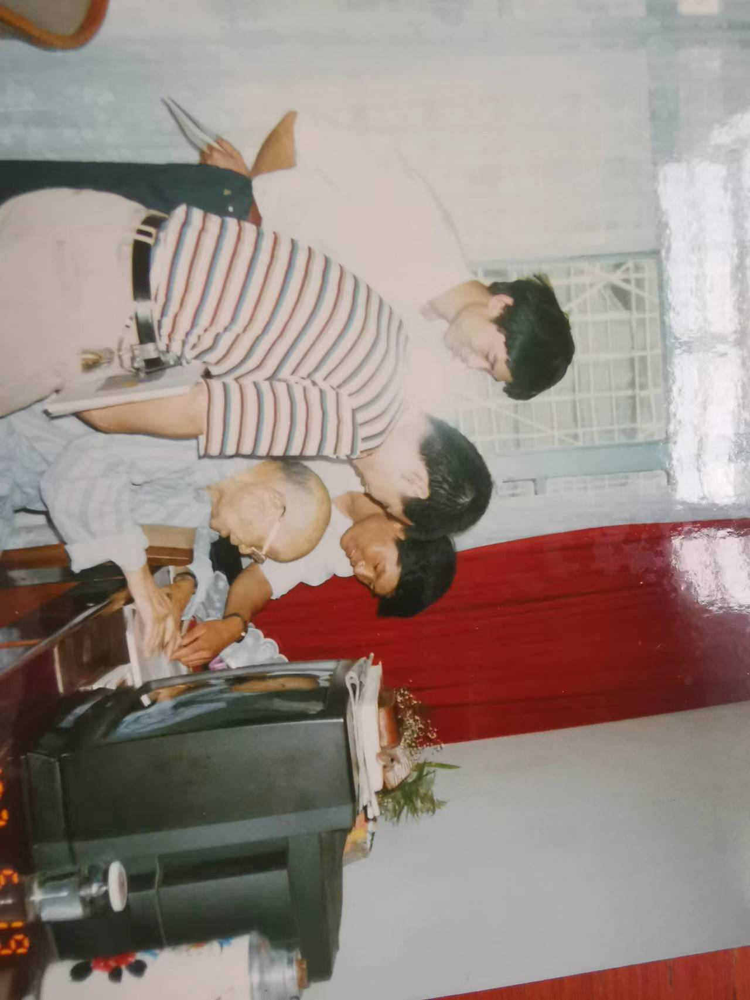
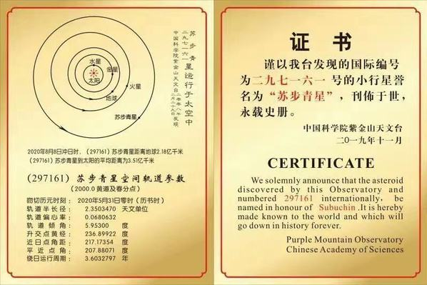

# 第19章　会议、教材与学术社区文化

---

## 19.1　全国几何设计与计算会议（GDC）

进入二十一世纪以后，GDC 年会成为中国计算几何最重要的定期学术聚会。它的气质很特别，介于两种场合之间——一半是正式的学术会议，有严肃的报告、尖锐的提问、最新成果的首次亮相；另一半则像一场老友的重逢，有饭桌上轻松的闲谈，有久别之后的握手。新人在这里展示自己刚做出来的工作，老一辈在这里回顾来时的路，两种声音在同一个会场里并不冲突，反而彼此成全。

*图 19-1　GDC15 合影——历届 GDC 会议合影组图之一*

*图 19-2　2013 年 GDC 合影*

*图 19-3　2016 年 GDC 合影*

*图 19-4　2017 年 GDC 合影*

*图 19-5　2022 年 GDC 合影——年复一年的聚首，是这个学术共同体的脉搏*

GDC 年会还承担着一个不写在日程表上、却极为关键的功能：代际传递。一个年轻学者第一次来开 GDC，认识的不只是同行，还有这个领域的前辈；他听到的不只是技术报告，还有这个学科一路走来的故事。他会慢慢明白，自己手上的工作不是凭空冒出来的，背后connecting着一条几十年的脉络。一个领域的历史感与归属感，往往就是在这样年复一年的会场上，一点一点传下去的。

## 19.2　教材体系与研究生培养

学术共同体的延续，光靠开会还不够，它还需要文本——需要把分散在各人脑中的知识，沉淀成可以一代代传授的教材。进入二十一世纪，计算几何相关的教材体系逐步完善起来。几何造型方向开始有了系统性的中文教材；像 Farin 的《Curves and Surfaces for CAGD》这样的国际经典，也有了中文译本或配套讲义，使国内学生能够更直接地接触到领域的标准文献；与此同时，各大高校的计算几何课程也逐步走向规范化，从因人而异的零散讲授，变成有相对统一框架的固定课程。

*图 19-6　《计算机图形学》（修订版）封面*

*图 19-7　《计算机图形学》（修订版）封底——二十一世纪计算几何与图形学教材体系走向完善的一个例证*

研究生培养也在这一时期形成了相对稳定的模式。浙大、清华、山大等核心机构成为主要的培养基地，一届届学生在这里完成训练，毕业后流向全国各地的高校与研究机构。这种"核心培养、全国扩散"的循环，把第18章所说的多中心格局，落到了实实在在的人身上——格局不只是地图上的标记，它是由一个个被培养出来、又走出去的人撑起来的。

## 19.3　学术社区的文化

在所有看得见的制度建设——年会、教材、培养体系——之外，GDC 社区还有一样东西，最难描述，却或许最宝贵，那就是它的文化气质。

这种气质有几个彼此交织的侧面。它重视数学基础，不轻看那些不直接产生应用的理论训练；它重视几何直觉，相信对形体的那种"看得见、想得出"的感觉是这个领域的看家本领；它重视工程应用，始终记得这个学科最初是为了解决工厂里的真问题而生的；同时，它又保持着一种对历史的尊重和对传承的自觉——知道自己从哪里来，也在意能把什么交给下一代。

*图 19-8　1995 年底部分协作组成员看望苏步青先生（与第十五章图 15-6 同图，本章因社区文化主线再次置入）*

*图 19-9　1997 年苏步青在华东医院约见学生（与第十五章图 15-7 同图，本章因社区文化主线再次置入）*

*图 19-10　2019 年第 297161 号小行星命名为"苏步青星"——从九十年代成员看望苏步青到 2019 年小行星命名，对前辈与历史的尊重，是这个社区文化气质的一部分*

这种文化不是一纸规章能够规定出来的，它是四十年时间一点点积淀的结果，是无数次会议、无数对师生、无数个具体的人共同养成的习性。也正是这种文化，使这个社区在竞争激烈、热点频繁更替的学术生态中，始终保有一种不易被同化的独特性。说到底，一个学科能留给后人的，除了定理与系统，还有这样一种做学问的气质。

---

::: tip 本章关键词
GDC 年会 · 教材体系 · 研究生培养 · 社区文化 · 代际传递
:::

**→ 下一章：[第20章　从学术到产业](../06-flourish/ch20)**
