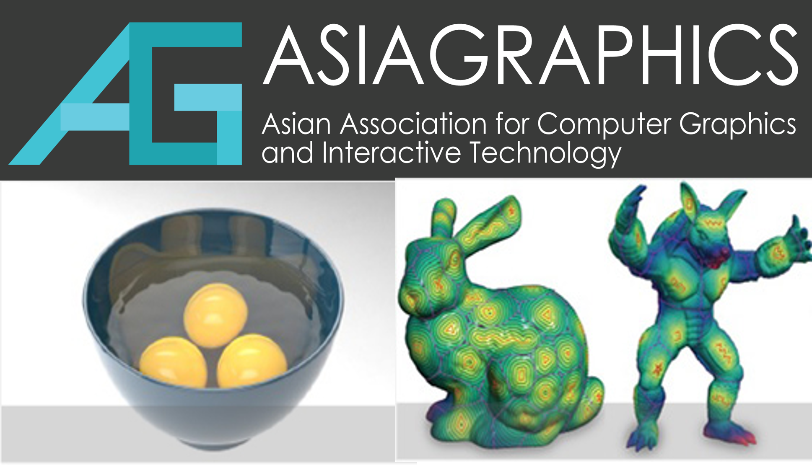

# 第21章　中国计算机几何与图形学的国际舞台

---

## 21.1　SIGGRAPH Asia 2014 深圳

2014 年，SIGGRAPH Asia 在深圳举办。这是这一全球计算机图形学顶级会议第一次来到中国大陆，单是"首次"二字，就足以让它具有不寻常的象征意义。

但比"在中国办会"更值得回味的，是中国为什么能办这场会。承办 SIGGRAPH Asia 不只是当一回提供场地的东道主，它更像是一场资格的认证。一个国家的图形学界要能扛起这一级别的会议，背后需要一整套实力的支撑：足够多、足够好的论文投稿，使会议有充实的学术内容；足够多进入评审委员会的学者，使这个国家在会议的学术决策中有发言权；以及一个足够成熟、足够活跃的学术社区，能够组织和承接如此规模的国际活动。当这些条件同时具备，承办权才会落到这里。所以 2014 年的深圳，与其说是中国图形学的一次亮相，不如说是它多年积累终于被国际同行集体确认的一刻。

[图待补：fig_TBA_ch21_001——SIGGRAPH Asia 2014 深圳现场图（会场、横幅、中国学者参与场景）；**待新增**]
*图 21-1　SIGGRAPH Asia 2014 深圳现场——这一全球图形学顶级会议第一次来到中国大陆（**待新增**）*

*图 21-2　AsiaGraphics 协会 Logo 与代表性研究成果展示——中国学者在亚太图形学舞台上日益活跃的体现*

## 21.2　GMP、AsiaGraphics、ISVD 等

SIGGRAPH Asia 是最耀眼的那一次，但中国学者的国际身影，远不止于这一个舞台。在若干个专业性的国际会议上，都能稳定地看到他们的参与。

其中与计算几何关系最直接的是 GMP——Geometric Modeling and Processing，几何造型与处理领域的国际顶级会议。这正是中国计算几何这条学脉对口的国际平台，多年来，中国学者在 GMP 上的论文占比持续增长，从偶有亮相到成为常规力量。AsiaGraphics 则是亚太地区的图形学年会，中国既是重要的参与方，也多次扮演主办者的角色，在亚太图形学的版图中分量越来越重。〔待核实：AsiaGraphics 协会的成立年份、与中国学者的关系——fig_114 涉及该协会 Logo，需据资料确认〕此外，在 ISVD——国际 Voronoi 图研讨会——这样更偏向计算几何基础理论的场合，也有中国学者的身影。从顶级综合会议到专门的理论研讨会，参与的层次是完整的。

## 21.3　国际论文与影响力的增长

会议上的身影之外，更硬的指标写在期刊的页面上。从 2000 年代末到 2010 年代，中国计算几何学者在国际顶级期刊上发表的论文数量显著增加——Computer Aided Geometric Design、Computer-Aided Design、ACM Transactions on Graphics，这些代表着领域最高水准的刊物上，来自中国的名字越来越密。

但数量本身还不是最关键的。真正标志着分量改变的，是这些论文开始被频繁地引用，是其中一部分成果在国际上产生了实实在在的影响——它们被同行追随，被写进后续研究的出发点。这意味着一种角色的转变：在某些方向上，中国学者不再只是跟在别人后面追赶，而是站到了能够提出问题、定义方向的位置上。从追赶到并跑，再到在局部领跑，这条路走了几十年。回望全书开头那个为造船厂求解放样数学问题的年代，再看此刻国际期刊上的引用曲线，四十年的距离，在这里被丈量了出来。

[图待补：fig_TBA_ch21_002——中国学者在 CAGD/CAD/TOG 等国际期刊上的论文数量与引用增长统计图（据真实数据制作）；**待新增**]
*图 21-3　中国学者在国际顶级期刊上的论文数量与引用增长曲线——四十年距离的另一种丈量方式（**待新增**）*

---

::: tip 本章关键词
SIGGRAPH Asia 2014 · GMP · 国际论文 · CAGD 期刊 · 国际影响力
:::

**→ 下一章：[第22章　企业、系统与应用](./ch22)**
